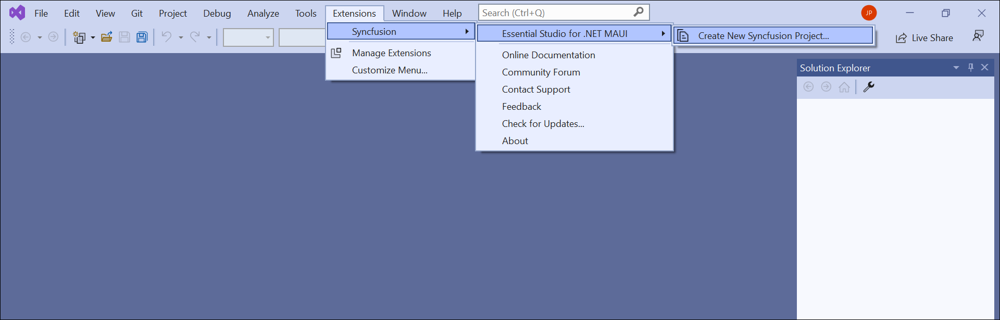
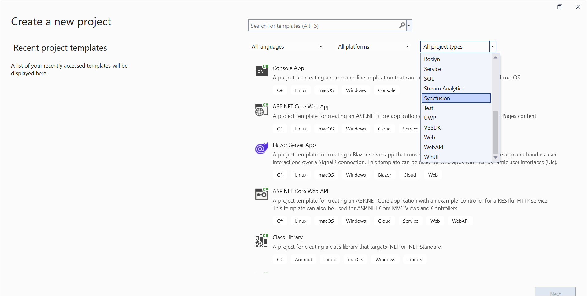
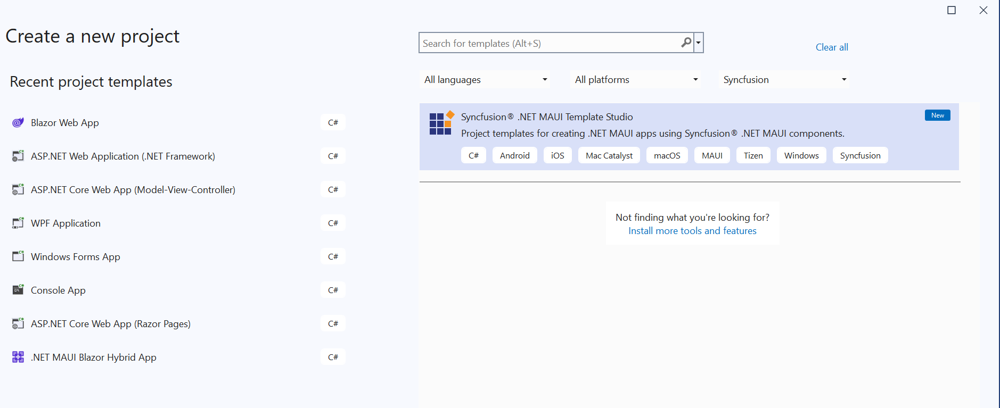
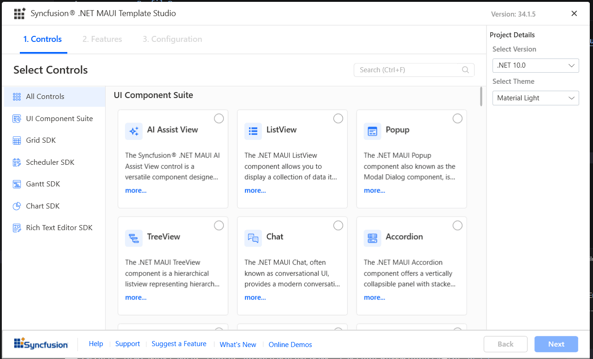
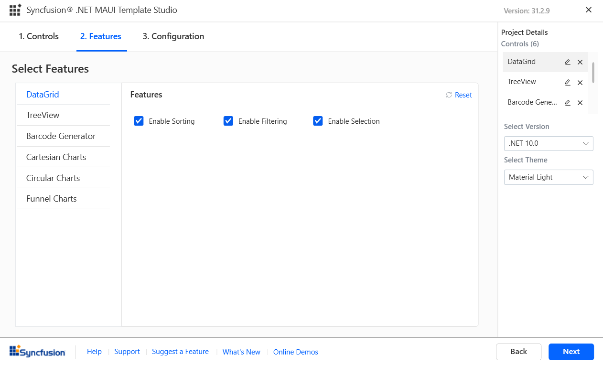
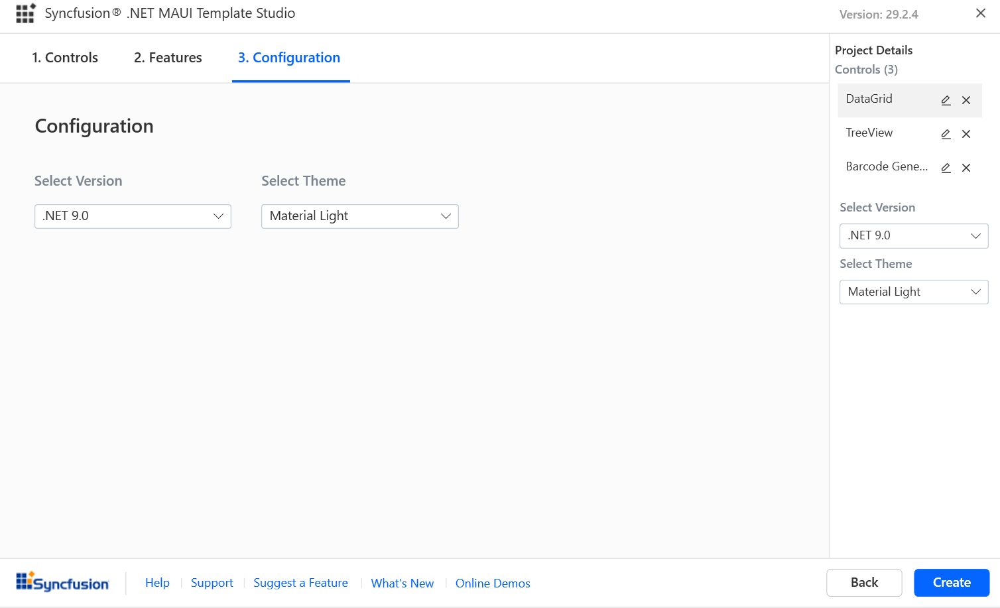
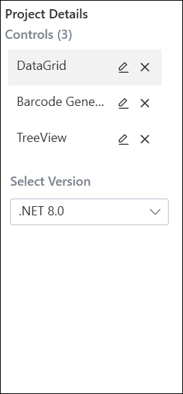
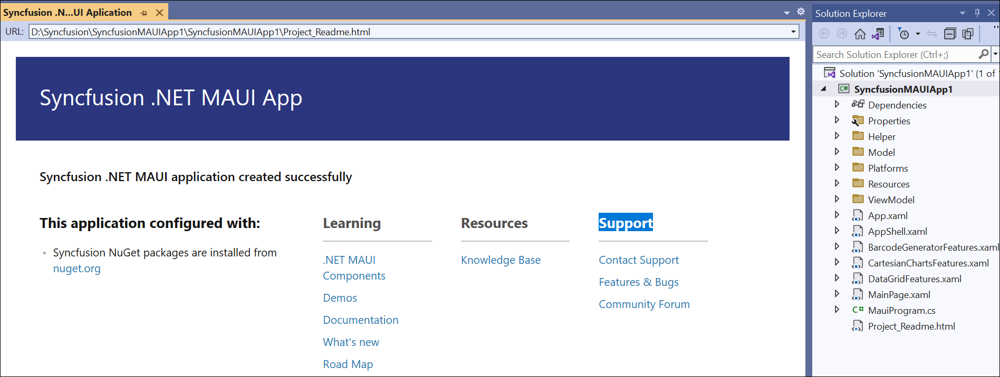

# Syncfusion® .NET MAUI Template Studio

The .NET MAUI Template Studio, provided by Syncfusion®, helps you build .NET MAUI applications using Syncfusion® components. It includes the necessary components, NuGet references, namespaces, and rendering code to streamline development. The Template Studio also offers a project wizard that simplifies the process of creating applications with Syncfusion® components.

The following steps will assist you in creating your **Syncfusion® .NET MAUI Application** through **Visual Studio 2022 or 2026**:

N> Before using the Syncfusion® .NET MAUI Project Template, verify whether the Syncfusion® .NET MAUI Template Studio extension is installed in the Visual Studio Extension Manager by clicking on **Extensions > Manage Extensions > Installed**. If the extension is not installed, install it by following the steps in the [download and installation](download-and-installation) help topic.

1. Open Visual Studio.

2. To develop the Syncfusion® .NET MAUI application, select one of the following options:

     **Option 1**

     Choose **Extensions > Syncfusion® > Essential Studio® for .NET MAUI > Create New Syncfusion® Project...** from the Visual Studio menu.

     

     **Option 2**

     Choose **File > New > Project** from the menu. This launches a new dialog for creating a new application. Filtering the application type by **Syncfusion** or typing **Syncfusion** as a keyword in the search option can help you find the Syncfusion® templates for .NET MAUI.

     

3. Select the **Syncfusion® .NET MAUI Template Studio** template and click **Next**.

     

4. After launching the Syncfusion® .NET MAUI Template Studio, a configuration wizard will appear to help you set up your application. You can then choose from the available Syncfusion® .NET MAUI components which are listed based on category wise such as UI Component Suite, Grid SDK, Scheduler SDK, Gantt SDK, Chart SDK and Rich Text Editor SDK.

    

    Choose the required control(s) by clicking the corresponding control box.

    To unselect the added control(s), use either one of the following options:

    **Option 1:** Click the corresponding selected control box.

    **Option 2:** Click the **'x'** button for the corresponding control in the control list under **Project Details**.

    N> **Note:** Choose at least one control to enable the **Features** and **Configuration** tabs.

5. The features for the selected controls are listed when you click on **Next** or the **Features** tab. You can choose the required features for the selected controls.

    

    By unchecking the feature checkboxes, you can unselect features from the selected controls.

6. The Configuration section will load when you click **Next** or the **Configuration** tab. You can select the required .NET version (.NET 9.0 or .NET 10.0).

     

     **Project details section**

     Under the Project Details section, you can modify the configurations and remove one or more controls from the selected controls.

     

7. Click the **Create** button to create the Syncfusion® .NET MAUI application. The created Syncfusion® .NET MAUI application has the Syncfusion® NuGet packages and the rendering code for the selected Syncfusion® components.

     

8. The Syncfusion® .NET MAUI application is configured with the latest Syncfusion® .NET MAUI NuGet package versions, namespaces, and component rendering code.

9. If you installed the trial setup or NuGet packages from nuget.org, you must register the Syncfusion® license key to your application, since Syncfusion® introduced the licensing system from 2018 Volume 2 (v16.2.0.41) Essential Studio® release. Navigate to the [help topic](https://help.syncfusion.com/common/essential-studio/licensing/overview#how-to-generate-syncfusion-license-key) to generate and register the Syncfusion® license key to your application. Refer to this [blog](https://www.syncfusion.com/blogs/post/whats-new-in-2018-volume-2.aspx) post for understanding the licensing changes introduced in Essential Studio®.
