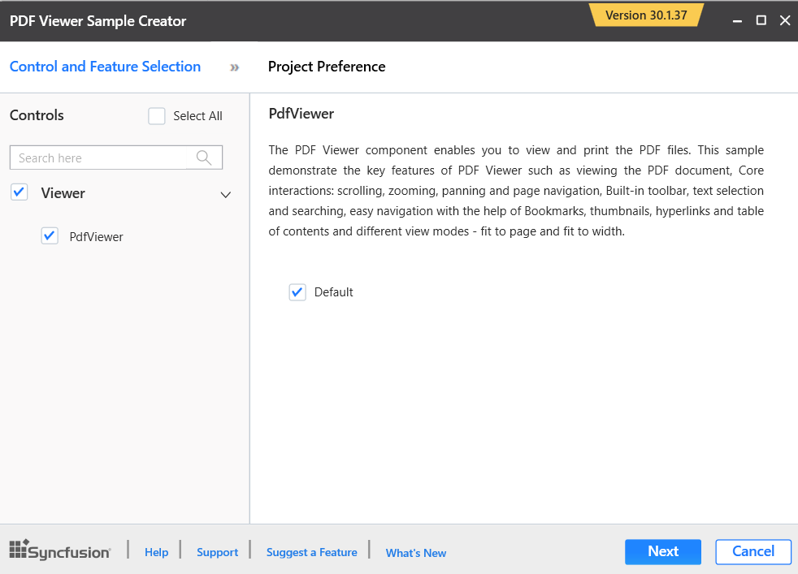
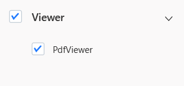
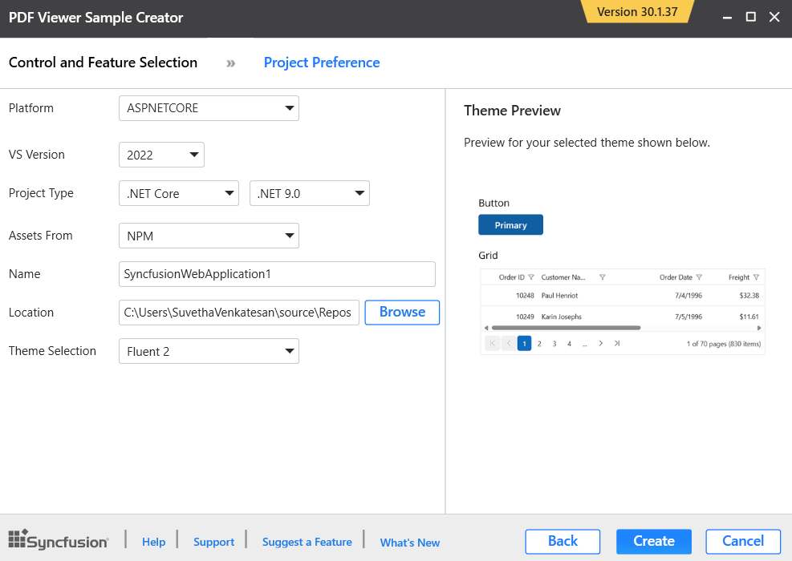

# Sample Creator

Sample Creator is the utility that allows you to create Essential Studio&reg; PDF Viewer SDK Projects along with the samples based on platform and Features selection.

I> The Essential Studio&reg; PDF Viewer SDK Sample Creator utility is available from v30.1.37

## Create Essential Studio&reg; PDF Viewer SDK Web Application from Sample Creator

The following steps help you to create the Essential Studio&reg; PDF Viewer SDK Web Application via the Sample Creator utility.

1. To launch PDF Viewer SDK (Essential&reg; JS 1) Sample Creator application, follow either one of the options below: 

   **Option 1:**   
   Click **Syncfusion&reg; Menu** and choose **Essential Studio&reg; for PDF Viewer SDK > Launch Sample Creator…** in **Visual Studio**.
   
   

   N> In Visual Studio 2019, Syncfusion&reg; menu available under Extension in Visual Studio menu.

   **Option 2:**  
   Launch the Essential Studio&reg; PDF Viewer SDK (Essential&reg; JS 1) Control Panel. Select the Sample Creator button to launch the PDF Viewer SDK (Essential&reg; JS 1) Sample Creator application. Refer to the following screenshot for more information.

   

2. Syncfusion&reg; Sample Creator Wizard displaying the **Controls and its Feature Selection** section

   

### Controls Selection

Listed here are the Essential Studio&reg; PDF Viewer SDK controls so you can choose the required controls.

   

### Project Configuration

1. You can configure the following project details in the Sample Creator.

   * Platform Type – Select the type of platform either ASP.NET Core or MVC.
   
   * VS Version – Choose the Visual Studio version.

   * Project Type: Select the .NET Core Project.

   * .NET Framework – Choose the .NET Framework version.
   
   * Assets From – Load the Syncfusion&reg; assets to ASP.NET Core Project, either Bower, CDN or Installed Location.

   * Name – Name your Syncfusion&reg; PDF Viewer SDK Application.

   * Location – Choose the target location of your project.

   * Theme Selection – Choose the required theme.The Theme Preview section shows the controls preview before create the Syncfusion&reg; project.

   

2. When you click the Create button, the new Essential Studio&reg; PDF Viewer SDK project is created. The following resources are added in the project:

   * Added the required View(.cshtml) and Class files in the project.

     

   * Included the required Syncfusion&reg; scripts and themes files.

     

   * Restored the required Syncfusion&reg; NuGet/Bower packages for selected controls under dependencies.

     

3. Once the project is created you can open the project by clicking the Yes button. If you click No button the corresponding location of the project will be opened. Refer the following screenshot for more information.

   
