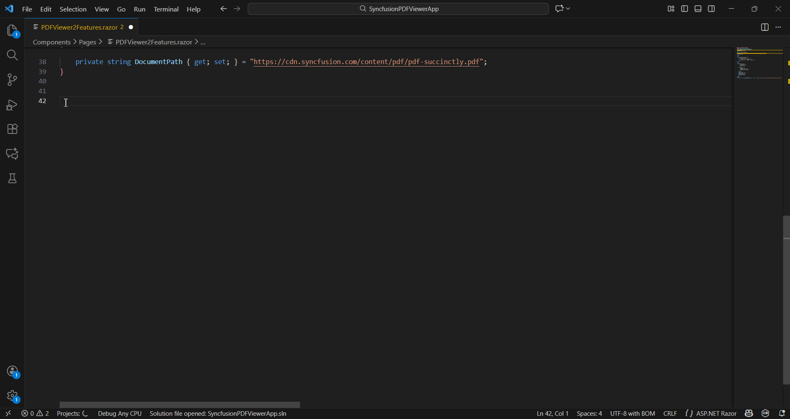
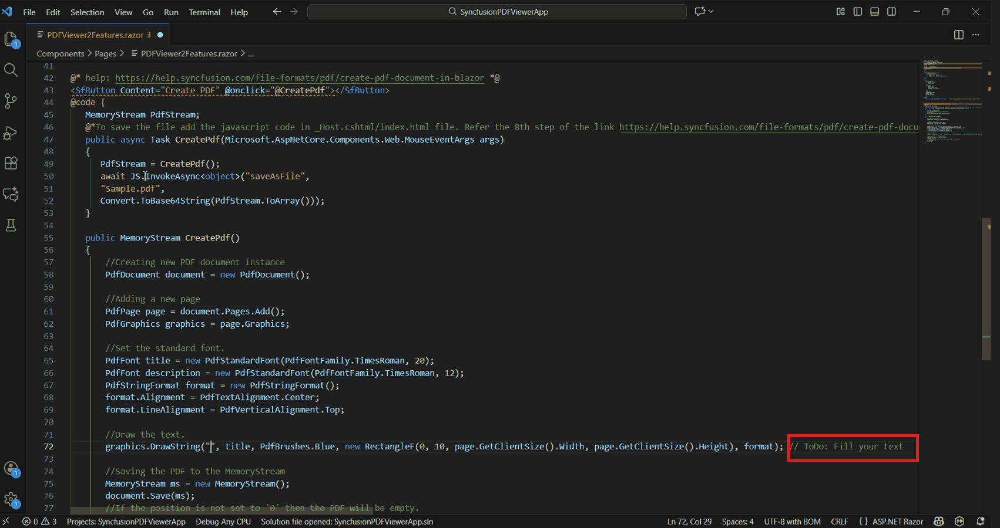
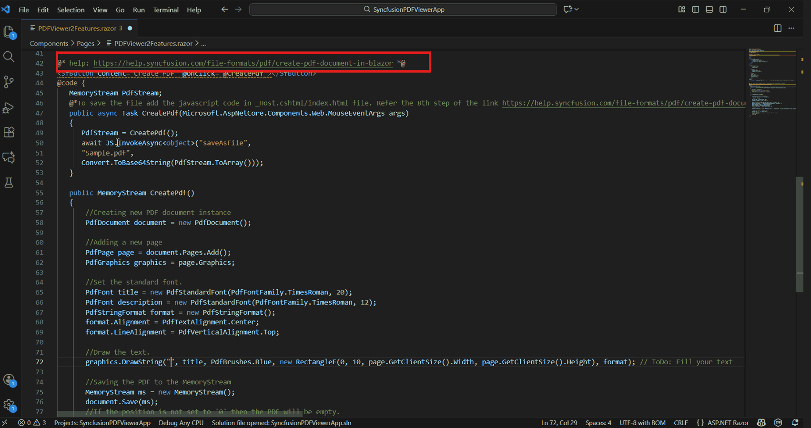
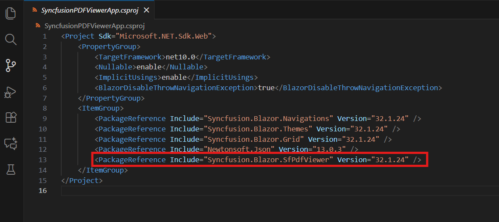
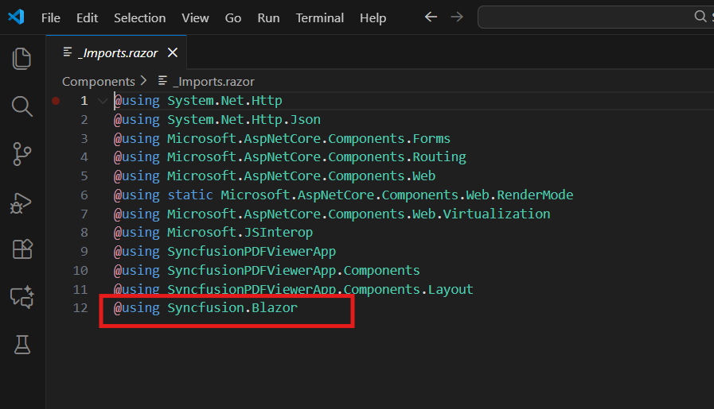
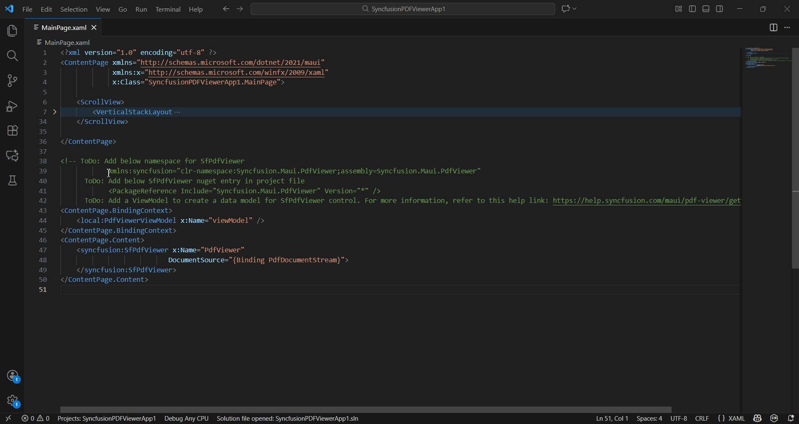
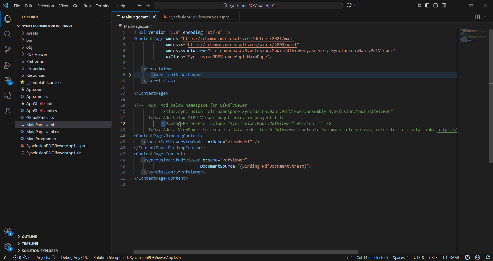

# Add Syncfusion® PDF Viewer SDK component in the Blazor application

The Syncfusion® PDF Viewer SDK code snippet utility for Visual Studio Code includes snippets for inserting a Syncfusion® PDF Viewer SDK component with various features into the Blazor Application's Razor code editor.

   N> The Syncfusion® PDF Viewer SDK code snippet is available from Essential Studio® 2026 Volume 1 (`v*`).

## Add a Syncfusion® PDF Viewer SDK component

The instructions below guide you the process of using the Syncfusion® PDF Viewer SDK code snippet in your Blazor application.

1. In Visual Studio Code, open an existing Blazor Application or create a new Blazor Application.

2. Open the razor file that you need and place the cursor in required place where you want to add Syncfusion® PDF Viewer SDK component.

3. You can find the Syncfusion® PDF Viewer SDK component with the various features by typing the **sf** word in the format shown below.

    ```
    sf<Syncfusion component name>-<Syncfusion component feature>
    For Example, sfpdf
    ```
4. Choose the Syncfusion® PDF Viewer SDK component and click the **Enter** or **Tab** key, the Syncfusion® PDF Viewer SDK component will be added in the razor file.

    

5. After adding the Syncfusion® PDF Viewer SDK component to the razor file, use the tab key to fill in the required values to render the component with data. You can find the comment section in the code snippet to see what values are required.

    

6. You can also find the Syncfusion® help link at the top of the added snippet to learn more about the new Syncfusion® PDF Viewer SDK component feature.

    

## Configure Blazor application with Syncfusion

The Syncfusion® Blazor snippet simply inserts the code into the razor file. You must configure the Blazor application with Syncfusion® by installing the Syncfusion® Blazor NuGet package, namespace, themes, and registering the Syncfusion® Blazor Service. To configure, follow the steps below:

1. Open the Blazor application file and manually add the required Syncfusion® Blazor individual NuGet package(s) for the Syncfusion® Blazor components as a package reference. Refer to [this section](https://blazor.syncfusion.com/documentation/nuget-packages#benefits-of-using-individual-nuget-packages) to learn about the advantages of the individual NuGet packages. This NuGet package will be automatically restored when building the application.

    

    N> Starting with Volume 4, 2020 (v18.4.0.30) release, Syncfusion® provides [individual NuGet packages](https://blazor.syncfusion.com/documentation/nuget-packages) for our Syncfusion® Blazor components. We highly recommend this new standard for your Blazor production applications.

2. To render the Syncfusion® PDF Viewer SDK components in your application, open the **~/_Imports.razor** file and add the required Syncfusion® Blazor namespace entries.

    

3. Add the Syncfusion® Blazor [theme](https://blazor.syncfusion.com/documentation/appearance/themes) in the `<head>` element of the **~/Components/App.razor** page for Web App and `<head>` element of the **~/Pages/_Host.html** page for server application and **~/wwwroot/index.html** page for a client application.

    

4. Open the **~/Program.cs** file for Web App and server application and client application then register the Syncfusion® Blazor Service.

    If you select an **Interactive render mode** as `WebAssembly` or `Auto`, you need to register the Syncfusion® Blazor service in both **~/Program.cs** files of your Blazor Web App.

    

5. If you installed the trial setup or NuGet packages from nuget.org you must register the Syncfusion® license key to your application since Syncfusion® introduced the licensing system from 2018 Volume 2 (v16.2.0.41) Essential Studio® release. Navigate to the [help topic](https://help.syncfusion.com/common/essential-studio/licensing/overview#how-to-generate-syncfusion-license-key) to generate and register the Syncfusion® license key to your application. Refer to this [UG](https://blazor.syncfusion.com/documentation/getting-started/license-key/overview) topic for understanding the licensing details in Essential Studio® for Blazor.


# Add Syncfusion<sup>®</sup> PDF Viewer SDK component in the .NET MAUI application

The Syncfusion<sup>®</sup> .NET MAUI Code Sample Utility for Visual Studio Code provides ready-to-use samples for easily inserting Syncfusion<sup>®</sup> PDF Viewer SDK components with various features into the XAML editor of your .NET MAUI application.

N> The Syncfusion<sup>®</sup> .NET MAUI code sample is available from Essential Studio<sup>®</sup> 2026 Volume 1 (`v*`) onwards.

## Add a Syncfusion<sup>®</sup> PDF Viewer SDK component

The following instructions outline the process of using the Syncfusion<sup>®</sup> PDF Viewer SDK code snippet in your .NET MAUI application.

1.	In Visual Studio Code, either open an existing .NET MAUI application or create a new .NET MAUI Application.

2.	Open the XAML file you require and position the cursor where you want to add the Syncfusion<sup>®</sup> PDF Viewer SDK component.

3.	To access Syncfusion<sup>®</sup> PDF Viewer SDK components with various features, type the **sf** word in the specified format.

```
sf<Syncfusion® component name>-<Syncfusion® component feature>
For Example, sf-pdfviewer
```

4.	Select the Syncfusion<sup>®</sup> PDF Viewer SDK component and press the **Enter** or **Tab** key to add the Syncfusion<sup>®</sup> PDF Viewer SDK component to the XAML file. 

      

5.	After adding the Syncfusion<sup>®</sup> PDF Viewer SDK component to the XAML file, We've included instructions in the **TODO** section for your reference. This will guide you in determining whether to add the the View Model file or if only add namespace and NuGet entries to run the Syncfusion<sup>®</sup> components.

     

6.	You can also find a Syncfusion<sup>®</sup> help link at the top of the added sample to learn more about the new Syncfusion<sup>®</sup> .NET MAUI component feature.

     

## Configure .NET MAUI application with Syncfusion<sup>®</sup>

The Syncfusion<sup>®</sup> .NET MAUI snippet inserts code into the XAML file. However, you need to configure the .NET MAUI project with Syncfusion<sup>®</sup> by installing the Syncfusion<sup>®</sup> .NET MAUI NuGet package and adding the appropriate namespace. To configure, follow these steps:

1.	Open your .NET MAUI project file and manually add the required Syncfusion<sup>®</sup> .NET MAUI NuGet package(s) as package references for the components you want to use. We've provided commented code samples showing the corresponding NuGet entries for each component. Simply copy the relevant entry and paste it into your project file. The package will be automatically restored during the build or save process.

     

2.	To integrate Syncfusion<sup>®</sup> PDF Viewer SDK components into your application, open the XAML file and add the required Syncfusion<sup>®</sup> .NET MAUI namespace entries. We've provided commented code samples showing the appropriate namespace for each component. Simply copy the relevant entry and paste it into your XAML file.

    