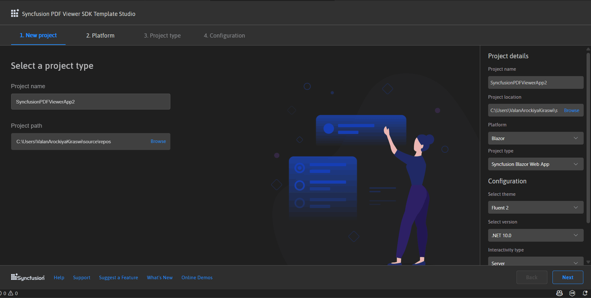
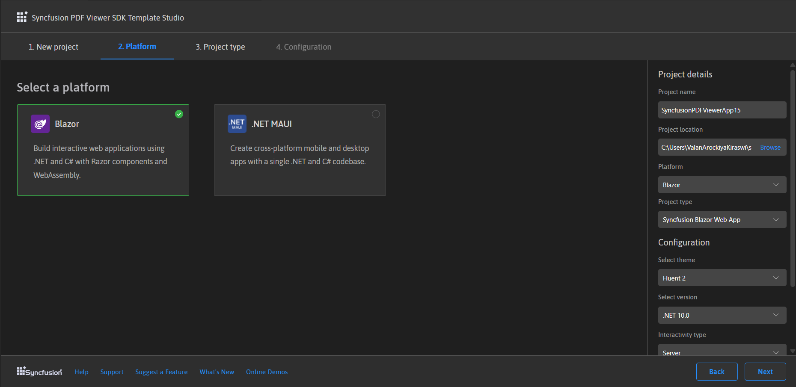
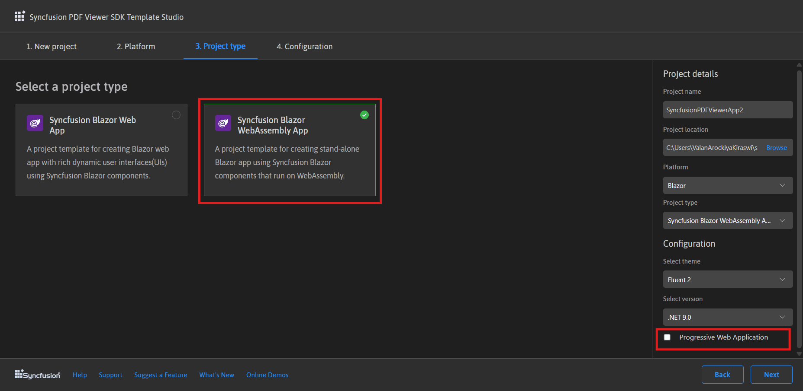
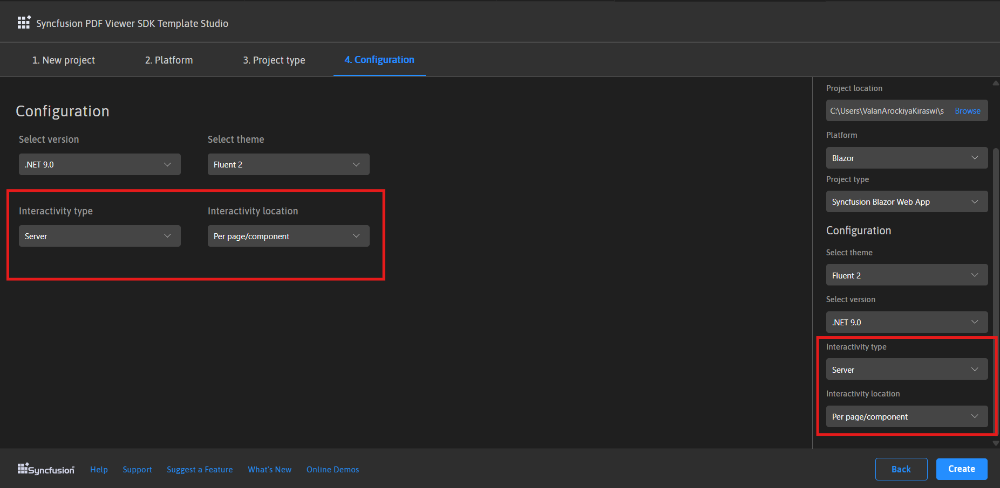
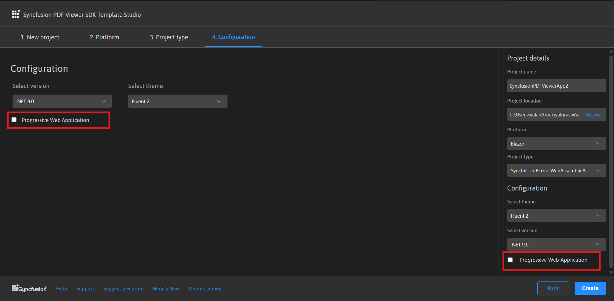
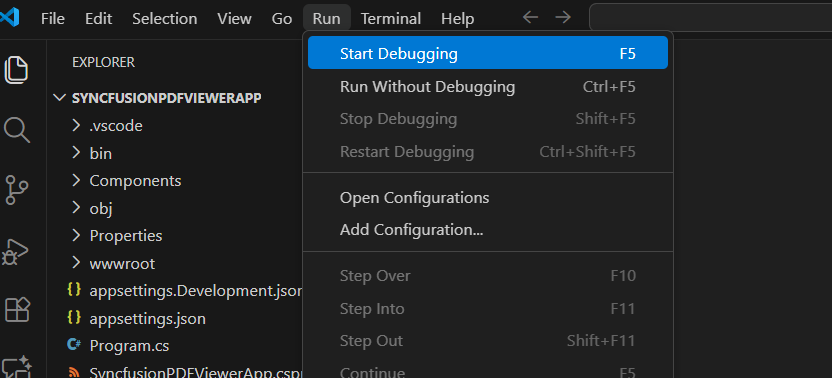

# Creating a Syncfusion® PDF Viewer SDK application

Syncfusion® provides the PDF Viewer SDK Template Studio in Visual Studio Code, which allows you to create a Syncfusion application based on the platform selection such as Blazor, and .NET MAUI using Syncfusion® PDF Viewer SDK component. The Syncfusion® application is created with the required Syncfusion® NuGet references, namespaces, styles, and component render code. The Template Studio includes an easy-to-use project wizard that guides you through the process of creating an application with Syncfusion® PDF Viewer SDK component.

N> PDF Viewer SDK project templates from `v*` are supported by the Syncfusion® Visual Studio Code project template.

The instructions below assist you in creating **Syncfusion® PDF Viewer SDK Applications** using **Visual Studio Code**:

1. To create a Syncfusion® PDF Viewer SDK application in Visual Studio Code, open the command palette by pressing **Ctrl+Shift+P**. Search for the word **Syncfusion** in the Visual Studio Code palette to get the templates provided by Syncfusion®.

    

2. Select **Syncfusion PDF Viewer SDK Template Studio: Launch**, then press **Enter** key. The Template Studio wizard for configuring the Syncfusion® PDF Viewer SDK app will be launched. Provide the Project name and Project path.

    

3. Select either **Next** or the **Platform** tab. Syncfusion® PDF Viewer SDK platform types will be displayed. Select the platform to add the Syncfusion® PDF Viewer SDK component.

    

4. Based on the platform selection, choose the configurations and create the respective application to add the Syncfusion® PDF Viewer SDK component.

    - Blazor Platform:
        
        -  **Project type section**

            Choose one of the Syncfusion® Blazor application types based on the version of the .NET SDK you are using.

            | .NET SDK version | Supported Syncfusion Blazor Application Type |
            | ---------------- | -------------------------------------------- |
            | [.NET 10.0](https://dotnet.microsoft.com/en-us/download/dotnet/10.0), [.NET 9.0](https://dotnet.microsoft.com/en-us/download/dotnet/9.0), [.NET 8.0](https://dotnet.microsoft.com/en-us/download/dotnet/8.0) | Syncfusion Blazor Web App |
            | [.NET 10.0](https://dotnet.microsoft.com/en-us/download/dotnet/10.0), [.NET 9.0](https://dotnet.microsoft.com/en-us/download/dotnet/9.0), [.NET 8.0](https://dotnet.microsoft.com/en-us/download/dotnet/8.0) | Syncfusion Blazor WebAssembly App |
            
            In the **Syncfusion Blazor Web App** application type, you can configure the following options:

            <table>
            <tbody>
            <tr>
            <td>
            <a href="https://learn.microsoft.com/en-us/aspnet/core/blazor/components/render-modes?view=aspnetcore-8.0#render-modes" rel="nofollow">Interactivity type</a>
            </td>
            <td>
            Server, WebAssembly, Auto (Server and WebAssembly)
            </td>
            </tr>
            <tr>
            <td>
            <a href="https://learn.microsoft.com/en-us/aspnet/core/blazor/tooling?view=aspnetcore-8.0&pivots=windows" rel="nofollow">Interactivity location</a>
            </td>
            <td>
            Global, Per page/component
            </td>
            </tr>
            </tbody>
            </table>

            

            In the **Syncfusion Blazor WebAssembly App** application type, you can choose Progressive Web Application.

            

        - **Configuration Section**
    
            Click **Next** or the **Configuration** tab to load the Configuration section. You can choose the required (.NET10.0, .NET 9.0 and .NET 8.0), themes, https configuration, localization option, authentication type, Blazor Web App, and Blazor Web Assembly application types.

            Depending on your Syncfusion Blazor Application Type, refer to the table below for supported authentication types.

            | Syncfusion Blazor Application Type | Supported Authentication Types |
            | ------------- | ------------- |
            | Syncfusion Blazor Web App | None and Individual Accounts |
            | Syncfusion Blazor WebAssembly App | None, Individual Accounts and Microsoft Identity Platform |

            If you choose the **Blazor Web App** application type, you can customize the Interactivity type and Interactivity location options.

            

            If you choose the **Blazor Web Assembly App** application type, you can customize the Progressive Web Application option.

            

            Click **Create** button. The Syncfusion® PDF Viewer SDK Blazor application has been created. The created Syncfusion® PDF Viewer SDK Blazor app has the Syncfusion NuGet packages, styles, and the render code for Syncfusion® PDF Viewer SDK component.

    - . NET MAUI Platform
    
        - **Configuration Section**
    
            You can select the required .NET Core Version (.NET 9.0 or .NET 10.0) and themes
    
            
            
            Click **Create** button. The Syncfusion® PDF Viewer SDK .NET MAUI application has been created and has the Syncfusion NuGet packages, styles, and the render code for Syncfusion® PDF Viewer SDK component.
    
5. You can run the application to see the Syncfusion® components. Click **F5** or go to **Run>Start Debugging**.

     

6. The Syncfusion® PDF Viewer SDK application configures with most recent Syncfusion® Blazor NuGet packages version, selected style, namespaces, selected authentication, and component render code for Syncfusion® PDF Viewer SDK components.

7. If you installed the trial setup or NuGet packages from nuget.org you must register the Syncfusion® license key to your application since Syncfusion® introduced the licensing system from 2018 Volume 2 (v16.2.0.41) Essential Studio® release. Navigate to the [help topic](https://help.syncfusion.com/common/essential-studio/licensing/license-key#how-to-generate-syncfusion-license-key) to generate and register the Syncfusion® license key to your application. Refer to this [UG](https://blazor.syncfusion.com/documentation/getting-started/license-key/overview) topic for understanding the licensing details in Essential Studio® for Blazor.

## Syncfusion® integration

The Syncfusion® Blazor application configures with latest Syncfusion® Blazor NuGet packages, styles, namespaces, and component render code for Syncfusion® components are added in the created application.

### NuGet Packages

The `Syncfusion.Blazor` NuGet package will be added as NuGet references for all application types.

### Style

The selected theme is added from Syncfusion® NuGet and its reference at these applications locations in Blazor.

| Application type  | File location  |
|---|---|
| Syncfusion Blazor Web App | ~/Components/App.razor |
| Syncfusion Blazor WebAssembly App (ASPNET Core hosted)   Syncfusion Blazor WebAssembly App (Progressive Web Application) | {Client Project location}/wwwroot/index.html  |
| Syncfusion Blazor WebAssembly App  | {Project location}/wwwroot/index.html|

### Namespaces

The Syncfusion® Blazor namespaces are added in the **`_imports.razor`** file.

### Component render code

The Syncfusion® Blazor Calendar, Button, and DataGrid component render code is in the Razor files in the pages folder. The render code is updated in these Razor files.

| File name  | Code snippet added |
|---|---|
| `~/Pages/Home.razor or Index.razor`  |  |
| `~/Pages/Counter.razor` |  |
| `~/Pages/FetchData.razor`  |  |