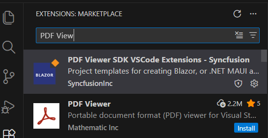
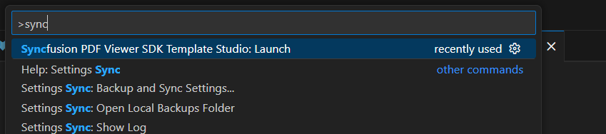
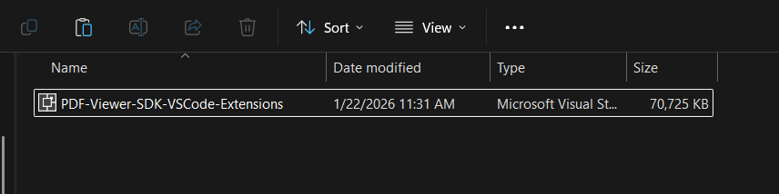

# Download and Installation - PDF Viewer SDK Extension for Visual Studio Code

Syncfusion® publishes the Visual Studio Code extension in the [Visual Studio Code marketplace](https://marketplace.visualstudio.com/items?itemName=SyncfusionInc.PDF-Viewer-SDK-VSCode-Extensions). You can either install it directly from Visual Studio Code or download and install it from the Visual Studio Code marketplace.

## Prerequisites

The following software prerequisites must be installed to install the Syncfusion® PDF Viewer SDK extension, as well as to creating, and adding component code Syncfusion® PDF Viewer SDK applications.

* [Visual Studio Code 1.87.1 or later](https://code.visualstudio.com/download)

* [C# Extension ](https://marketplace.visualstudio.com/items?itemName=ms-dotnettools.csharp) 

* [C# Dev Kit](https://marketplace.visualstudio.com/items?itemName=ms-dotnettools.csdevkit)

## Install through the Visual Studio Code Extensions

The instructions below describe the process of installing the Syncfusion® PDF Viewer SDK extensions from Visual Studio Code Extensions.

1. Open Visual Studio Code.

2. Navigate to **View > Extensions**, and the Manage Extensions option will appear on the left side of the window.

3. By entering the keyword **"PDF Viewer SDK"** in the search box, you can find the Syncfusion® PDF Viewer SDK Visual Studio Code extension in the Visual Studio Code Marketplace.

     

4. Install the **"PDF Viewer SDK VSCode Extensions - Syncfusion"** extension by clicking the **Install** button.

5. Reload Visual Studio Code after installation by using the **Reload Window** command in the Visual Studio Code palette. You can open the command palette by pressing **Ctrl+Shift+P** and find the Reload Window from Visual Studio Code commands.

     

6. Now, you can create a new Syncfusion® PDF Viewer SDK application by using the Syncfusion® PDF Viewer SDK extensions from the Visual Studio Code Palette Find the **Syncfusion PDF Viewer SDK Template Studio: Launch** from Visual Studio Code commands to open the Syncfusion PDF Viewer SDK Template Studio wizard.

     

## Install from the Visual Studio Code Marketplace

The instructions below describe the process of downloading and installing Syncfusion® PDF Viewer SDK applications from the Visual Studio Code Marketplace.

1. Open [Syncfusion® PDF Viewer SDK Code Extensions](https://marketplace.visualstudio.com/items?itemName=SyncfusionInc.PDF-Viewer-SDK-VSCode-Extensions) in Visual Studio Code Marketplace.

2. Click Install from Visual Studio Code Marketplace. The browser displays a popup window with information such as **"Open Visual Studio Code"**. When you click Open Visual Studio Code, the [Syncfusion® PDF Viewer SDK Extension](https://marketplace.visualstudio.com/items?itemName=SyncfusionInc.PDF-Viewer-SDK-VSCode-Extensions) will launch in Visual Studio Code.

3. Install the **"PDF Viewer SDK VSCode Extensions - Syncfusion"** extension by clicking the **Install** button.

4. Reload Visual Studio Code after installation by using the **Reload Window** command in the Visual Studio Code palette. You can open the command palette by pressing **Ctrl+Shift+P** and find the Reload Window from Visual Studio Code commands.

     

5. Now, you can create a new Syncfusion® PDF Viewer SDK application by using the Syncfusion® PDF Viewer SDK extensions from the Visual Studio Code Palette Find the **Syncfusion PDF Viewer SDK Template Studio: Launch** from Visual Studio Code commands to open the Syncfusion PDF Viewer SDK Template Studio wizard.

     

## Manually Installing an Extension in Visual Studio Code
The instructions below describe the process of installing the Syncfusion® PDF Viewer SDK extensions manually in Visual Studio Code.

1. Install the extension by downloading it from the Visual Studio Marketplace and then installing it from a local file within VS Code. To do this: Download the **"SyncfusionInc.PDF-Viewer-SDK-VSCode-Extensions.vsix"** file from the [Visual Studio Code Marketplace](https://marketplace.visualstudio.com/items?itemName=SyncfusionInc.PDF-Viewer-SDK-VSCode-Extensions).

2. In VS Code, go to the Extensions view by clicking on the Extensions icon in the Activity Bar.

      

3. Click on the three dots (ellipsis) in the top-right corner and select "Install from VSIX."

      

4. Browse to the downloaded SyncfusionInc.Blazor-VSCode-Extensions.vsix file and install it.

      
