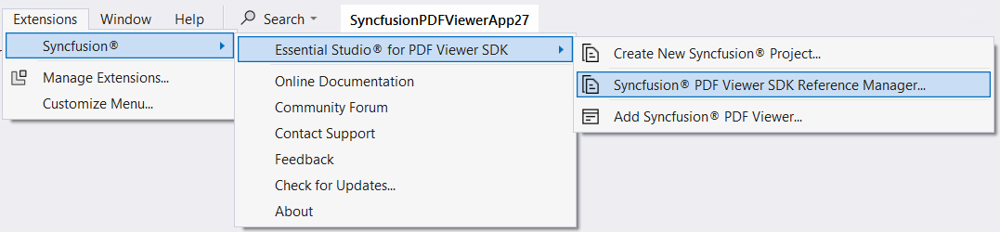
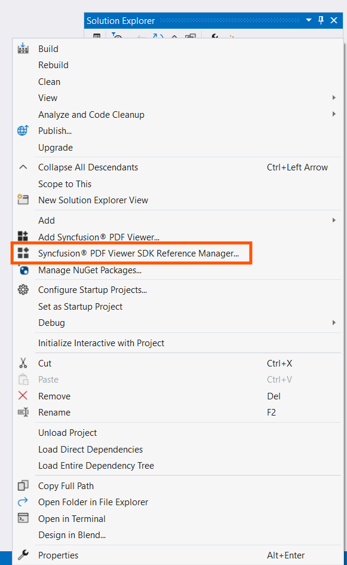
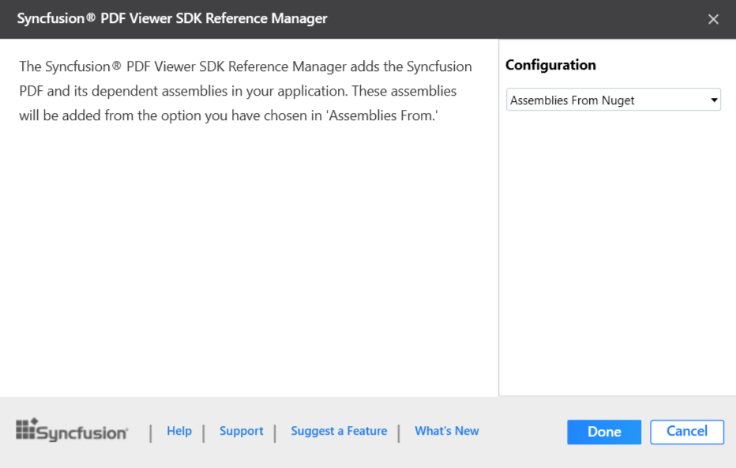
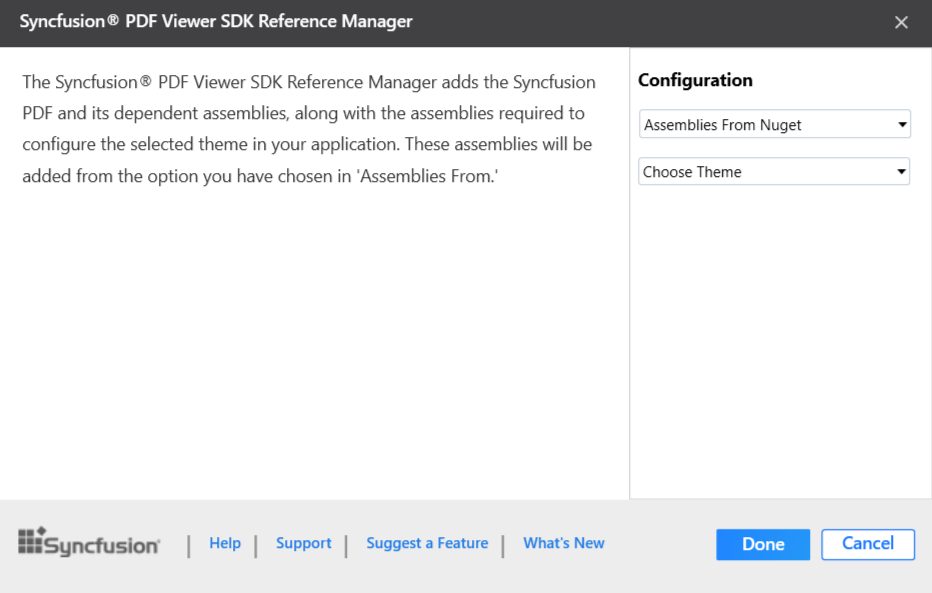
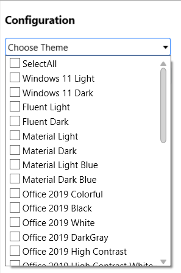
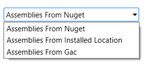
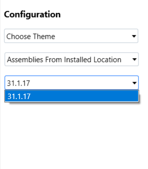
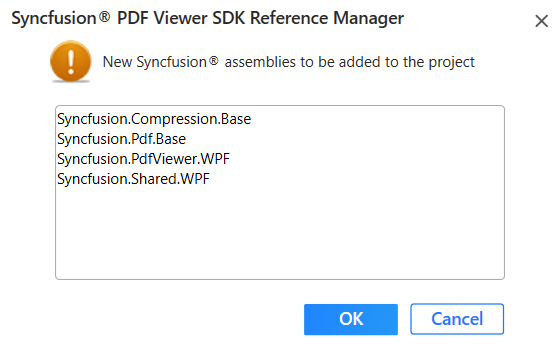
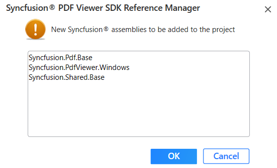

# Add Syncfusion® PDF Viewer SDK Reference - WinForms or WPF Application

Syncfusion® PDF Viewer SDK Reference Manager is an Add-In for WinForms and WPF application. It adds the Syncfusion&reg; PDF Viewer SDK assembly reference to the project, either from the GAC location or Essential Studio&reg; installed location. It can also migrate the projects that contain the old versions of the Syncfusion&reg; assembly reference to newer or specific versions of the Syncfusion&reg; assembly reference.

N> This Syncfusion® PDF Viewer SDK Reference Manager can be applied to a project for Syncfusion&reg; assembly version 31.2.2 and later.

Follow the given steps to add the Syncfusion® PDF Viewer SDK Reference Manager in Visual Studio:

> Before use the Syncfusion® PDF Viewer SDK Reference Manager, check whether the **Syncfusion® PDF Viewer SDK Extensions - Syncfusion&reg;** installed or not in Visual Studio Extension Manager by clicking on the Tools -> Extensions and Updates -> Installed for Visual Studio 2022 or later by clicking on the Extensions -> Manage Extensions -> Installed.If this extension not installed, please install the extension by follow the steps from the [download and installation](https://help.Syncfusion.com/extension/pdfviewer-sdk-extension/visual-studio/download-and-installation/) help topic.

1. Open a new or existing **WinForms** or **WPF** application.

2. To open Syncfusion® PDF Viewer SDK Reference Manager Wizard, follow either one of the options below:

   **Option 1:**  
   Click **Syncfusion&reg; Menu** and choose **Essential Studio&reg; for Syncfusion® PDF Viewer SDK > Add Syncfusion® PDF Viewer SDK Reference Manager…**.

   

   **Option 2:**  
   Right-click the selected WinForms and WPF project file from Solution Explorer, then select **Syncfusion® PDF Viewer SDK Reference Manager…** from **Context Menu**. The following screenshot shows this option in Visual Studio.   

   

3. The Syncfusion® PDF Viewer SDK Reference Manager Wizard will be loaded.

   - Windows Forms:

      

   - WPF:

      

   **Choose Theme:** Choose the required Theme options which is enabled only for WPF application from the dropdown.

   

   **Assembly From:** Choose the assembly location, either from NuGet packages, the build installed location, or by using the GAC location.

   N> The installed location and GAC option will be available only when the Syncfusion&reg; PDF Viewer SDK setup has been installed.

   

   N> The GAC option will not be available if you have selected a WinForms or WPF (.NET 8.0, .NET 7.0, and .NET 6.0) application in Visual Studio 2022 or later.

   **Version:** Choose the installed build version to add the corresponding version assemblies to the project.

   

4. click Done to add the required assemblies for the PDF Viewer SDK control into the project. The following screenshot shows the list of required assemblies for the control to be added.

   - Windows Forms:

      

   - WPF:

      

5. Click **OK**. The listed Syncfusion&reg; assemblies are added to project. Then it notifies “Syncfusion&reg; PDF Viewer SDK assemblies have been added successfully” in Visual Studio status bar.

6. Then, Syncfusion&reg; licensing registration required message box will be shown, if you installed the trial setup or NuGet packages since Syncfusion&reg; introduced the licensing system from 2018 Volume 2 (v16.2.0.41) Essential Studio&reg; release. Navigate to the  [help topic](https://help.Syncfusion.com/common/essential-studio/licensing/license-key#how-to-generate-Syncfusion-license-key), which is shown in the licensing message box to generate and register the Syncfusion&reg; license key to your project. Refer to this [blog](https://blog.Syncfusion.com/post/Whats-New-in-2018-Volume-2-Licensing-Changes-in-the-1620x-Version-of-Essential-Studio.aspx) post for understanding the licensing changes introduced in Essential Studio&reg;.

   

N>  Syncfusion&reg; provides Syncfusion® PDF Viewer SDK Reference Manager support for specific .NET Framework, which is shipped (assemblies) in Syncfusion&reg; Essential Studio&reg; setup. So, if you try to add Syncfusion&reg; assemblies in the project and project framework is not supported with selected Syncfusion&reg; version assemblies, the dialog appears along with **“Current build v{version} is not supported this framework v{Framework Version}”** message.

