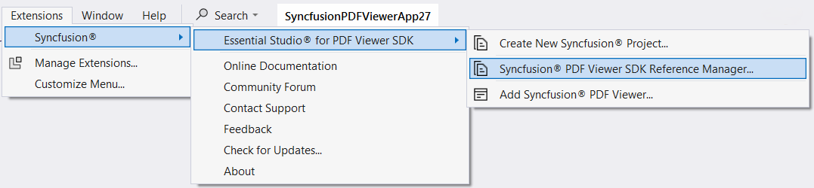
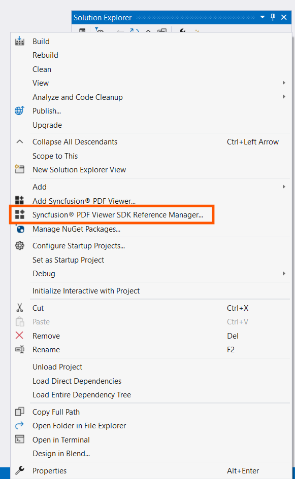
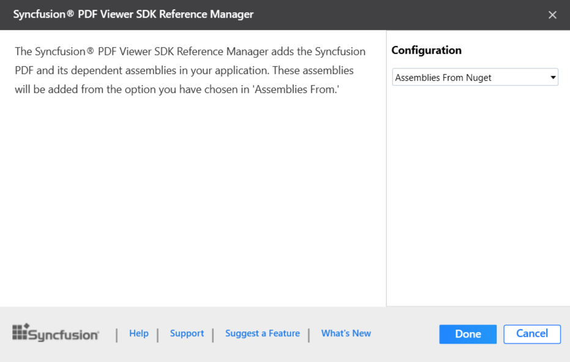
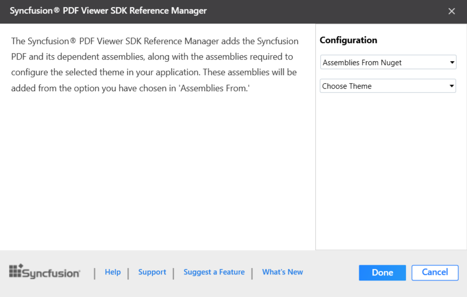
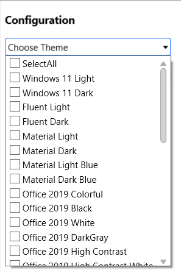
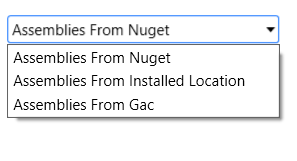
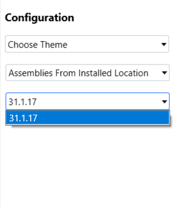
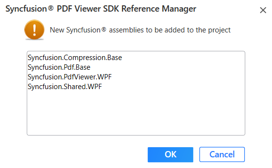
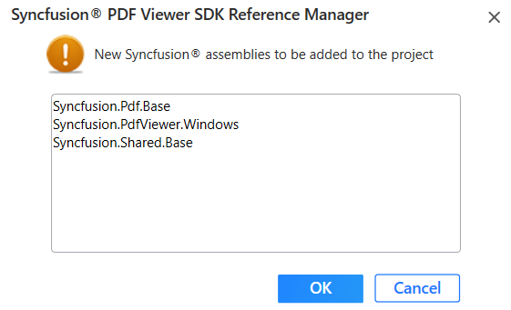
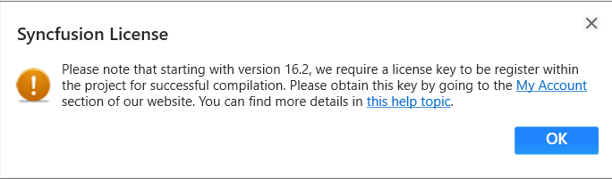

# Add Syncfusion® PDF Viewer SDK Reference - WinForms or WPF Application

Syncfusion® PDF Viewer SDK Reference Manager is an Add-In for WinForms and WPF applications. It adds the required Syncfusion&reg; PDF Viewer SDK assembly references to the project, either from the GAC location or the Essential Studio&reg; installed location. It can also migrate projects that contain old versions of the Syncfusion&reg; assembly reference to newer or specific versions of the Syncfusion&reg; assembly reference.

N> This Syncfusion® PDF Viewer SDK Reference Manager can be applied to a project for Syncfusion&reg; assembly version 32.1.19 and later. The latest supported version is v33.1.44.

Follow the given steps to add the Syncfusion® PDF Viewer SDK Reference Manager in Visual Studio:

> Before using the Syncfusion® PDF Viewer SDK Reference Manager, check whether the **Syncfusion® PDF Viewer SDK Extension** is installed. In **Visual Studio 2022 or later**, go to **Extensions > Manage Extensions > Installed**. If this extension is not installed, please install the extension by following the steps from the [download and installation](https://help.syncfusion.com/extension/pdfviewer-sdk-extension/visual-studio/download-and-installation) help topic.

1. Open a new or existing **WinForms** or **WPF** application.

2. To open the Syncfusion® PDF Viewer SDK Reference Manager Wizard, follow either one of the options below:

   **Option 1:**
   Click **Syncfusion&reg; Menu** and choose **Essential Studio&reg; for Syncfusion® PDF Viewer SDK > Add Syncfusion® PDF Viewer SDK Reference Manager…**.

   

   **Option 2:**
   Right-click the selected WinForms or WPF project file in **Solution Explorer**, then select **Syncfusion® PDF Viewer SDK Reference Manager…** from the context menu. The following screenshot shows this option in Visual Studio.

   

3. The Syncfusion® PDF Viewer SDK Reference Manager Wizard will be loaded.

   - **Windows Forms:**

      

   - **WPF:**

      

   In the wizard, configure the following options:

   - **Choose Theme:** Choose the required theme from the dropdown. This option is enabled only for WPF applications. Supported themes include Material 3, Fluent, Office 2019 (Colorful, Black, Dark Gray, White), and others shipped with the Essential Studio® PDF Viewer SDK.

      

   - **Assembly From:** Choose the assembly location — either from **NuGet** packages (recommended for new projects and online-restored scenarios), the **build installed location**, or by using the **GAC** location (recommended when migrating older projects that previously referenced assemblies from the installed location).

      N> The installed location and GAC options will be available only when the Syncfusion&reg; PDF Viewer SDK setup has been installed.

      

   - **Version:** Choose the installed build version to add the corresponding version assemblies to the project. The dropdown lists only the versions that are installed locally; if a version is missing, install the corresponding Essential Studio® PDF Viewer SDK build first.

      

4. Click **Done** to add the required assemblies for the PDF Viewer SDK control into the project. The following screenshot shows the list of required assemblies for the control to be added.

   - Windows Forms:

      

   - WPF:

      

5. Click **OK**. The listed Syncfusion&reg; assemblies are added to the project. The Visual Studio status bar notifies **“Syncfusion&reg; PDF Viewer SDK assemblies have been added successfully”**.

6. Then, the Syncfusion&reg; licensing registration required message box will be shown if you installed the trial setup or NuGet packages, since Syncfusion&reg; introduced the licensing system from 2018 Volume 2 (v16.2.0.41) Essential Studio&reg; release. Navigate to the [help topic](https://help.syncfusion.com/common/essential-studio/licensing/license-key#how-to-generate-syncfusion-license-key), which is shown in the licensing message box to generate and register the Syncfusion&reg; license key to your project. Refer to this [blog](https://blog.syncfusion.com/post/Whats-New-in-2018-Volume-2-Licensing-Changes-in-the-1620x-Version-of-Essential-Studio.aspx) post for understanding the licensing changes introduced in Essential Studio&reg;.

   

N>  Syncfusion&reg; provides Syncfusion® PDF Viewer SDK Reference Manager support for specific .NET Framework, which is shipped (assemblies) in Syncfusion&reg; Essential Studio&reg; setup. So, if you try to add Syncfusion&reg; assemblies in the project and project framework is not supported with selected Syncfusion&reg; version assemblies, the dialog appears along with **“Current build v{version} is not supported this framework v{Framework Version}”** message.

