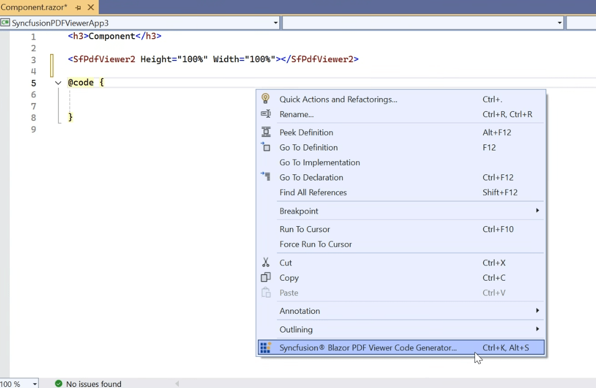
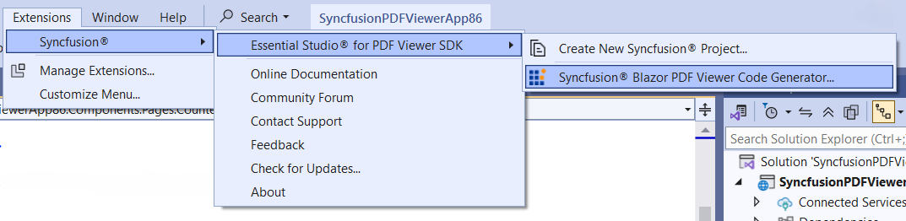
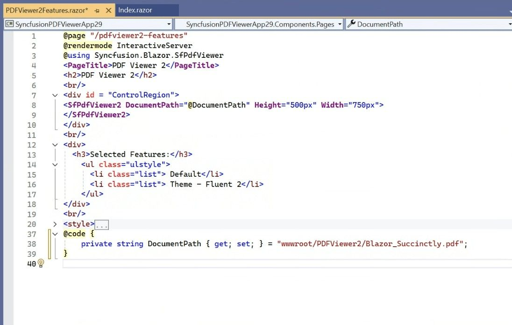
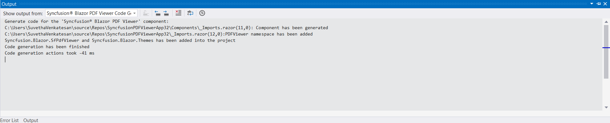

# Add Blazor PDF Viewer SDK component code

Syncfusion® offers a Code Generator component for the Blazor platform that adds the Syncfusion® PDF Viewer SDK component to your Razor files with minimal effort. It automatically inserts the necessary code, including the PDF Viewer SDK component, required namespaces, styles, and NuGet references, at your chosen location. It simplifies the process by interacting with data models and embedding the Syncfusion® PDF Viewer SDK component with the desired features directly into your application.

The steps below will assist you to add the Syncfusion® PDF Viewer SDK component code in your Blazor application through **Visual Studio 2022 or later**:

N> Before using the Syncfusion® Blazor PDF Viewer SDK Code Generator, check whether the Syncfusion® PDF Viewer SDK Extension is installed in the Visual Studio Extension Manager by clicking on **Extensions > Manage Extensions > Installed**. If this extension is not installed, follow the steps from the [download and installation](download-and-installation) help topic.

N> The target project must be a Blazor Web App or Blazor WebAssembly project. The Syncfusion® Blazor NuGet package will be added automatically, but for production projects we recommend [using individual NuGet packages](https://blazor.syncfusion.com/documentation/nuget-packages).

1. Open your existing Blazor application or create a new Blazor application in Visual Studio 2022 or later.

2. To open the Syncfusion® Blazor PDF Viewer SDK Code Generator, select one of the options below in the Razor file, and then add the Syncfusion® PDF Viewer SDK component:

    **Option 1:** Right-click in the Razor file editor at the required line and select **Syncfusion® Blazor PDF Viewer SDK Code Generator...**

    

    **Option 2:** Open the .razor file, place the cursor at the required line, then choose **Extension > Syncfusion® > Essential Studio® for PDF Viewer SDK > Syncfusion® Blazor PDF Viewer SDK Code Generator…** from the Visual Studio menu.

    

    The selected Syncfusion® PDF Viewer SDK component render code is generated and inserted wherever the cursor is positioned.

    

3. In the Output window, select the **Syncfusion® Blazor PDF Viewer SDK Code Generator** from the **“Show output from”** drop-down to see the changes made to your application. The window logs the inserted component, namespaces, styles, and NuGet references. If a step fails, the error message is shown here.

    

4. The selected Syncfusion® Blazor PDF Viewer SDK component code is inserted into the active Razor file, and the application is configured with the latest NuGet package, styles, and namespaces required for the selected component.

5. Build and run the application to verify the component renders correctly.

6. If you have installed the trial setup or NuGet packages from nuget.org, you must register the Syncfusion® license key to your application as Syncfusion® has introduced the licensing system from 2018 Volume 2 (v16.2.0.41) Essential Studio® release. Navigate to the [help topic](https://help.syncfusion.com/common/essential-studio/licensing/overview#how-to-generate-syncfusion-license-key) to generate and register the Syncfusion® license key to your application. Refer to this [blog](https://www.syncfusion.com/blogs/post/whats-new-in-2018-volume-2) post to know more about the licensing changes introduced in Essential Studio®.
