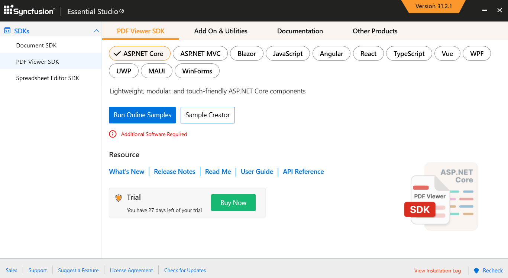
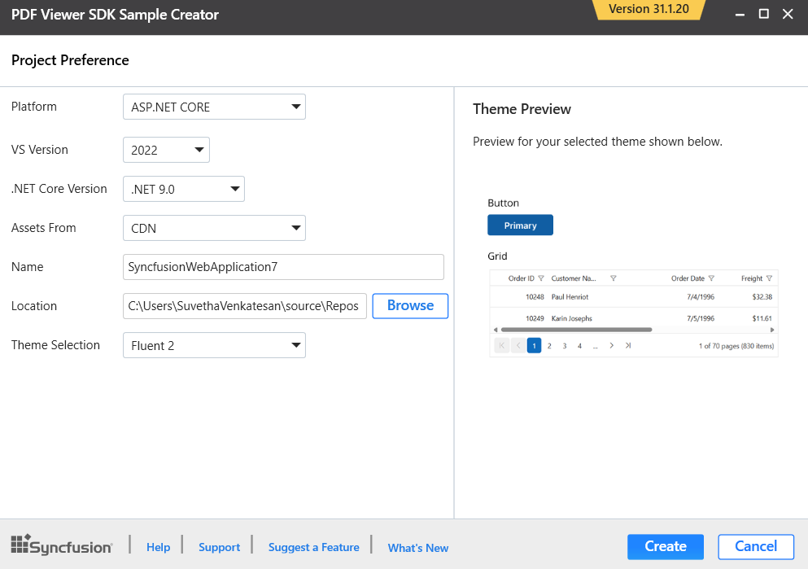
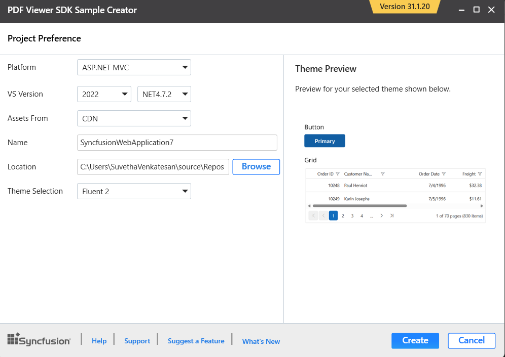
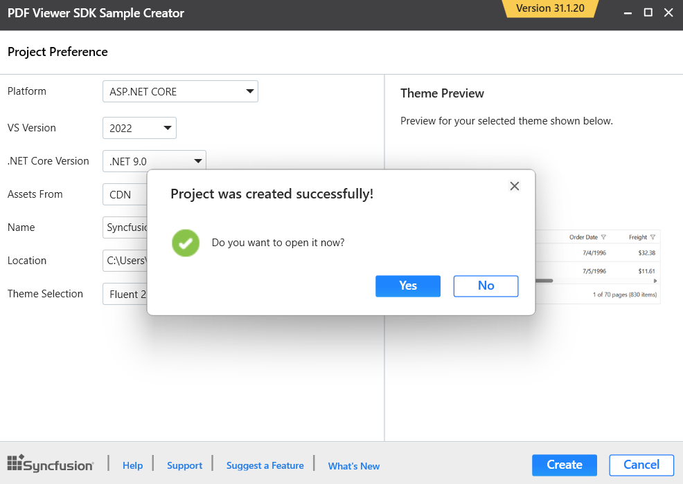
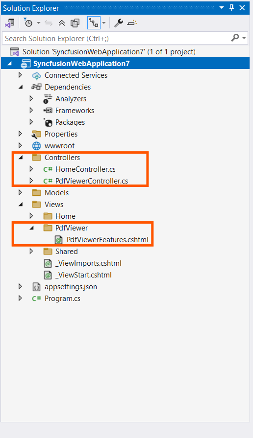
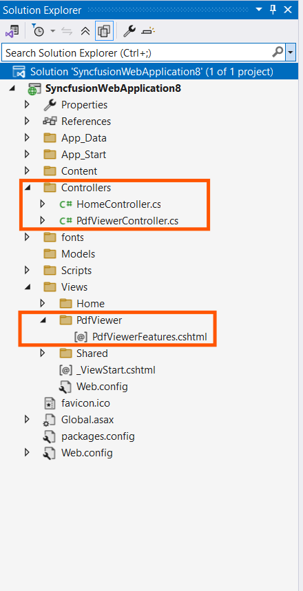
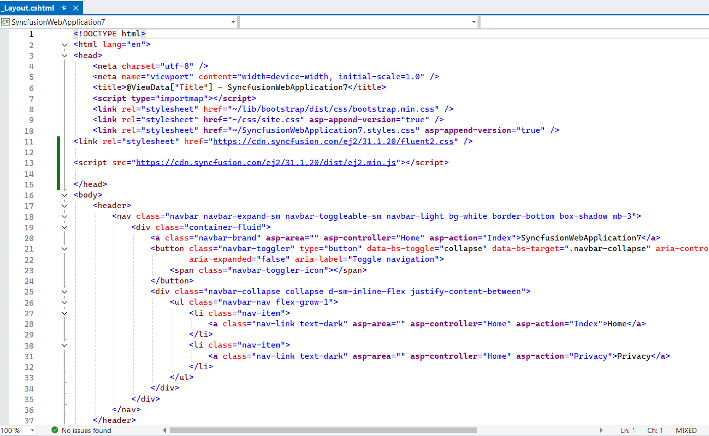
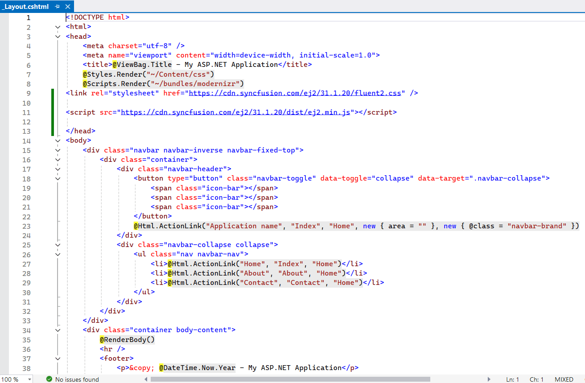
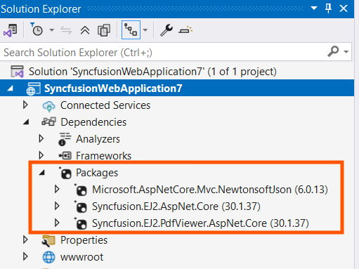
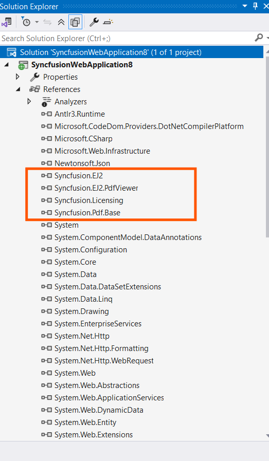

# Sample Creator for Syncfusion® PDF Viewer SDK

The Syncfusion® PDF Viewer SDK Sample Creator is a tool that lets you create Syncfusion® ASP.NET Core or ASP.NET MVC projects with sample code for Syncfusion® PDF Viewer SDK component features and control configuration.

I> The Syncfusion® PDF Viewer SDK Sample Creator utility is available from v31.2.2

## Create Syncfusion® ASP.NET Core or ASP.NET MVC Web Application from Sample Creator

The following steps help you to create the Syncfusion® ASP.NET Core or ASP.NET MVC Web Application via the Sample Creator utility.

1.  Launch the Syncfusion® PDF Viewer SDK Control Panel and click the Sample Creator button to launch the PDF Viewer SDK Sample Creator utility.

    

### Project Configuration

1.  You can configure the following project details in the Sample Creator.
    
    -   Platform Type – Select the type of platform either ASP.NET Core or MVC.
        
        -   ASP.NET Core:
            
            -   Select the VS Version - Choose the Visual Studio Version
            -   .NET Core – Choose the .NET Core version
            -   Assets From – Load the Syncfusion® assets to either CDN or NPM.
            
            
            
        -   ASP .NET MVC:
            
            -   Select the VS Version - Choose the Visual Studio Version
            -   .NET Framework – Choose the .NET Framework version
            -   Assets From – Load the Syncfusion® assets to either CDN or NuGet.
            
            
            
    -   Name – Name your Syncfusion® ASP.NET Core or ASP.NET MVC Application.
        
    -   Location – Choose the target location of your project.
        
    -   Theme Selection – Choose the required theme.The Theme Preview section shows the control preview before create the Syncfusion® project.
        
2.  Click **Create** button. After creating the project, open the project by clicking **Yes**. If you click **No**, the corresponding location of the project will be opened. Refer to the following screenshot for more information.
    
    
    
3.  The new Syncfusion® project is created with the resources.
    
    -   Added the required PDF Viewer SDK Controller and View files in the project.
        
        -   ASP.NET Core:
            
            
            
        -   ASP.NET MVC:
            
            
            
    -   Included the required Syncfusion® PDF Viewer SDK scripts and theme files.
        
        -   ASP.NET Core:
            
            
            
        -   ASP.NET MVC:
            
            
            
    -   The required Syncfusion® PDF Viewer SDK assemblies are added for control under Project Reference.
        
        -   ASP.NET Core:
            
            
            
        -   ASP .NET MVC:
            
            