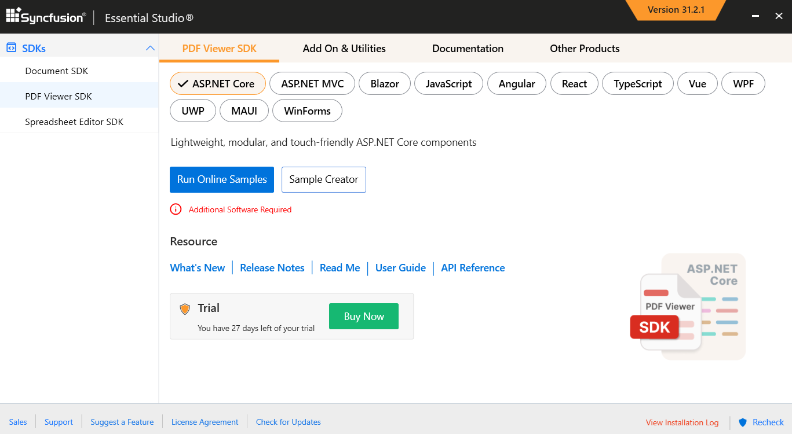
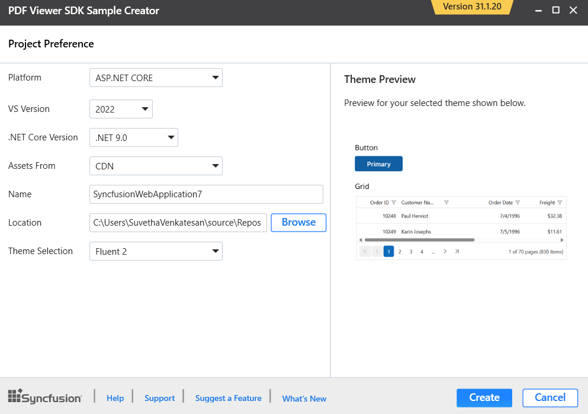
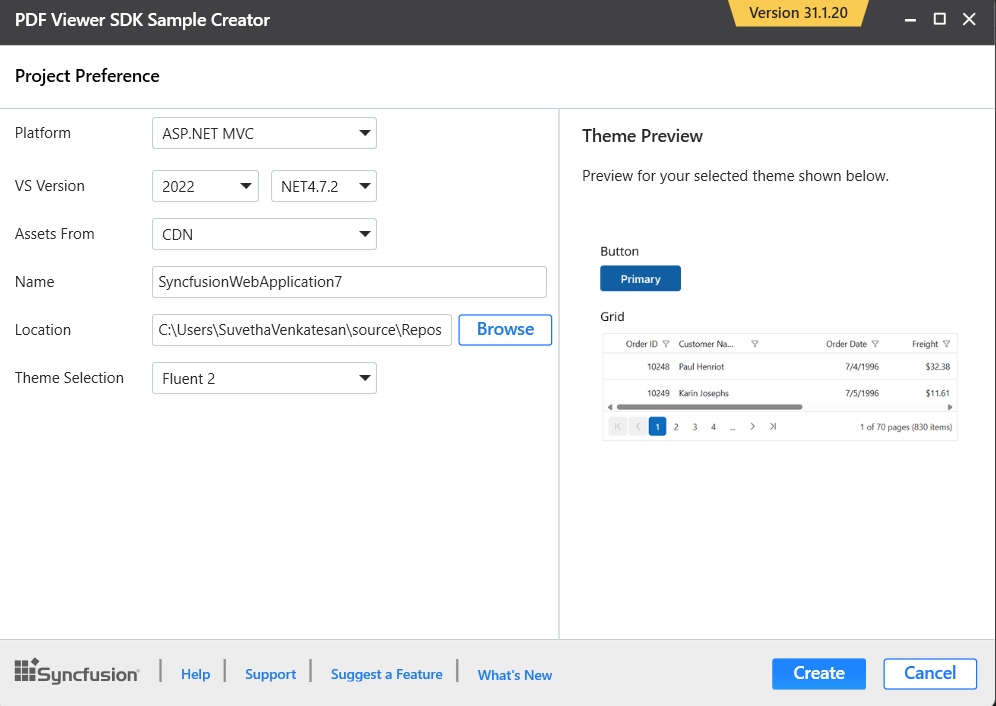
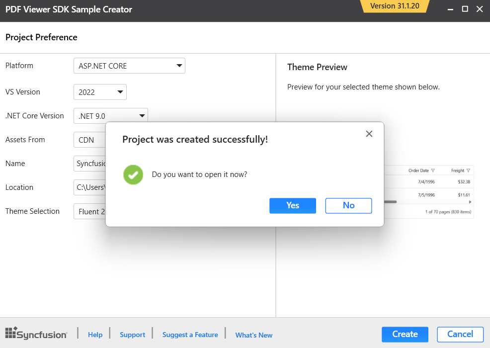
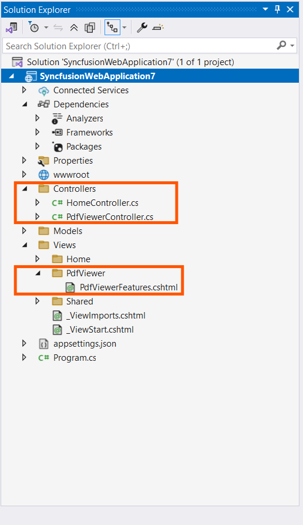
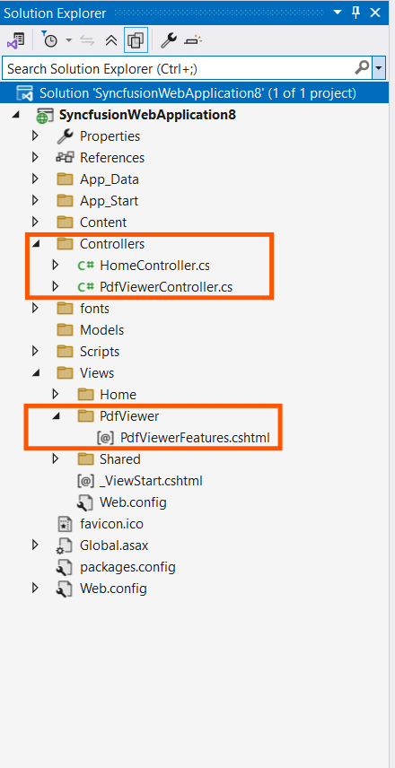
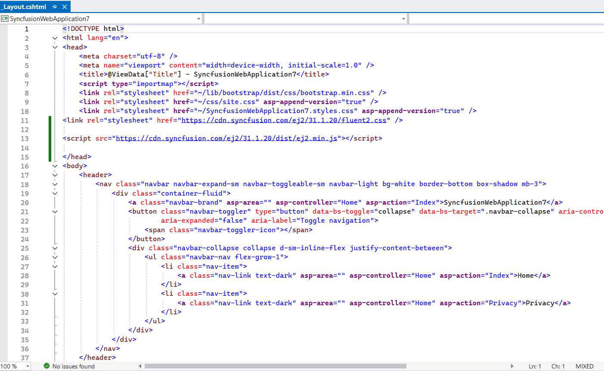
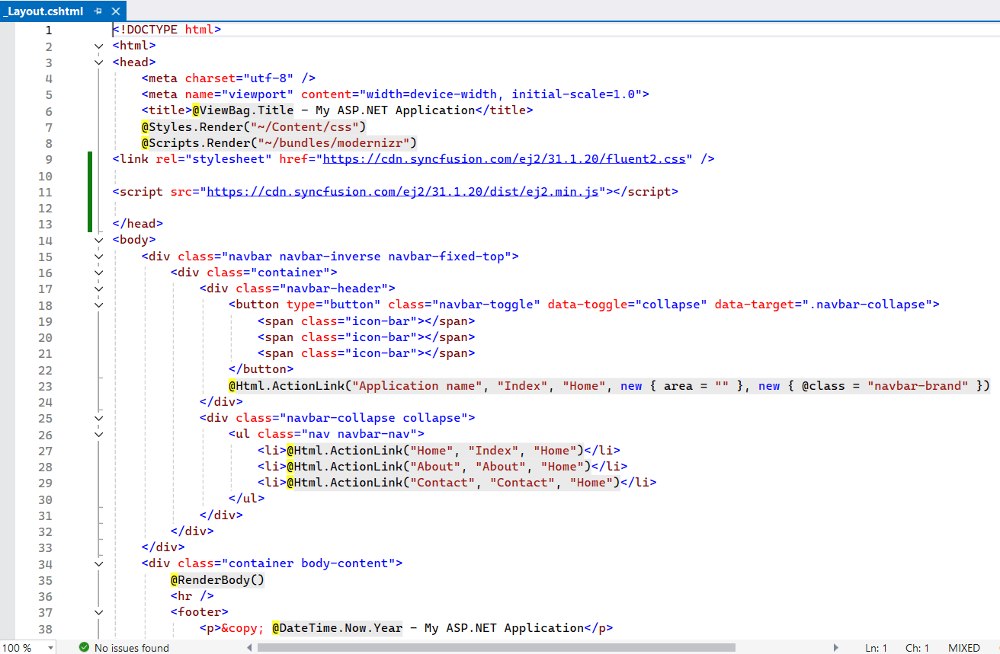
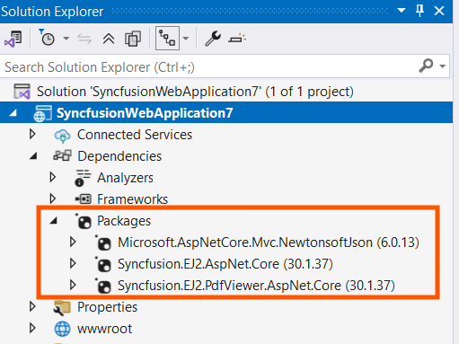
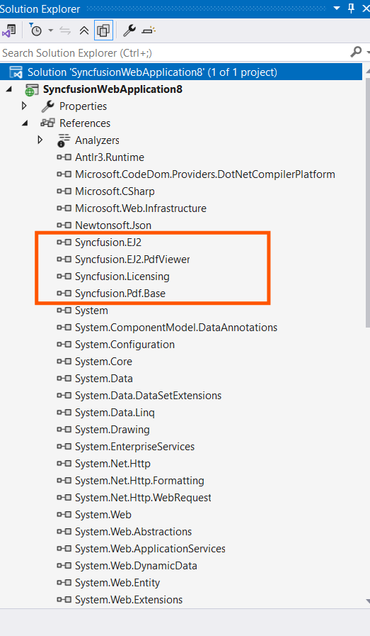

# Sample Creator for Syncfusion® PDF Viewer SDK

The Syncfusion® PDF Viewer SDK Sample Creator lets you create ASP.NET Core or ASP.NET MVC projects with sample code for the PDF Viewer SDK component features and control configuration.

I> The Syncfusion® PDF Viewer SDK Sample Creator utility is available from v31.2.2 onwards. The latest supported version is v33.1.44.

N> Prerequisite: The Syncfusion® Essential Studio® PDF Viewer SDK setup must be installed (provides the Control Panel that launches the Sample Creator). The Visual Studio **ASP.NET and web development** workload is also required.

## Create Syncfusion® ASP.NET Core or ASP.NET MVC Web Application from Sample Creator

The following steps help you to create the Syncfusion® ASP.NET Core or ASP.NET MVC Web Application via the Sample Creator utility.

1.  Launch the Syncfusion® PDF Viewer SDK Control Panel and click the Sample Creator button to launch the PDF Viewer SDK Sample Creator utility.

    

### Project Configuration

1.  You can configure the following project details in the Sample Creator.

    -   **Platform Type** – Select the platform, either ASP.NET Core or MVC. **ASP.NET Core** is recommended for new projects; choose **MVC** only when you must maintain a .NET Framework application.

        -   **ASP.NET Core**

            | Option | Description |
            | --- | --- |
            | Select the VS Version | Choose the Visual Studio version (2022 or 2026). |
            | .NET Core | Choose the .NET Core version (.NET 8.0, 9.0, or 10.0). |
            | Assets From | Load the Syncfusion® assets from CDN (recommended for online apps) or NPM (for client-side bundling). |

            

        -   **ASP.NET MVC**

            | Option | Description |
            | --- | --- |
            | Select the VS Version | Choose the Visual Studio version (2022 or 2026). |
            | .NET Framework | Choose the .NET Framework version (4.6.2 or later). |
            | Assets From | Load the Syncfusion® assets from CDN or NuGet. |

            

    -   **Name** – Name your Syncfusion® ASP.NET Core or ASP.NET MVC Application.

    -   **Location** – Choose the target location of your project.

    -   **Theme Selection** – Choose the required theme. The Theme Preview section shows the control preview before creating the Syncfusion® project. Supported themes include Material 3, Fluent, Bootstrap 5, Tailwind, and others shipped with the Essential Studio® PDF Viewer SDK.

2.  Click **Create**. After creating the project, click **Yes** to open it in Visual Studio. If you click **No**, the folder containing the project is opened in Windows Explorer.

    

3.  Build and run the project to verify the sample renders correctly.

4.  The new Syncfusion® project is created with the resources.

    -   Added the required PDF Viewer SDK Controller and View files in the project.

        -   ASP.NET Core:

            

        -   ASP.NET MVC:

            

    -   Included the required Syncfusion® PDF Viewer SDK scripts and theme files.

        -   ASP.NET Core:

            

        -   ASP.NET MVC:

            

    -   The required Syncfusion® PDF Viewer SDK assemblies are added for control under Project Reference.

        -   ASP.NET Core:

            

        -   ASP.NET MVC:

            