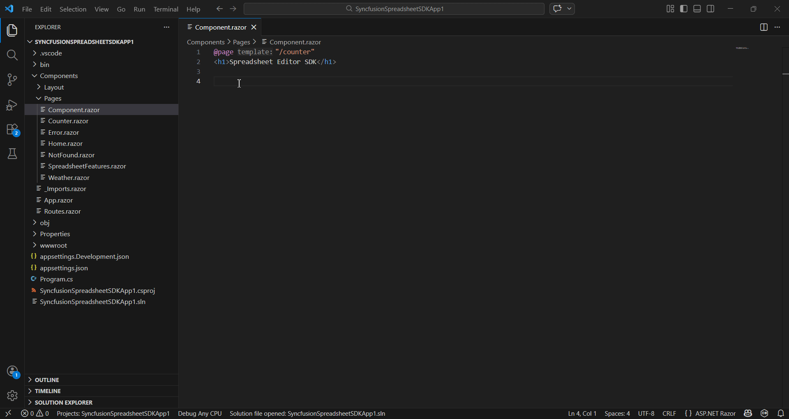
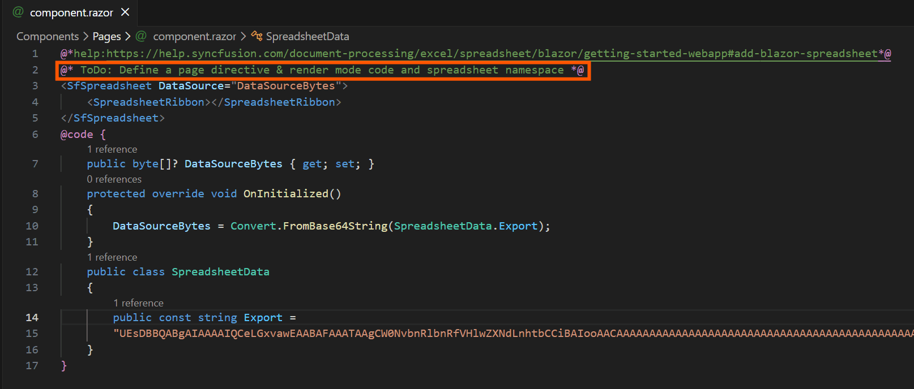
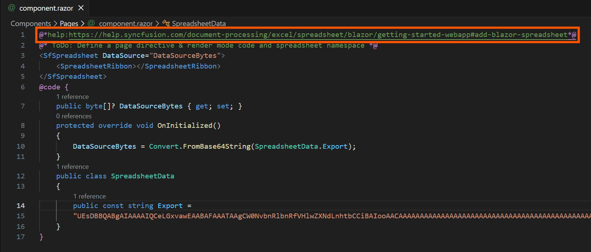
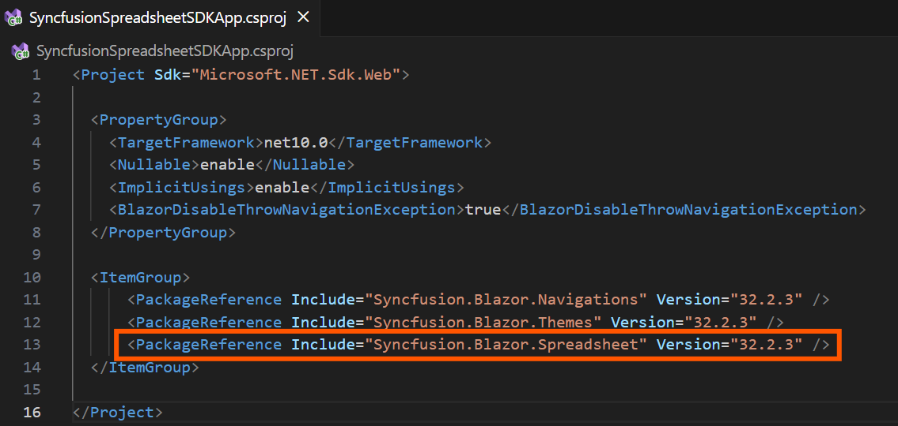
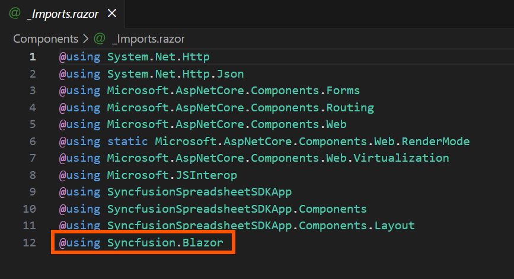
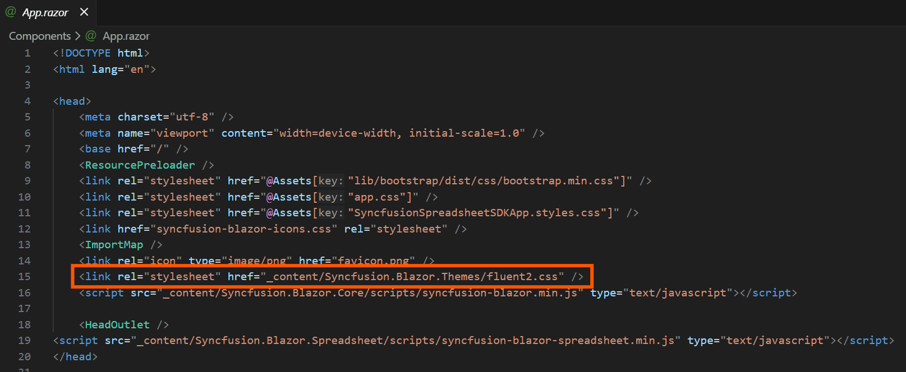
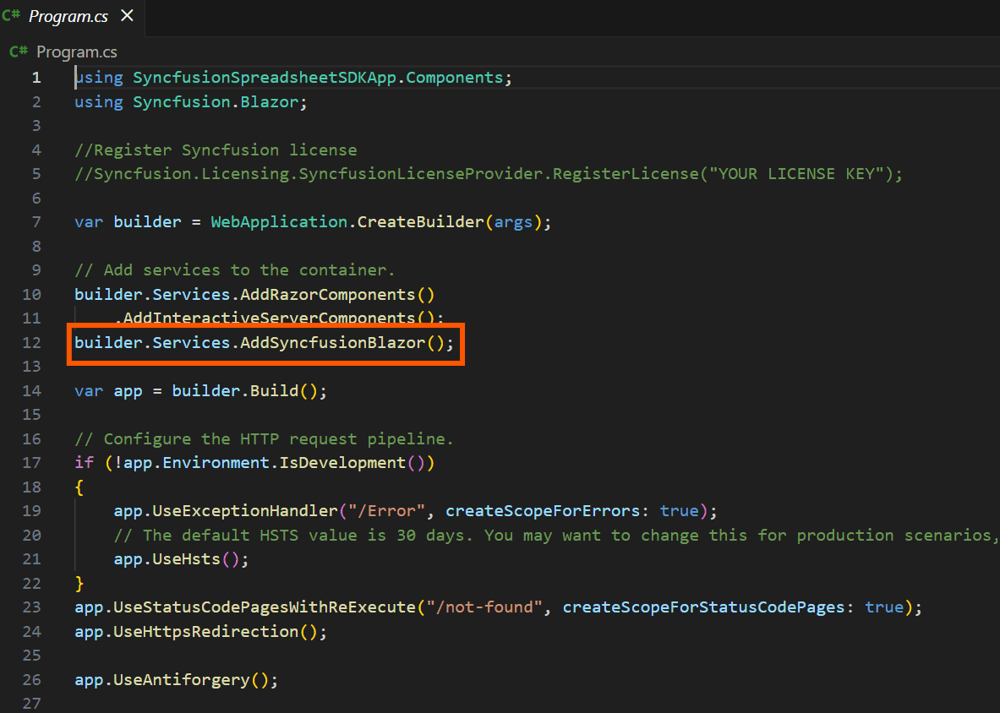

# Add Syncfusion® Spreadsheet Editor SDK component in VS Code

The Syncfusion® Spreadsheet Editor SDK code snippet utility for Visual Studio Code includes snippets for inserting a Syncfusion® Spreadsheet Editor SDK component with various features into the Blazor Application's Razor code editor.

## Add a Syncfusion® Spreadsheet Editor SDK component in the Blazor application

The instructions below guide you the process of using the Syncfusion® Spreadsheet Editor SDK code snippet in your Blazor application.

1. In Visual Studio Code, open an existing Spreadsheet Editor SDK Application or create a new Spreadsheet Editor SDK Application.

2. Open the razor file that you need and place the cursor in required place where you want to add Syncfusion® component.

3. You can find the Syncfusion® Spreadsheet Editor SDK component by typing the **sf** in the format shown below.

    ```
    sf<Syncfusion component name>-<Syncfusion component feature>
    For Example, sfword
    ```
4. Choose the Syncfusion® component and click the **Enter** or **Tab** key, the Syncfusion® Spreadsheet Editor SDK component will be added in the razor file.

    

5. After adding the Syncfusion® Spreadsheet Editor SDK component to the razor file, use the tab key to fill in the required values to render the component with data. You can find the comment section in the code snippet to see what values are required.

    

6. You can also find the Syncfusion® help link at the top of the added snippet to learn more about the new Syncfusion® Spreadsheet Editor SDK component feature.

    

## Configure Blazor application with Syncfusion Spreadsheet Editor SDK Component

The Syncfusion® Spreadsheet Editor SDK snippet simply inserts the code into the razor file. You must configure the Blazor application with Syncfusion® by installing the Syncfusion® Spreadsheet Editor SDK NuGet package, namespace, themes, and registering the Syncfusion® Spreadsheet Editor SDK Service. To configure, follow the steps below:

1. Open the Blazor application file and manually add the required Syncfusion® Spreadsheet Editor SDK individual NuGet package(s) for the Syncfusion® Spreadsheet Editor SDK component as a package reference. Refer to [this section](https://blazor.syncfusion.com/documentation/nuget-packages#benefits-of-using-individual-nuget-packages) to learn about the advantages of the individual NuGet packages. This NuGet package will be automatically restored when building the application.

    

    N> Starting with Volume 1, 2026 (v33.1.X) release, Syncfusion® provides [individual NuGet packages](https://blazor.syncfusion.com/documentation/nuget-packages#syncfusionblazorspreadsheet) for our Syncfusion® Spreadsheet Editor SDK component. We highly recommend this new standard for your Spreadsheet Editor SDK production applications.

2. To render the Syncfusion® component in your application, open the **~/_Imports.razor** file and add the required Syncfusion® Spreadsheet Editor SDK namespace entries.

    

3. Add the Syncfusion® Blazor [theme](https://blazor.syncfusion.com/documentation/appearance/themes) in the `<head>` element of the **~/Components/App.razor** page for Web App and `<head>` element of the **~/Pages/_Host.html** page for server application and **~/wwwroot/index.html** page for a client application.

    

4. Open the **~/Program.cs** file for Web App and server application and client application then register the Syncfusion® Blazor Service.

    If you select an **Interactive render mode** as `WebAssembly` or `Auto`, you need to register the Syncfusion® Spreadsheet Editor SDK service in both **~/Program.cs** files of your Spreadsheet Editor SDK Web App.

    

5. If you installed the trial setup or NuGet packages from nuget.org you must register the Syncfusion® license key to your application since Syncfusion® introduced the licensing system from 2018 Volume 2 (v16.2.0.41) Essential Studio® release. Navigate to the [help topic](https://help.syncfusion.com/common/essential-studio/licensing/overview#how-to-generate-syncfusion-license-key) to generate and register the Syncfusion® license key to your application. Refer to this [UG](https://blazor.syncfusion.com/documentation/getting-started/license-key/overview) topic for understanding the licensing details in Essential Studio® for Spreadsheet Editor SDK.