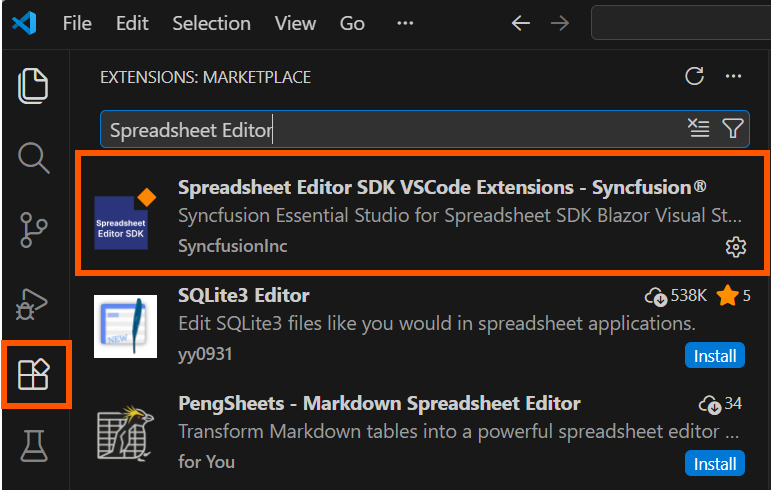
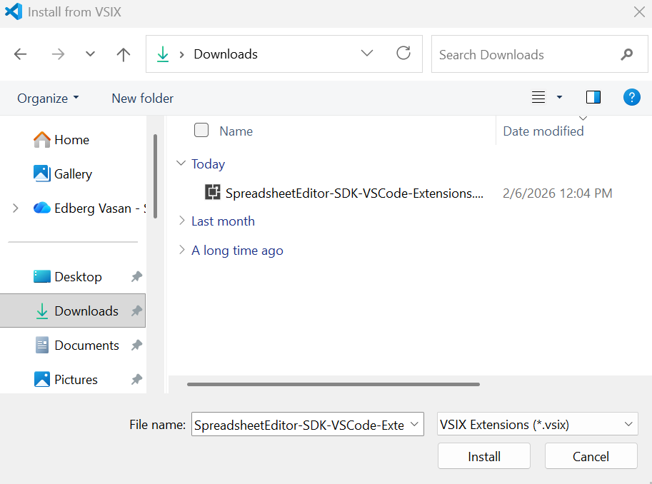

# Download and Installation - Spreadsheet Editor SDK

Syncfusion® publishes the Visual Studio Code extension in the [Visual Studio Code marketplace](https://marketplace.visualstudio.com/items?itemName=SyncfusionInc.Spreadsheet-Editor-SDK-VSCode-Extensions). You can either install it directly from Visual Studio Code or download and install it from the Visual Studio Code marketplace.

## Prerequisites

The following software prerequisites must be installed to install the Syncfusion® Spreadsheet Editor SDK:

* [Visual Studio Code 1.29.0 or later](https://code.visualstudio.com/download)

* [Visual Studio 2022 ](https://visualstudio.microsoft.com/vs/) or later

* [C# Extension](https://marketplace.visualstudio.com/items?itemName=ms-dotnettools.csharp)

The instructions below describe the process of installing the Syncfusion® Spreadsheet Editor SDK extension:

## Install through the Visual Studio Code Extension

1. Open Visual Studio Code.

2. Navigate to **View > Extensions**, and the Manage Extensions option will appear on the left side of the window.

3. Search for **"Syncfusion Spreadsheet Editor SDK"** in the search box and click **Install** button, you can find the Visual Studio Code extension in the Visual Studio Code Marketplace.

     

4. Reload Visual Studio Code after installation by using the **Reload Window** command in the Visual Studio Code palette.

     

5. Now, you can create a new Syncfusion® Spreadsheet Editor SDK application by using the Syncfusion® Spreadsheet Editor SDK extensions from the Visual Studio Code Palette, find the **Syncfusion Spreadsheet Editor SDK Template Studio: Launch** from Visual Studio Code commands to open the Syncfusion Spreadsheet Editor SDK Template Studio wizard.

     

## Install from the Visual Studio Code Marketplace

1. Open [Syncfusion® Spreadsheet Editor SDK Extensions](https://marketplace.visualstudio.com/items?itemName=SyncfusionInc.Blazor-VSCode-Extensions) in Visual Studio Code Marketplace.

2. Click Install from Visual Studio Code Marketplace. The browser displays a popup window with information such as **"Open Visual Studio Code"**. When you click Open Visual Studio Code, click install button and install the selected extension.

3. Reload the Visual Studio Code.

## Manually Installing an Extension in Visual Studio Code

1. Install the extension by downloading it from the Visual Studio Marketplace and then installing it from a local file within VS Code. To do this: Download the **"Spreadsheet-Editor-SDK-VSCode-Extensions.vsix"** file from the [Visual Studio Code Marketplace](https://marketplace.visualstudio.com/items?itemName=SyncfusionInc.Blazor-VSCode-Extensions).

2. In VS Code, go to the Extensions view by clicking on the Extensions icon in the Activity Bar and Click on the three dots (ellipsis) in the top-right corner and select "Install from VSIX."

      

4. Browse to the downloaded Spreadsheet-Editor-SDK-VSCode-Extensions.vsix file and install it.

     