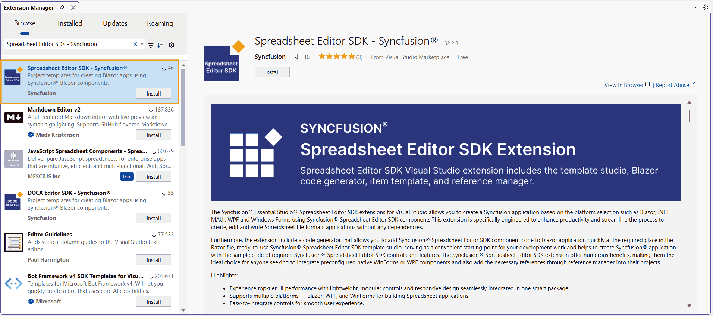
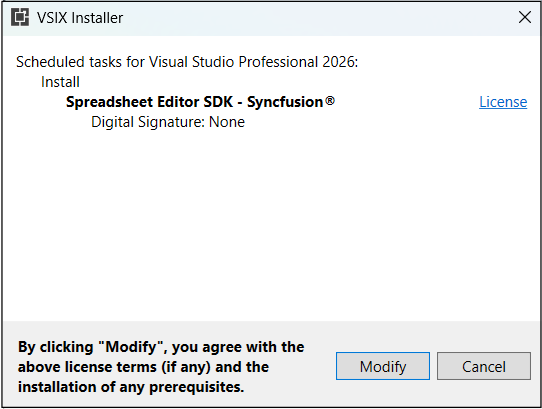
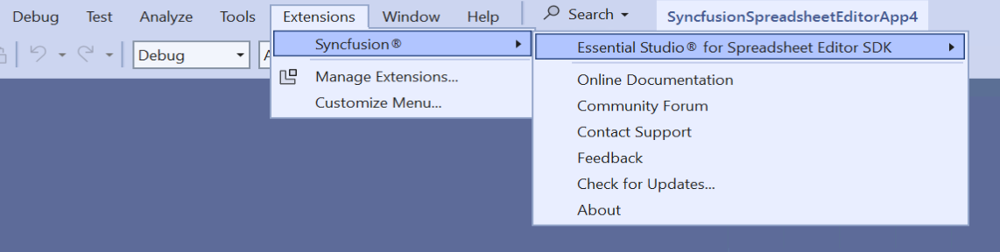
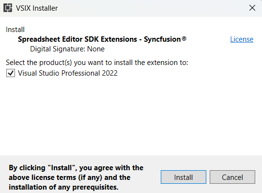

# Download and Installation

Syncfusion® publishes the Visual Studio extension in the below Visual Studio marketplace link. You can either install it directly from Visual Studio or download and install it from the Visual Studio marketplace.

[Visual Studio 2022 or 2026](https://marketplace.visualstudio.com/items?itemName=SyncfusionInc.SpreadsheetEditorSDKVSExtension)

## Prerequisites

The following software prerequisites must be installed to install the Syncfusion® Spreadsheet Editor SDK extension, as well as to creating, adding snippet, converting, and upgrading applications.

* [Visual Studio 2022 or later](https://visualstudio.microsoft.com/downloads/).

* [.NET 9.0](https://dotnet.microsoft.com/en-us/download/dotnet).

* [.NET 8.0](https://dotnet.microsoft.com/en-us/download/dotnet).

## Install through the Visual Studio Manage Extensions

The steps below assist you to how to install the Syncfusion® Spreadsheet Editor SDK extensions from **Visual Studio Manage Extensions**.

1. Open the Visual Studio 2022 or later.

2. Navigate to **Extension ->Manage Extensions** and open the Manage Extensions.

3. On the left, click the **Online** tab and type **"Spreadsheet Editor SDK - Syncfusion® "** in the **search box**.

    

4. Click the **Download** button in the **“Syncfusion® Spreadsheet Editor SDK Template Studio”** extensions.

5. Close all Visual Studio instances after downloading the extensions to begin the installation process. You will see the following VSIX installation prompt.

    

6. Click the **Modify** button.

7. After the installation is complete, open Visual Studio.

8. Now, under the menu **Extensions**, you can use the Syncfusion® extensions from the Visual Studio.

    

## Install from the Visual Studio Marketplace

The steps below illustrate how to download and install the Syncfusion® Spreadsheet Editor SDK extension from the Visual Studio Marketplace.

1. Download the Syncfusion® Spreadsheet Editor SDK Extension from the below Visual Studio Marketplace.

   [Visual Studio 2022 or later](https://marketplace.visualstudio.com/items?itemName=SyncfusionInc.SpreadsheetEditorSDKVSExtension)

2. Close all Visual Studio instances running, if any.

3. Double-click to install the downloaded VSIX file. You will see the VSIX installation prompts with the corresponding installed Visual Studio version checkbox for select the Visual Studio to install extension.

    

4. Click the **Install** button.

5. After the installation is complete, open Visual Studio. You can now use Syncfusion® extensions from the Visual Studio under the **Extensions** menu.

     