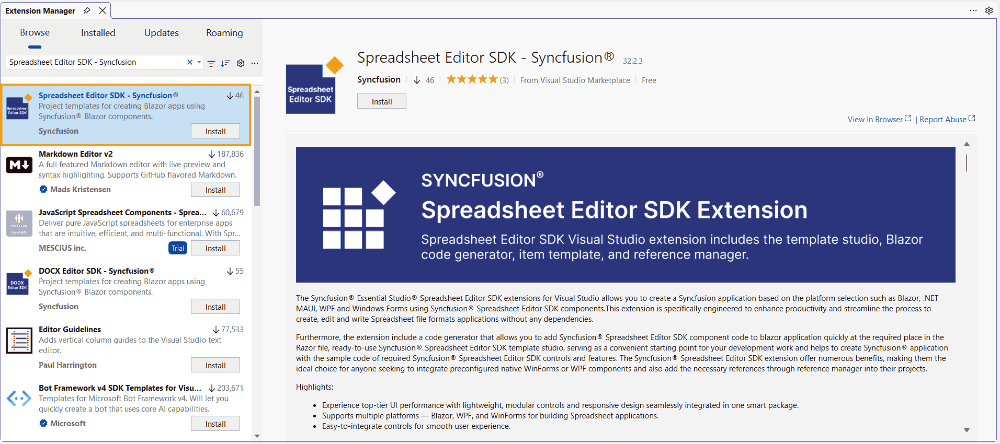
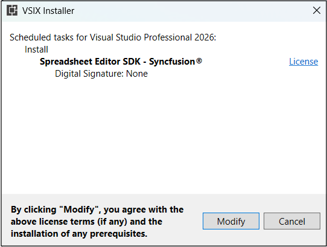
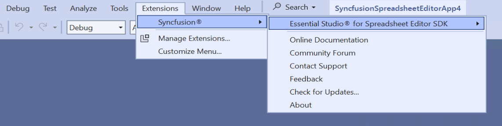
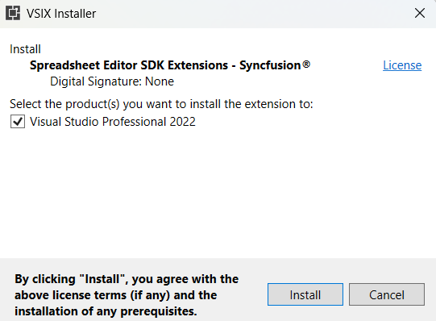

# Spreadsheet Editor SDK Extension - Download and Installation

Syncfusion® publishes the Visual Studio extension in the Visual Studio marketplace link below. You can either install it directly from Visual Studio or download and install it from the Visual Studio marketplace.

[Visual Studio 2022 or later](https://marketplace.visualstudio.com/items?itemName=SyncfusionInc.SpreadsheetEditorSDKVSExtension)

## Prerequisites

The following software prerequisites must be installed to install the Syncfusion® Spreadsheet Editor SDK extension, as well as to create, add snippets, convert, and upgrade applications.

* [Visual Studio 2022 or later](https://visualstudio.microsoft.com/downloads/).

* [.NET 10.0](https://dotnet.microsoft.com/en-us/download/dotnet).

* [.NET 9.0](https://dotnet.microsoft.com/en-us/download/dotnet).

* [.NET 8.0](https://dotnet.microsoft.com/en-us/download/dotnet).

## Install through the Visual Studio Manage Extensions

The steps below assist you to install the Syncfusion® Spreadsheet Editor SDK extension from **Visual Studio Manage Extensions**.

1. Open Visual Studio 2022 or later.

2. Navigate to **Extensions -> Manage Extensions** and open the Manage Extensions dialog.

3. On the left, click the **Online** tab and type **"Spreadsheet Editor SDK - Syncfusion®"** in the **search box**.

    

4. Click the **Download** button on the **"Syncfusion® Spreadsheet Editor SDK Template Studio"** extension.

5. Close all Visual Studio instances after downloading the extension to begin the installation process. You will see the following VSIX installation prompt.

    

6. Click the **Modify** button.

7. After the installation is complete, open Visual Studio.

8. Now, under the **Extensions** menu, you can use the Syncfusion® extensions from Visual Studio.

    

## Install from the Visual Studio Marketplace

The steps below illustrate how to download and install the Syncfusion® Spreadsheet Editor SDK extension from the Visual Studio Marketplace.

1. Download the Syncfusion® Spreadsheet Editor SDK Extension from the Visual Studio Marketplace link below.

   [Visual Studio 2022 or later](https://marketplace.visualstudio.com/items?itemName=SyncfusionInc.SpreadsheetEditorSDKVSExtension)

2. Close all running Visual Studio instances, if any.

3. Double-click to install the downloaded VSIX file. You will see the VSIX installation prompt with the corresponding installed Visual Studio version checkbox to select the Visual Studio instances for installing the extension.

    

4. Click the **Install** button.

5. After the installation is complete, open Visual Studio. You can now use Syncfusion® extensions from Visual Studio under the **Extensions** menu.

     