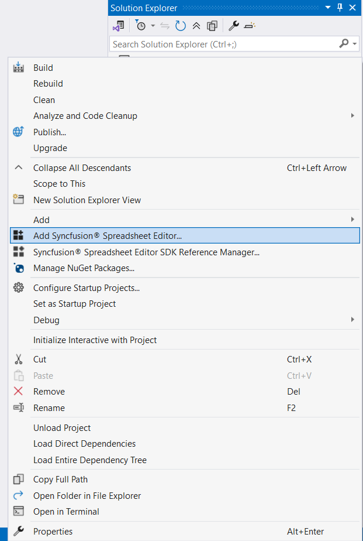
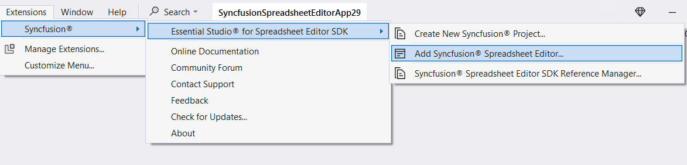
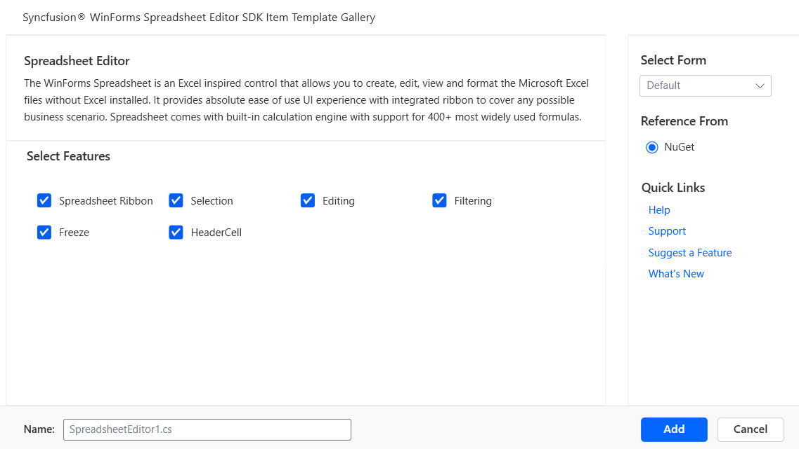
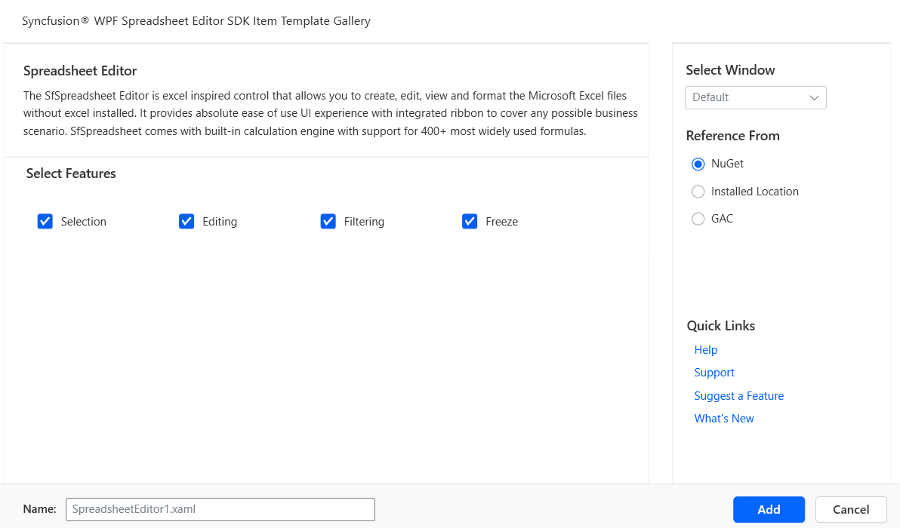
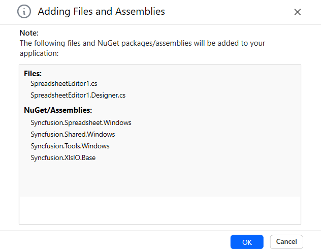
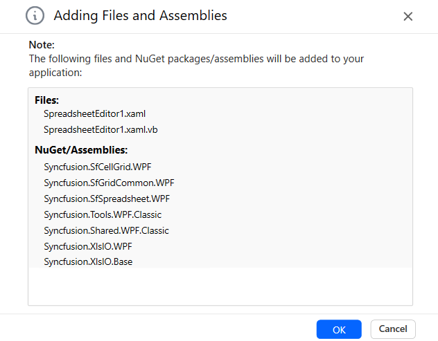
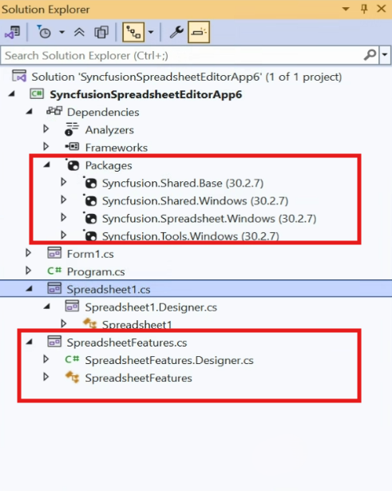
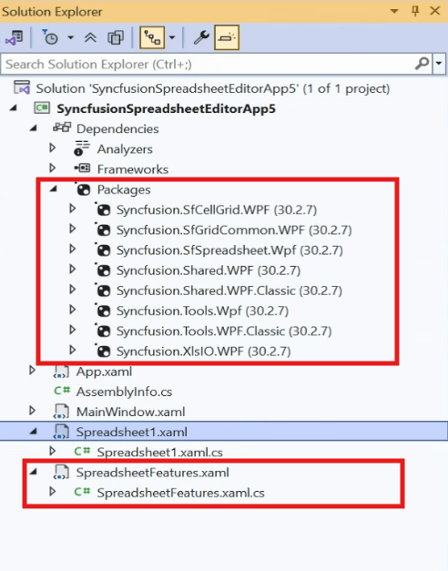

# Add Syncfusion&reg; Spreadsheet Editor SDK Components to the WinForms or WPF Application

Syncfusion&reg; supports Visual Studio Item Templates to add Syncfusion&reg;Spreadsheet Editor SDK Components to the corresponding applications with their references. 

I> The Syncfusion&reg; Spreadsheet Editor SDK item templates are available from v30.1.37.

The following steps will guide you in adding the Syncfusion&reg; Spreadsheet Editor SDK components to your Visual Studio WinForms or WPF application.

## Add Components using Syncfusion&reg; Spreadsheet Editor SDK Item Template

1.	Open a new or existing WinForms or WPF application.

    **Option 1:**

    From the **Solution Explorer, right-click** on the WinForms or WPF application. Choose **Add Syncfusion&reg; Spreadsheet...**.

    

    **Option 2:**

    Click **Extensions > Essential Studio&reg; for Spreadsheet Editor SDK > Add Syncfusion&reg; Spreadsheet…** in Visual Studio.

    

2.	The Syncfusion&reg; Spreadsheet Editor SDK Item Template wizard will be launched, displaying available components for the selected platform (WinForms or WPF).

    - Windows Forms:
        
        

    - WPF:
        
        

3.	Select the Components from the Component list within your Spreadsheet Editor SDK Item template. The features associated with the selected Component will be presented.

4.	Choose an assembly reference option such as GAC location, Essential Studio&reg; installed location, or NuGet packages to specify where the required Syncfusion&reg; assemblies are added to the project.

    N> If the Syncfusion&reg; Essential WindowsForm or WPF build is installed, the Installed location and GAC options will be enabled. Without installing the Syncfusion&reg; Essential WindowsForm or WPF setup, use the NuGet option. The GAC option will not be available when using the Syncfusion&reg; WinForms Components in a .NET Core application. The Version drop-down lists the installed WinForms versions.

5.  Click **Add**, and a pop-up will appear providing information about adding Component **files** and **NuGet/Assemblies** details.

    - Windows Forms:
        
        

    - WPF:
        
        

6.	Click **OK** to incorporate the chosen Components into the application, along with the necessary Syncfusion&reg; assemblies.

    - Windows Forms:
        
        

    - WPF:
        
        

7.	Then, Syncfusion&reg; licensing registration required message box will be shown if you installed the trial setup or NuGet packages since Syncfusion&reg; introduced the 			licensing system from 2018 Volume 2 (v16.2.0.41) Essential Studio&reg; release. Navigate to the [help topic](https://help.Syncfusion.com/common/essential-studio/licensing/license-key#how-to-generate-Syncfusion-license-key), which is shown in the licensing message box to generate and register the Syncfusion&reg; license key to 		your project. Refer to this [blog](https://blog.Syncfusion.com/post/Whats-New-in-2018-Volume-2-Licensing-Changes-in-the-1620x-Version-of-Essential-Studio.aspx) post 	 for understanding the licensing changes introduced in Essential Studio&reg;.

    