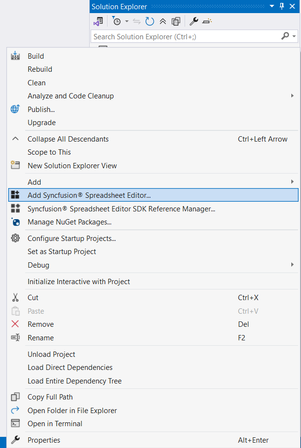
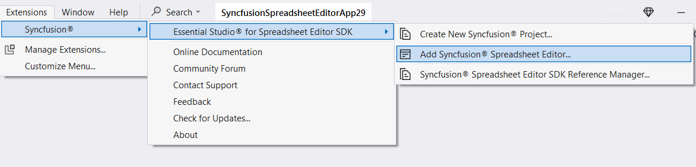
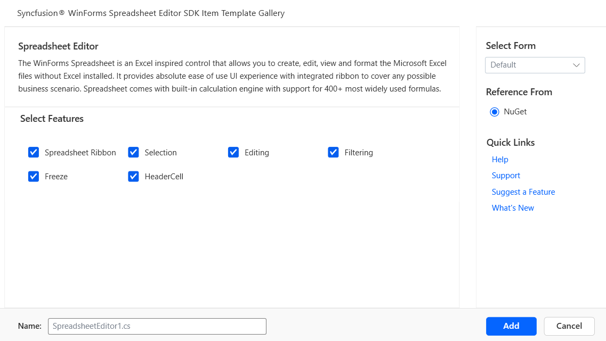
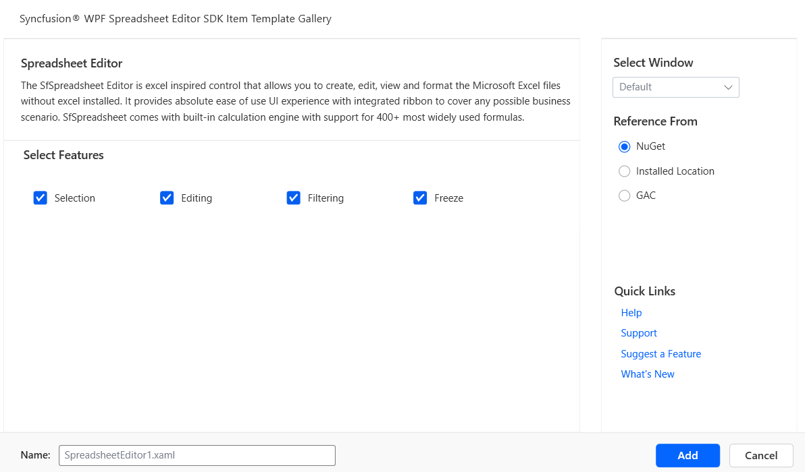
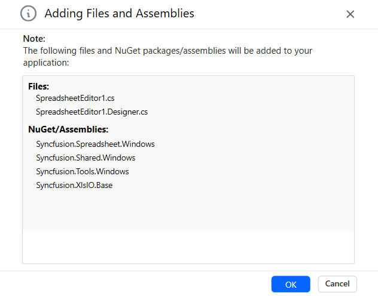
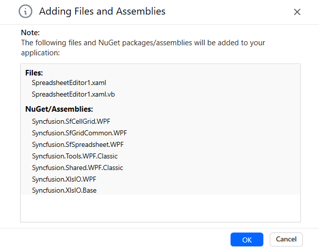
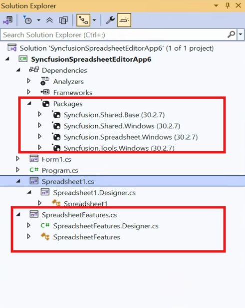
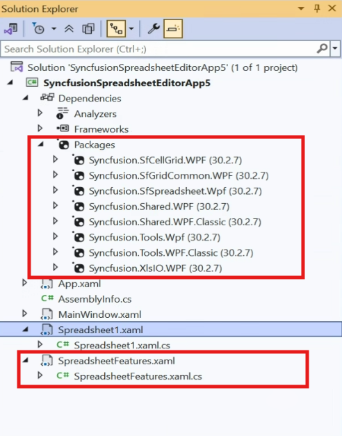

# Add Syncfusion® Spreadsheet Editor SDK component

Syncfusion® supports Visual Studio Item Templates to add the Syncfusion® Spreadsheet Editor SDK component to the corresponding applications with their references. 

I> The Syncfusion® Spreadsheet Editor SDK item templates are available from v32.1.19.

The following steps will guide you in adding the Syncfusion&reg; Spreadsheet Editor SDK component to your Visual Studio WinForms or WPF application.

## Add Syncfusion&reg; Spreadsheet Editor SDK Component using Syncfusion&reg; Spreadsheet Editor SDK Item Template

1.	Open a new or existing WinForms or WPF application.

    **Option 1:**

    From the **Solution Explorer**, right-click on the WinForms or WPF application and choose **Add Syncfusion® Spreadsheet...**.

    

    **Option 2:**

    Click **Extensions > Essential Studio® for Spreadsheet Editor SDK > Add Syncfusion® Spreadsheet…** in Visual Studio.

    

2.	The Syncfusion® Spreadsheet Editor SDK Item Template wizard will be launched, displaying available components for the selected platform (WinForms or WPF).

    - Windows Forms:
        
        

    - WPF:
        
        

3.	The component and the features associated with the Spreadsheet Editor SDK component will be presented within your Spreadsheet Editor SDK Item template.

4.	The required Syncfusion® assemblies are added to the project from the NuGet packages reference option.

5.  Click **Add**, and a pop-up will appear providing information about adding component **files** and **NuGet/Assemblies** details.

    - Windows Forms:
        
        

    - WPF:
        
        

6.	Click **OK** to incorporate the component into the application, along with the necessary Syncfusion® assemblies.

    - Windows Forms:
        
        

    - WPF:
        
        

7.	Then, a Syncfusion® licensing registration required message box will be shown if you installed the trial setup or NuGet packages since Syncfusion® introduced the licensing system from 2018 Volume 2 (v16.2.0.41) Essential Studio® release. Navigate to the [help topic](https://help.syncfusion.com/common/essential-studio/licensing/overview#how-to-generate-syncfusion-license-key), which is shown in the licensing message box, to generate and register the Syncfusion® license key to your project. Refer to this [blog](https://www.syncfusion.com/blogs/post/whats-new-in-2018-volume-2) post to understand the licensing changes introduced in Essential Studio®.

    