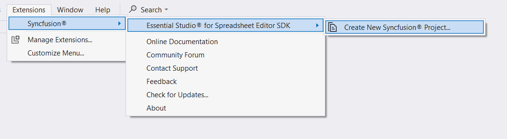
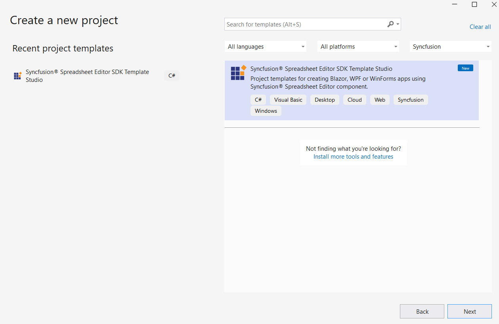
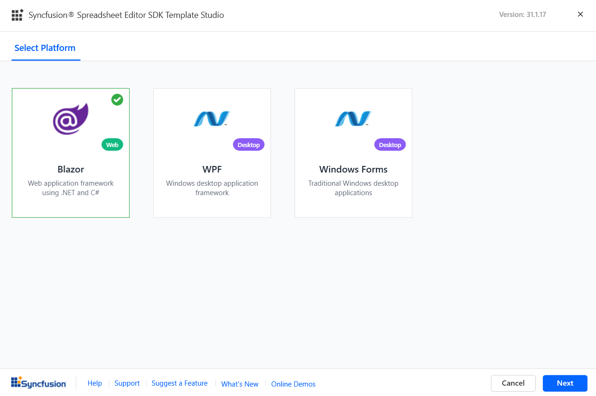
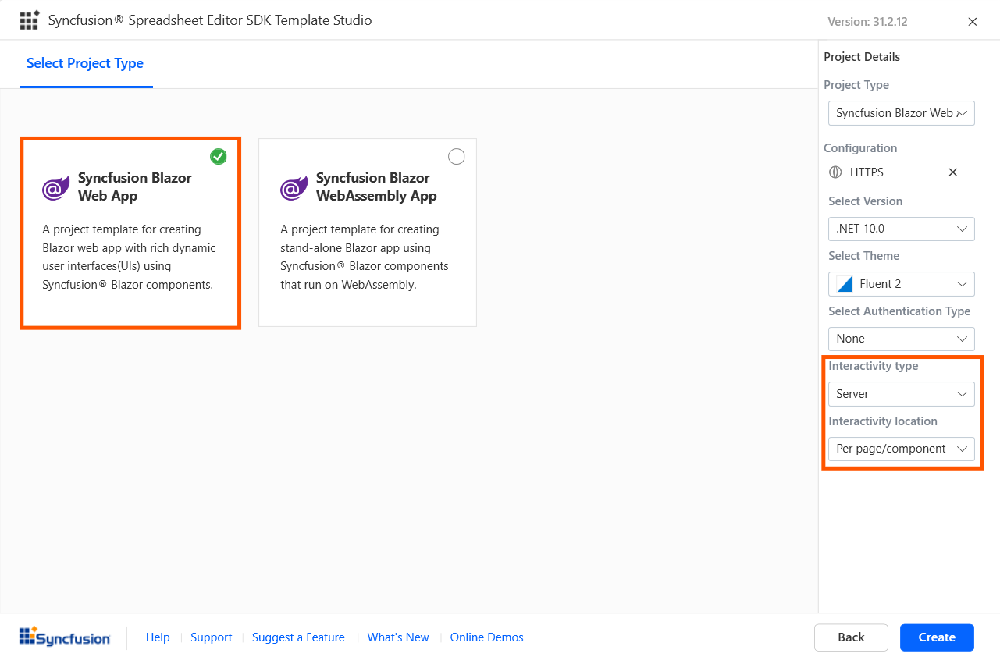
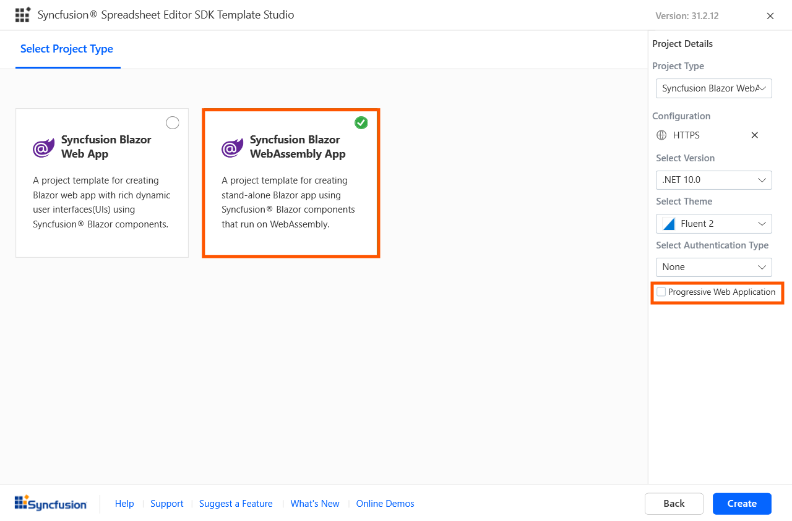
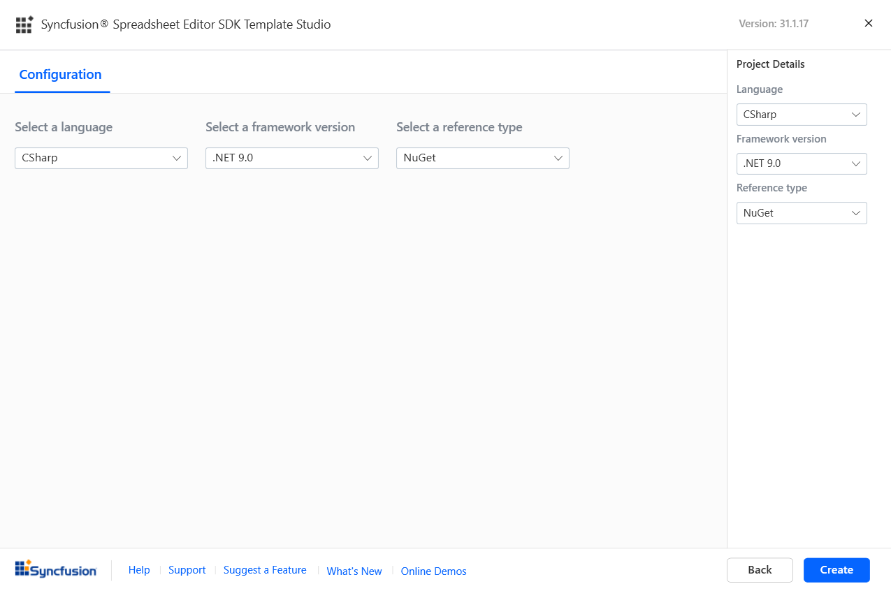
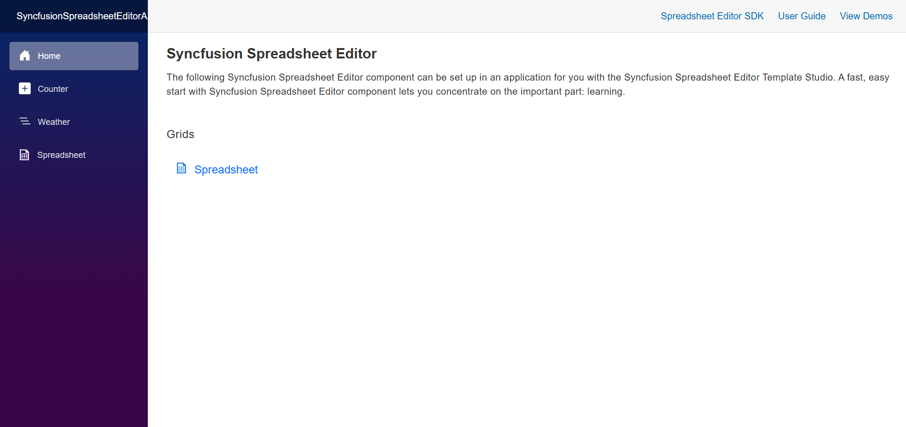

# Syncfusion® Spreadsheet Editor SDK Template Studio

Syncfusion® provides the Spreadsheet Editor SDK Template Studio, which allows you to create a Syncfusion application based on the platform selection such as Blazor, WPF and Windows Forms using Syncfusion® Spreadsheet Editor SDK component. The Syncfusion® application is created with the required Syncfusion® NuGet references, namespaces, styles, and component render code. The Template Studio includes an easy-to-use project wizard that guides you through the process of creating an application with Syncfusion® Spreadsheet Editor SDK component.

The steps below will assist you to create your **Syncfusion® Application** through **Visual Studio**:

N> Before use the Syncfusion® Project Template, check whether the Syncfusion® Spreadsheet Editor SDK Template Studio Extension installed or not in Visual Studio Extension Manager by clicking on the Extensions -> Manage Extensions -> Installed. If this extension not installed, install the extension by follow the steps from the [download and installation](https://blazor.syncfusion.com/documentation/visual-studio-integration/download-and-installation) help topic.

1. Open Visual Studio 2022 or later.

2. To create a Syncfusion® application, use either one of the following options:

     **Option 1**

     Choose **Extension -> Syncfusion -> Essential Studio® for Spreadsheet Editor SDK -> Create New Syncfusion Project...** from the **Visual Studio menu**.

     

     **Option 2**

     Choose **File -> New -> Project** from the menu. This launches a new dialogue for creating a new application. Syncfusion® templates can be found by filtering the application type for **Syncfusion** or by entering **Syncfusion** as a keyword in the search option.

     

3. Select the **Syncfusion® Spreadsheet Editor SDK Template Studio** and click **Next**.

     

4. The Syncfusion® Spreadsheet Editor SDK Template Studio wizard will be launched. Select the platform to add the Syncfusion® Spreadsheet Editor SDK component. 

    

5. Based on the platform selection, choose the configurations and create the respective application to add the Syncfusion® Spreadsheet Editor SDK component.

    - Blazor Platform:
        
        -  **Project type section**
        
            Choose one of the Syncfusion® Blazor application types based on the version of the .NET SDK you are using.

            | .NET SDK version | Supported Syncfusion Blazor Application Type |
            | ---------------- | -------------------------------------------- |
            | [.NET 10.0](https://dotnet.microsoft.com/en-us/download/dotnet/10.0), [.NET 9.0](https://dotnet.microsoft.com/en-us/download/dotnet/9.0), [.NET 8.0](https://dotnet.microsoft.com/en-us/download/dotnet/8.0) | Syncfusion Blazor Web App |
            | [.NET 10.0](https://dotnet.microsoft.com/en-us/download/dotnet/10.0), [.NET 9.0](https://dotnet.microsoft.com/en-us/download/dotnet/9.0), [.NET 8.0](https://dotnet.microsoft.com/en-us/download/dotnet/8.0) | Syncfusion Blazor WebAssembly App |

            > **Note:** Refer to the .NET SDK support for Syncfusion Blazor component [here](https://blazor.syncfusion.com/documentation/system-requirements#net-sdk).

            In the **Syncfusion Blazor Web App** application type, you can configure the following options:

            <table>
            <tbody>
            <tr>
            <td>
            <a href="https://learn.microsoft.com/en-us/aspnet/core/blazor/component/render-modes?view=aspnetcore-8.0#render-modes" rel="nofollow">Interactivity type</a>
            </td>
            <td>
            Server, WebAssembly, Auto (Server and WebAssembly)
            </td>
            </tr>
            <tr>
            <td>
            <a href="https://learn.microsoft.com/en-us/aspnet/core/blazor/tooling?view=aspnetcore-8.0&pivots=windows" rel="nofollow">Interactivity location</a>
            </td>
            <td>
            Global, Per page/component
            </td>
            </tr>
            </tbody>
            </table>

            

            In the **Syncfusion Blazor WebAssembly App** application type, you can choose Progressive Web Application.

            

            > **Note:** The Progressive Web Application will be enabled if .NET 8.0 version or higher is installed.
            
            You can choose the required (.NET 10.0, .NET 9.0 and .NET 8.0), themes, https configuration, authentication type, Blazor Web App, and Blazor Web Assembly application types.

            Depending on your Syncfusion Blazor Application Type, refer to the table below for supported authentication types.

            | Syncfusion Blazor Application Type | Supported Authentication Types |
            | ------------- | ------------- |
            | Syncfusion Blazor Web App | None and Individual Accounts |
            | Syncfusion Blazor WebAssembly App | None, Individual Accounts and Microsoft Identity Platform |
            
            Click **Create** button. The Syncfusion® Blazor application has been created. The created Syncfusion® Blazor app has the Syncfusion NuGet packages, styles, and the render code for Syncfusion® Spreadsheet Editor SDK component.

     - WPF and Windows Forms Platform

         - **Configuration Section**

            You will have the option to specify your preferred .NET Framework Version, select the desired language(CSharp or Visual Basic), and choose the reference type according to your requirements.

            

            > **Note:** The installed location and GAC options will be available only after the Syncfusion® Essential® Spreadsheet Editor SDK setup has been installed. Use the NuGet option instead of installing the Syncfusion® Essential® Spreadsheet Editor SDK setup.

            Click **Create** button. The Syncfusion® WPF or Windows Forms application has been created. The created application has the Syncfusion NuGet packages, styles, and the render code for Syncfusion® Spreadsheet Editor SDK component.

9. The Syncfusion® application based on the platform selection configures with most recent Syncfusion® NuGet packages version, selected style, namespaces, selected authentication, and component render code for Syncfusion® Spreadsheet Editor SDK component.

10. If you installed the trial setup or NuGet packages from nuget.org you must register the Syncfusion® license key to your application since Syncfusion® introduced the licensing system from 2018 Volume 2 (v16.2.0.41) Essential Studio® release. Navigate to the [help topic](https://help.syncfusion.com/common/essential-studio/licensing/overview#how-to-generate-syncfusion-license-key) to generate and register the Syncfusion® license key to your application. Refer to this [blog](https://www.syncfusion.com/blogs/post/whats-new-in-2018-volume-2.aspx) post for understanding the licensing changes introduced in Essential Studio®.

## Authentication Configuration for Blazor Platform

We need to register the created application in the Google API Console for Individual Accounts and in Azure Active Directory for the Microsoft Identity Platform. From the Google API Console registration, we can obtain the client ID for Individual Accounts. From the Azure Active Directory registration, we can obtain the tenant ID and application client ID for the Microsoft Identity Platform. We need to configure these ID values in the created applications; only then will the application run correctly with authentication support.

### Individual Accounts Authentication

#### Web Application and Progressive Web Application

1. Go to below credentials page for the Google cloud platform API console.

    <https://console.cloud.google.com/apis/credentials?project=aerobic-furnace-244104&pli=1>

2. Click Create Credentials and OAuth Client Id.

    

    

3. Select Application type as Web Application in client Id creation.

    

4. Add your publish URL link as an Authorized URI and login URL as Redirected URI.

    

5. Click save then OAuth client id will be created and copy that credential.

    

6. Add that Client Id, and RedirectUri in appsettings.json file of your application.

    

7. Change the build configuration bind as google from Local in program.cs file.

    

### Microsoft Identity Platform Authentication

#### Server Application

1. Go to below Azure Active Directory App Registration page.

    <https://portal.azure.com/#view/Microsoft_AAD_IAM/ActiveDirectoryMenuBlade/~/RegisteredApps>

2. Click New Registration in App Registration page.

    

3. Give name of the application and selected supported type as single tenant.

    

4. Dropdown the page, select platform as web and give your application Redirect URI like {Redirect URI}/signin-oidc and click Register.

    

5. App will be registered, go to the Authentication page and tick Id token check box.

    

6. Get client tenant id and application id form overview page.

    

7. Configure those client tenant id, application id, and domain in your application appsettings.json file.

    

#### Web Application and Progressive Web Application

1. Go to below Azure Active Directory App Registration page.

    <https://portal.azure.com/#view/Microsoft_AAD_IAM/ActiveDirectoryMenuBlade/~/RegisteredApps>

2. Click New Registration in App Registration page.

    

3. Give name of the application and selected supported type as single tenant.

    

4. Dropdown the page, select platform as web and give your application Redirect URI and click Register.

    

5. App will be registered, go to the Authentication page and tick Access token an Id token check box.

    

6. Migrate the API by clicking the highlighted arrow like in below image.

    

    

7. Get client tenant id and application id form overview page.

    

8. Configure those client tenant id and application id in your application appsettings.json file.

    

#### ASP.NET Core Hosted Web Application, and ASP.NET Core Hosted with Progressive Web Application

##### Client project Registration and Configuration

1. Go to below Azure Active Directory App Registration page.

    <https://portal.azure.com/#view/Microsoft_AAD_IAM/ActiveDirectoryMenuBlade/~/RegisteredApps>

2. Click New Registration in App Registration page.

    

3. Give name of the application and selected supported type as single tenant.

    

4. Dropdown the page, select platform as web and give your application Redirect URI and click Register.

    

5. App will be registered, go to the Authentication page and tick Access token an Id token check box.

    

6. Migrate the API by clicking the highlighted arrow like in below image.

    

    

7. Get client tenant id and application id form overview page.

    

8. Configure those client tenant id and application id in your application appsettings.json file.

    

##### Server project Registration and configuration

1. Go to below Azure Active Directory App Registration page.

    <https://portal.azure.com/#view/Microsoft_AAD_IAM/ActiveDirectoryMenuBlade/~/RegisteredApps>

2. Click New Registration in App Registration page.

    

3. Give name of the application and selected supported type as single tenant.

    

4. Dropdown the page, select platform as web and give your application Redirect URI and click Register.

    

5. App will be registered, go to the Authentication page and tick Access token an Id token check box.

    

6. Migrate the API by clicking the highlighted arrow like in below image.

    

    

7. Add a scope API in Expose an API page.

    

8. Give scope name, admin consent display name, and admin consent description and click Add scope. Scope API will be created, copy those scope API Value.

    

9. Get client tenant id and application id form overview page.

    

10. Configure those client tenant id, application id, added scope api id, and domain in your application appsettings.json file.

    

11. Configure the scope API in client application program.cs file below highlighted place.

    

### Run application

You can run the application and see the Syncfusion® Spreadsheet Editor SDK component you selected.



## Register and Login Application

### Individual Authentication

#### Blazor Web App

##### Applying Database Migrations and User Registration in the .NET 8.0, .NET 9.0 and .NET 10.0 Blazor Web App

##### Applying Database Migrations:

In the Blazor Web App, it's essential to apply pending migrations to the database before proceeding with user registration. Choose one of the following options:

**Option 1: Using Visual Studio Package Manager Console**
 
Navigate to **View -> Other Windows -> Package Manager Console** in Visual Studio.
 
Run the following command in the Package Manager Console:

   ```Update-Database```

**Option 2: Using Command Prompt**
 
Open a command prompt in your project directory and execute the following command:

   ```dotnet ef database update```

##### User Registration:

1.	Launch the application and register by submitting your email address and creating a password.

    

2.	Confirm your registration by clicking **Click here to confirm your account.**

    

3.	Submit your registered email address and password to log in to the application.

    

#### Server Application, ASP.NET Core hosted Web Application, and Progressive Web Application with ASP.NET Core hosted

1. For register the application, submit your email address and create a password.

    

2. Confirming registration by clicking **Click here to confirm your account.**

    

3. Submit your registered email address and password to login the application.

    

#### Web Application and Progressive Web Application

1. Login to the application using Gmail accounts.

    

### Microsoft Identity Platform

#### Server Application, Web Application, Progressive Application, ASP.NET Core Hosted Web Application, and ASP.NET Core Hosted with Progressive Web Application

1. Login to your application using your Microsoft account.

2. Accept permission request of your application.

    
