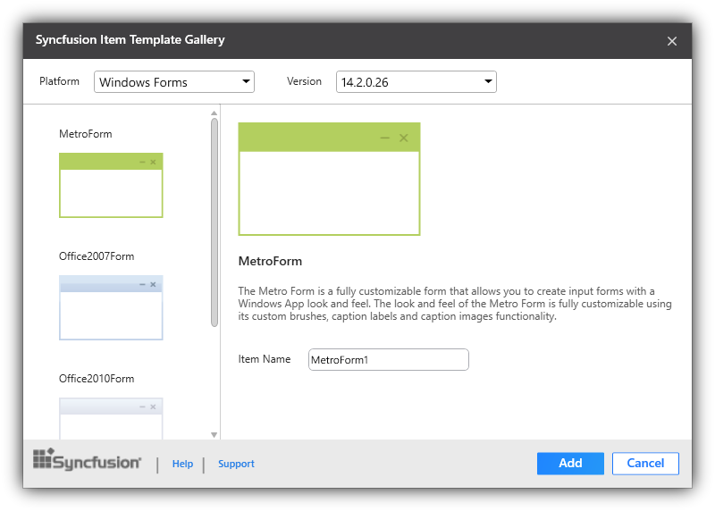
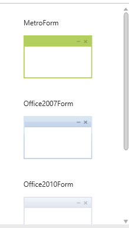

# Syncfusion Item Templates

## Overview

Syncfusion provides Item Templates to add Syncfusion class files to the Project in a quick manner.

## Syncfusion Item Templates for Windows Forms

The Syncfusion Item Templates’ Add new item feature provides support to Windows Forms platform. To add the Syncfusion item files in Visual Studio, install Syncfusion Essential Studio for Windows Forms platform.The item template available from Syncfusion Essential Studio v13.1.0.21.

### Using Syncfusion Item Template Gallery

Follow the given steps to add the Syncfusion item in Visual Studio.

1. Open a new or existing Windows Forms application.
2. Right-click on the Windows Forms Project from the Solution Explorer. Select the Add Syncfusion Item  New Item... option. Refer to the following screenshot for more information.

   

3. Select the required version and themes or Form from the Syncfusion Item Template Gallery. 

   

#### Platform

This is a combo box where you can choose the application’s platform. For now it contains Windows Forms Platform alone.

#### Version

Syncfusion’s Installed Build Versions are listed for Syncfusion Essential Studio v13.1.0.21 and later, for the installed Windows Forms platform. 

#### Search

A Typical Search bar is used to search the Syncfusion Item Templates.

#### Template Gallery

This part contains a set of Syncfusion Item Templates, and you can choose the Item Templates based on your need.

Once any of the item templates are chosen it navigates to the next page. When Add Item is selected, then the selected item template is added to the project.

### Using Visual Studio Add new Item

Syncfusion Project Template can be also add from the Visual Studio Item Template. Right-click on the Windows Forms Project Add ->New Item. You can refer to the following screenshot for more information.

1. The Syncfusion Item Templates are available under the Syncfusion tab. It is available for both C# Items and VB Items. 

   

2. Now the selected template is added to the project along with Syncfusion references.

   

   

