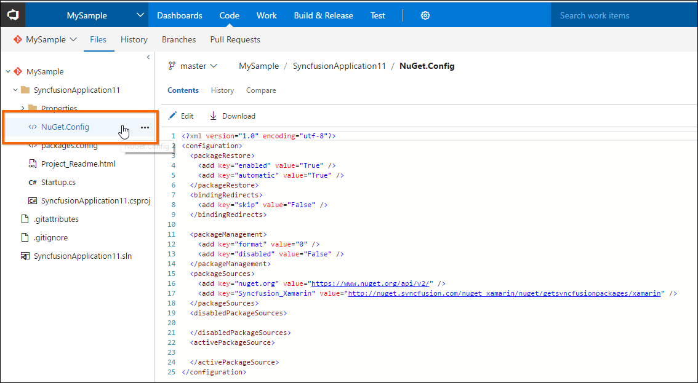
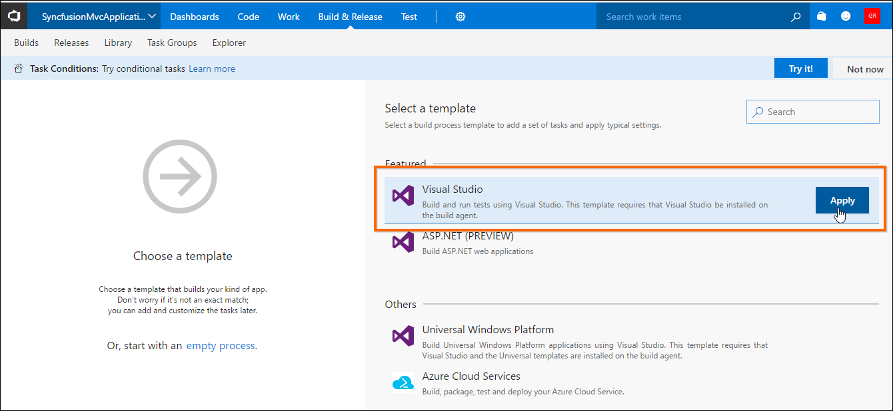
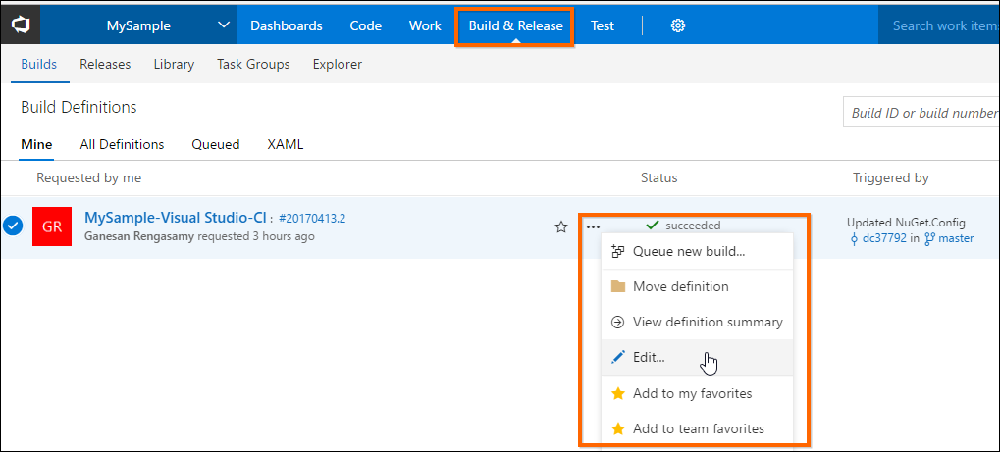
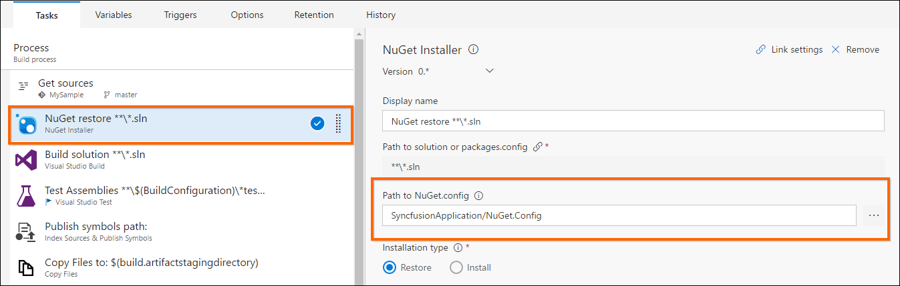
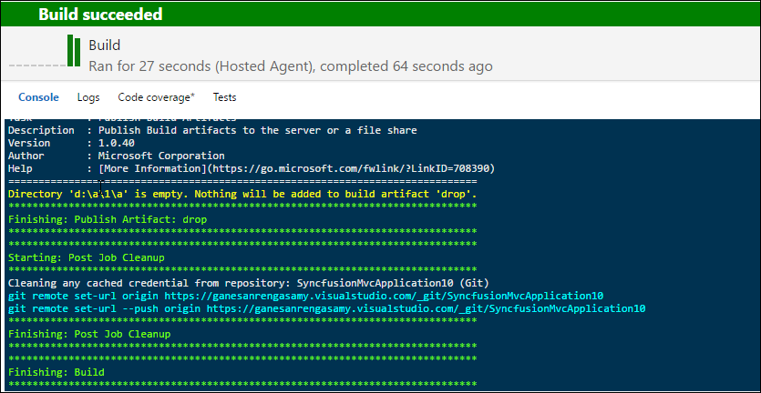

NuGet Configuration in Visual Studio Online
-------------------------------------------

You can use the Syncfusion NuGet packages in the Visual Studio online
project by following the below steps.

1.  Add the NuGet.config file in your Visual Studio online project
    location along with require Syncfusion NuGet package feed links. You
    can get the Syncfusion NuGet package feed link by clicking the Copy
    URL label

    from the required platform provided in the following link:
    <http://nuget.syncfusion.com>

    

2.  If the Visual Studio online project with the Syncfusion NuGet
    packages build for the first time, choose the build process template
    for build the project by following the below steps.

<!-- -->

1.  Click the New Definition button which is shown in the Mine tab under
    the Build and Release Navigate option.

    

2.  Then apply the build process template as Visual Studio.

    

<!-- -->

3.  If already choose the build process template, navigate to the Build
    and Release option and select the Edit option to edit the NuGet
    restore process.

    

4.  Then set the NuGet.config path in the NuGet restore
    process.

5.  Then start the build process from the Visual Studio online. The
    project will be compiled successfully.

    

