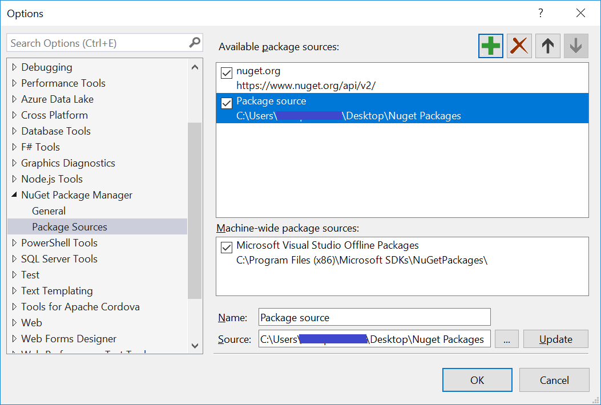

# NuGet Install and Configuration

## NuGet Configuration in Visual Studio

You can configure the SyncfusionNuGetPackages in Visual Studio 2008\2010\2012\2013. SyncfusionNuGet packages are configured in the following ways.

1. By using Syncfusion’s public feed URL.
2. Downloaded NuGet Packages from Syncfusion Website. 

### Configure the Syncfusion NuGet Packages by using Syncfusion’s public feed URL

The following steps help you configure Syncfusion NuGet Packages with a URL.

1. Launch the Microsoft Visual Studio 2008/2010/2012/2013/2015.
2. Select Tools-> NuGet Package Manager-> Package Manager Settings, and the Options dialog opens. 
3. Navigate to the NuGet Package Manager->Package Sources from the Options dialog. 
4. Click the Add 
button to create the new Package Source.
5. Select the newly created Package Source and rename the source name using the Name input box.
6. Copy the Syncfusion NuGet Package URL from Syncfusion NuGet account and paste it in the source textbox. You can get the URL by clicking the Copy URL label
   from the required version and platform provided in the following link: <http://nuget.syncfusion.com> 
   
   

7. Select Update and then click the OK button. The package's source is added to the list of available package sources as shown in the following screenshot.

   

N> The Syncfusion NuGet packages URL link is provided by platform basics.

### Configure the Syncfusion NuGet Packages in Visual Studio from downloaded packages

The following steps help you download and configure the downloaded Syncfusion NuGet Packages in the Visual Studio. The download file format is a zip file that contains all the packages with the Framework.

1. Click the download link of Syncfusion NuGet Package and save the zip file. The download option is shown in the following screenshot.

   
   
2. Launch the Visual Studio application.
3. Navigate to Tools-> NuGet Package Manager-> Package Manager Settings, and the Options dialog opens. 
4. Select the NuGetPackage Manager->Package Sources from the Options dialog. 
5. Click the Add 
button to create the new Package Source.
6. Select the newly created Package Source and rename the source name from the Name input box and browse the source location with the extracted location of
   Syncfusion NuGet packages.
7. Select Update and then click the OK button. The package's source is added to the list of available package sources as shown in the following screenshot.

    

## NuGet Installation

Refer to the Syncfusion NuGet Packages from the Visual Studio applications. The following steps help you to add the reference of the Syncfusion assemblies in the Project References.

1. Right click on Project and choose the Manage NuGet Packages.
2. Select Online -> &lt;Created Package Source Name&gt;. 
   Refer to the following screenshot for more information.
 
   

3. Install the required corresponding Framework control to use in Visual Studio projects. You can install the dependent assemblies when needed.

4. Find the installed Syncfusion Packages in the Directory location, of the solution file, of the created project (Syncfusion Packages).

N> The Framework number at the end of package name like, 35, 40, and 45, 451 is added.

## Install from Package Manager Console

You can install the Syncfusion NuGet packages by using the Package Manager Console. The following steps help you install the Syncfusion NuGet package.

1. Select the Tools-> NuGet Package Manager-> Package Manager Console.
2. Make sure that the Package source under the “Syncfusion packages registered Name” in Package Manager Settings is present. Refer the following screenshot.

   

3. Run the following command to install the specified NuGet Package with the package name.

   Install-package {package name}
    
   For Example: install-package Syncfusion.Chart.WPF45.

## Confuguring Syncfusion NuGet packages from command line in Linux/MAC

### NuGet Configuration

1.	Download the latest NuGet executable from [here](https://dist.nuget.org/win-x86-commandline/latest/nuget.exe).  

2.	Open the downloaded executable location in command window and run the following command,

       mono nuget.exe Sources Add –Name [Source name] –Source [source location]

       For Ex: mono nuget.exe Add –Name “Syncfusion Source” –Source “http://nuget.syncfusion.com/aspnetmvc"
                                                                                  
3.	Once the Source gets added successfully the confirmation message will be shown like below.

      For Linux OS :

      

      For MAC OS :
    
      
    
### NuGet Installation

Once the NuGet source has been added, then install the NuGet package which is available in that source by using following command.

mono nuget.exe install [Package name] 

For Ex: mono nuget.exe install “Syncfusion.EJ” –Prerelease 

For Linux OS :

For MAC OS :

## Visual Studio Toolbox manual configuration

To configure the Syncfusion control in the Visual Studio Toolbox manually with the Syncfusion assemblies, get the Syncfusion assemblies from the NuGet Installed in project location. The following steps help you to configure the toolbox to your Visual Studio.

1. Create a new tab named Syncfusion in the toolbox.

   

2. Right-click and select the Choose Items.

   

3. Click Toolbox Items and the window opens as displayed in the following screenshot.

   

4. Select the WPF Components tab.
5. Navigate to the SyncfusionWPF assembly from the packages location of the project. You do not have to add the design assemblies
6. Click OK, and the assemblies are copied to the newly created Syncfusion WPF Toolbox tab.

## NuGet Updates

The following steps help you update the Syncfusion NuGet to your Project.

1. Before updating the packages, configure the latest NuGet’s details in Visual Studio. 
2. Right-click on Project and choose Manage NuGet Packages. 
3. Select the Updates -> &lt;Created Package Source Name&gt;. Refer to the following  screenshot for more information.

   

4. When the latest version of the NuGets are available from Visual Studio Configurations, the Updates are automatically shown in the Manage NuGet Packages ->Updates-> &lt;Created Package Source Name&gt;.  Refer to the above screenshot for more information.
5. By clicking the Update button the NuGet is updated in your project.

