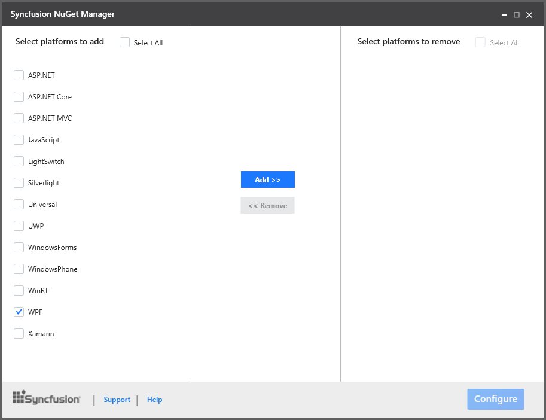
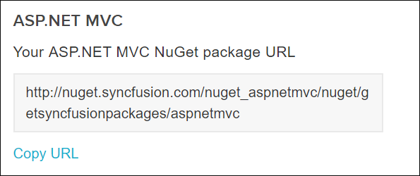
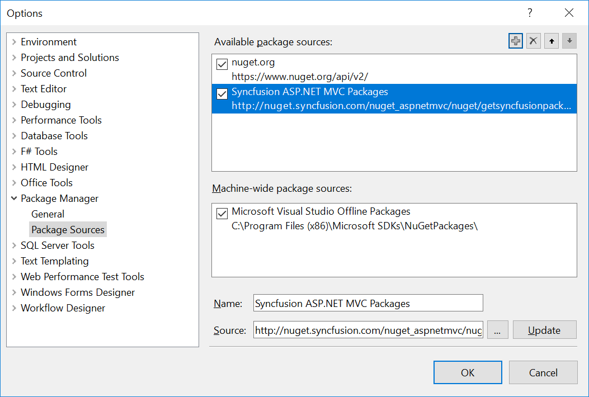
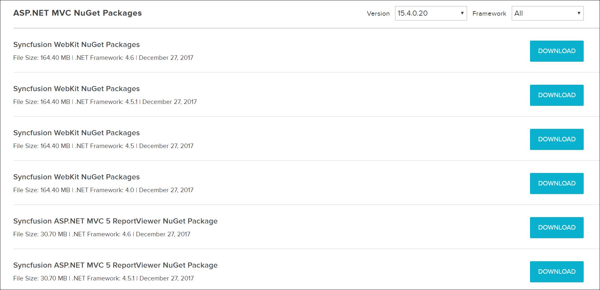
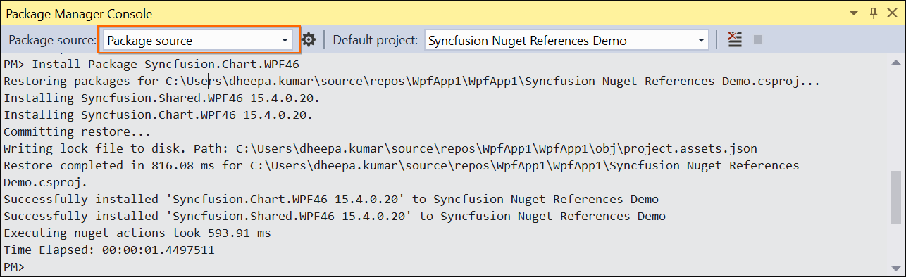
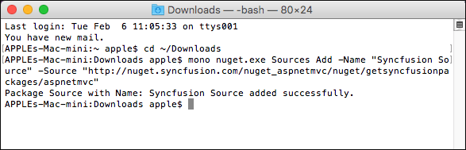
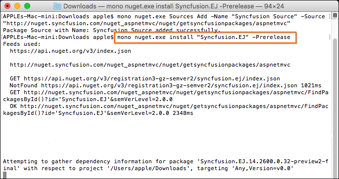

# NuGet Install and Configuration

The Syncfusion Xamarin NuGet packages are published in public [NuGet.org](https://www.nuget.org/) from v15.4.0.17. So, no need any additional configurations required to utilize the Syncfusion Xamarin NuGet packages from v15.4.0.17. If you required to utilize the Syncfusion Xamarin NuGet packages from Syncfusion private NuGet server instead of NuGet.org or if you required to utilize the other platform NuGet packages , follow the below topics to configure and install the Syncfusion NuGet packages.

## NuGet Configuration in Visual Studio

You can configure the Syncfusion NuGet Packages in Visual Studio 2010 or higher. SyncfusionNuGet packages are configured in the following ways.

1. By using Syncfusion’s public feed URL.
2. Downloaded NuGet Packages from Syncfusion Website. 

### Configure the Syncfusion NuGet Packages by using Syncfusion’s public feed URL

Syncfusion NuGet Package feed links are configured in Visual Studio in the following ways,

1. Syncfusion NuGet Package Manager
2. NuGet Package Manager settings

#### Syncfusion NuGet Package Manager

The following steps help you configure Syncfusion NuGet Packages with a URL.

1. **Syncfusion NuGet Manager** is allows you to **add** the Syncfusion NuGet sources (for available platforms) to NuGet Package Manager. Download the [Syncfusion NuGet Manager](http://www.syncfusion.com/downloads/support/directtrac/general/ze/SyncfusionNugetManager-1610952973.zip) utility.
2. Extract zip file and run the SyncfusionNuGetManager.exe
3. Syncfusion NuGet Manager Window will be opened.
4. Select the platform **WPF** (or required platform) from **“Select platforms to add”** (Left side of the window) column and click **Add>>** button. Then click **Configure** button.

   

5. Once Syncfusion NuGet Manager added the Syncfusion NuGet sources, the changes will be reflected in package sources of your Visual Studio. 

   

**Note:** Get the more details about Syncfusion NuGet Manager utility from [here](https://help.syncfusion.com/extension/syncfusion-nuget-packages/syncfusion-nuget-manager).

#### NuGet Package Manager settings

The following steps help you configure Syncfusion NuGet Packages with a URL.

1. Launch the Microsoft Visual Studio 2008/2010/2012/2013/2015.
2. Select Tools-> NuGet Package Manager-> Package Manager Settings, and the Options dialog opens. 
3. Navigate to the NuGet Package Manager->Package Sources from the Options dialog. 
4. Click the Add 
button to create the new Package Source.
5. Select the newly created Package Source and rename the source name using the Name input box.
6. Copy the Syncfusion NuGet Package URL from Syncfusion NuGet account and paste it in the source textbox. You can get the URL by clicking the Copy URL label
   from the required version and platform provided in the following link: <http://nuget.syncfusion.com> 
   
   

7. Select Update and then click the OK button. The package's source is added to the list of available package sources as shown in the following screenshot.

   

N> The Syncfusion public NuGet feed URL is provided by platform basics and you no need the credentials to access the Syncfusion NuGet packages.

### Configure the Syncfusion NuGet Packages in Visual Studio from downloaded packages

The following steps help you download and configure the downloaded Syncfusion NuGet Packages in the Visual Studio. The download file format is a zip file that contains all the packages with the Framework.

1. Click the download link of Syncfusion NuGet Package and save the zip file. The download option is shown in the following screenshot.

   
   
2. Launch the Visual Studio application.
3. Navigate to Tools-> NuGet Package Manager-> Package Manager Settings, and the Options dialog opens. 
4. Select the NuGetPackage Manager->Package Sources from the Options dialog. 
5. Click the Add 
button to create the new Package Source.
6. Select the newly created Package Source and rename the source name from the Name input box and browse the source location with the extracted location of
   Syncfusion NuGet packages.
7. Select Update and then click the OK button. The package's source is added to the list of available package sources as shown in the following screenshot.

    

## NuGet Installation

Refer to the Syncfusion NuGet Packages from the Visual Studio applications. The following steps help you to add the reference of the Syncfusion assemblies in the Project References.

1. Right click on Project and choose the Manage NuGet Packages.
2. Select Online -> &lt;Created Package Source Name&gt;. 
   Refer to the following screenshot for more information.
 
   

3. Install the required corresponding Framework control to use in Visual Studio projects. You can install the dependent assemblies when needed.

4. Find the installed Syncfusion Packages in the Directory location, of the solution file, of the created project (Syncfusion Packages).

N> The Framework number at the end of package name like, 35, 40, and 45, 451 is added.

## Install from Package Manager Console

You can install the Syncfusion NuGet packages by using the Package Manager Console. The following steps help you install the Syncfusion NuGet package.

1. Select the Tools-> NuGet Package Manager-> Package Manager Console.
2. Make sure that the Package source under the “Syncfusion packages registered Name” in Package Manager Settings is present. Refer the following screenshot.

   

3. Run the following command to install the specified NuGet Package with the package name.

   Install-package {package name}
    
   For Example: install-package Syncfusion.Chart.WPF45.
   
## NuGet Configuration in Visual Studio Online

The following steps help you configure and restore the Syncfusion NuGet packages in Visual Studio online application.

1.  Create and add the NuGet.config file in your Visual Studio online application location along with required Syncfusion platform NuGet feed links. You can get the Syncfusion NuGet package feed link by clicking the **Copy URL** label from the required platform provided in the following link:
    <http://nuget.syncfusion.com>
     
    

2.  If your application doesn't have any build definitions, create new build definition by clicking the **New Definition** button. 

    

    

3.  If your application has any build definitions, navigate to **Build & Release** tab and select the **Edit** option from corresponding application to include the NuGet restore process.

    
     
    N> If we can't find the NuGet restore process from these build definitions, we can add it by using **Add build step -> Package -> NuGet Installer**. 

4.  Then update path of the NuGet.config file in Path to NuGet.config textbox and Save this build definition.
	
	

5.  Then start the build process by clicking **Queue new build** button. The required NuGet packages are restored and project will be compiled successfully.

    
	
	

## Configuring Syncfusion NuGet packages from command line in Linux/MAC

### NuGet Configuration

1.	Download the latest NuGet executable from [here](https://dist.nuget.org/win-x86-commandline/latest/nuget.exe).  

2.	Open the downloaded executable location in command window and run the following command,

       mono nuget.exe Sources Add –Name [Source name] –Source [source location]

       For Ex: mono nuget.exe Add –Name “Syncfusion Source” –Source “http://nuget.syncfusion.com/aspnetmvc"
                                                                                  
3.	Once the Source gets added successfully the confirmation message will be shown like below.

      For Linux OS :

      

      For MAC OS :
    
      
    
### NuGet Installation

Once the NuGet source has been added, then install the NuGet package which is available in that source by using following command.

mono nuget.exe install [Package name] 

For Ex: mono nuget.exe install “Syncfusion.EJ” –Prerelease 

For Linux OS :

For MAC OS :

## Visual Studio Toolbox manual configuration

To configure the Syncfusion control in the Visual Studio Toolbox manually with the Syncfusion assemblies, get the Syncfusion assemblies from the NuGet Installed in project location. The following steps help you to configure the toolbox to your Visual Studio.

1. Create a new tab named Syncfusion in the toolbox.

   

2. Right-click and select the Choose Items.

   

3. Click Toolbox Items and the window opens as displayed in the following screenshot.

   

4. Navigate to the required Syncfusion WPF assembly from the packages installed location of the project by using **Browse** option. You can choose required controls using filter. Find the below screenshot for more information. 

    

5. Based on default behavior of Visual Studio Toolbox, to keep the dependent assemblies in GAC or same directory of required assembly to configure the toolbox. So, before browse and add required Syncfusion WPF assembly, ensure all the dependent package assemblies available in GAC or same directory of required assembly to configure the Toolbox.

    **For Example:** Syncfusion.Shared.Wpf dependent package of “Syncfusion.SfColorPalette.Wpf” package. So we need to move the Syncfusion.Shared.Wpf NuGet package libraries to Syncfusion.SfColorPalette.Wpf NuGet packages lib directory. Find the below screenshot for more information. 

    

6. Click OK, and the corresponding Syncfusion controls are exposed to the newly created Syncfusion WPF Toolbox tab.

    

7. Now you can drag and drop the Syncfusion controls from Toolbox to designer page. 

    
 
N> Syncfusion UI for UWP are added automatically to the specific Visual Studio UWP application Toolbox during Syncfusion NuGet package installation. Find the below topic to know more information about this. 

N>[Add Syncfusion controls through NuGet packages](https://help.syncfusion.com/uwp/add-syncfusion-controls#through-nuget-packages) 

N>Toolbox configuration for UWP controls by installing UWP NuGet packages support available from v15.4.0.17.        

## NuGet Updates

The following steps help you update the Syncfusion NuGet to your Project.

1. Before updating the packages, configure the latest NuGet’s details in Visual Studio. 
2. Right-click on Project and choose Manage NuGet Packages. 
3. Select the Updates -> &lt;Created Package Source Name&gt;. Refer to the following  screenshot for more information.

   

4. When the latest version of the NuGets are available from Visual Studio Configurations, the Updates are automatically shown in the Manage NuGet Packages ->Updates-> &lt;Created Package Source Name&gt;.  Refer to the above screenshot for more information.
5. By clicking the Update button the NuGet is updated in your project.

