# NuGet Packages

NuGet is a package manager for the .NET framework. The NuGet client tools simplify the process of installing and upgrading packages. This can be used to automatically add files and references to your Visual Studio projects.

N> You can use the Syncfusion NuGet packages without installing the Essential Studio or platform installation to implement the Syncfusion controls.The Syncfusion Xamarin NuGet packages are published in public [NuGet.org](https://www.nuget.org/) from v15.4.0.17. So, no need any additional configurations required to utilize the Syncfusion Xamarin NuGet packages from v15.4.0.17. 

## Get the Syncfusion NuGet feed URL

### Syncfusion private site NuGet feed URL 

You should get the private Syncfusion NuGet feed URL to install or upgrade the Syncfusion NuGet packages. To get the URL from Syncfusion website use the following steps:

1. Navigate to [nuget.syncfusion.com](https://nuget.syncfusion.com/), and select required platform tab.     

2. Click the Copy URL label under required platform to copy the Syncfusion required platform NuGet feed to clipboard.

    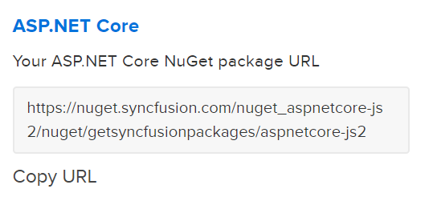

3. Now, use this NuGet feed URL to access the Syncfusion NuGet Packages in Visual Studio. 

## Add the Syncfusion NuGet feed URL

### Windows

1.	Open your Visual Studio application. 

2.	On the **Tools** menu, select **Options**.

3.	Expand the **NuGet Package Manager** and select **Package Sources**.

4.	Click the **Add** button (green plus), and enter the ‘Package Name’ and ‘Package Source URL’ of the Syncfusion NuGet packages.
    
    **Name:** Name of the package source.
    
    **Source:** Syncfusion NuGet Feed URL      

    For example, Name: Syncfusion AspNet Core-js2 Packages, Source: [https://nuget.syncfusion.com/nuget_aspnetcore-js2/nuget/getsyncfusionpackages/aspnetcore-js2](https://nuget.syncfusion.com/nuget_aspnetcore-js2/nuget/getsyncfusionpackages/aspnetcore-js2).

5.	Click the **Update** button to add the name and source details to package sources. 

    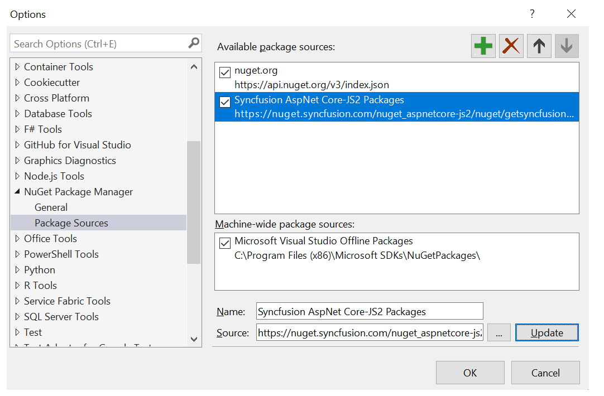

### macOS 

1.	Open your Visual Studio application. 

2.	Right-click on the Packages folder in the project, and then select **Add Packages…**
 
    

3.	Choose the **Configure Sources…** from the dropdown that appears in the left corner of the Add Packages dialog. 

    

4.	At the bottom right corner of the dialog, click the **Add** button to enter the feed name and the URL. 
   
    **Name:** Name of the package source.
    
    **Source:** Syncfusion NuGet Feed URL      

    For example, Name: Syncfusion ASP.NET Core Packages, Source: [https://nuget.syncfusion.com/nuget_aspnetcore-js2/nuget/getsyncfusionpackages/aspnetcore-js2](https://nuget.syncfusion.com/nuget_aspnetcore-js2/nuget/getsyncfusionpackages/aspnetcore-js2).
    
	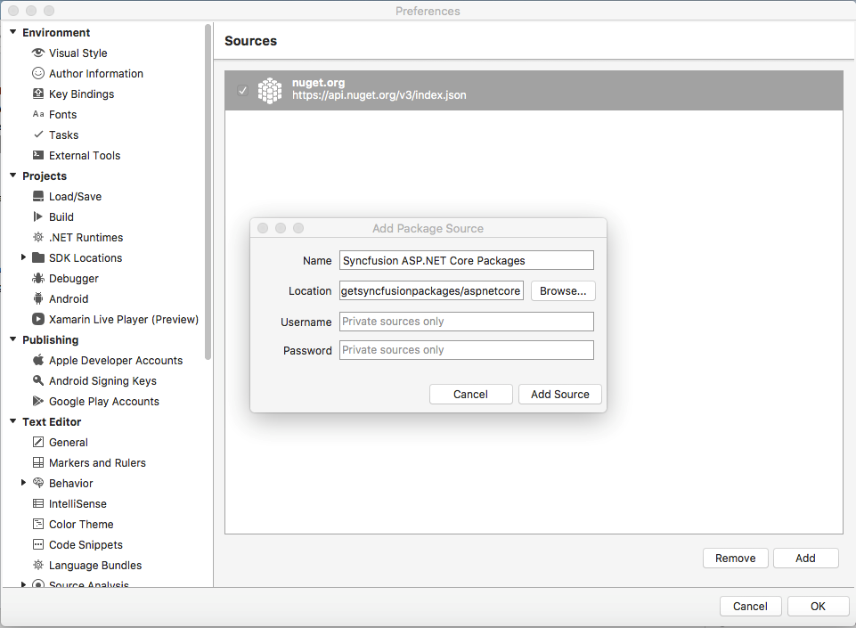
 
5.	Now, click **Add Source** and then click **OK**.

## Installing NuGet Packages

### Using NuGet Package Manager

The NuGet Package Manager can be used to search and install NuGet packages in the Visual Studio solution or project:

1.	On the **Tools**, menu, NuGet `Package Manager | Manage NuGet Packages for Solution...`

    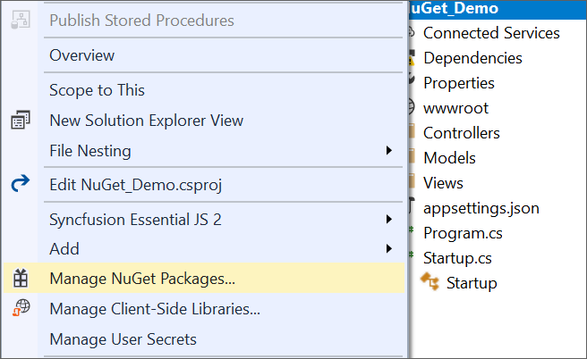

    Alternatively, right-click on the project/solution in Solution Explorer tab, and choose **Manage NuGet Packages…**

2.	By default, the NuGet.org package is selected in the **Package source** drop-down. Select your appropriate feed name that you configured. 

     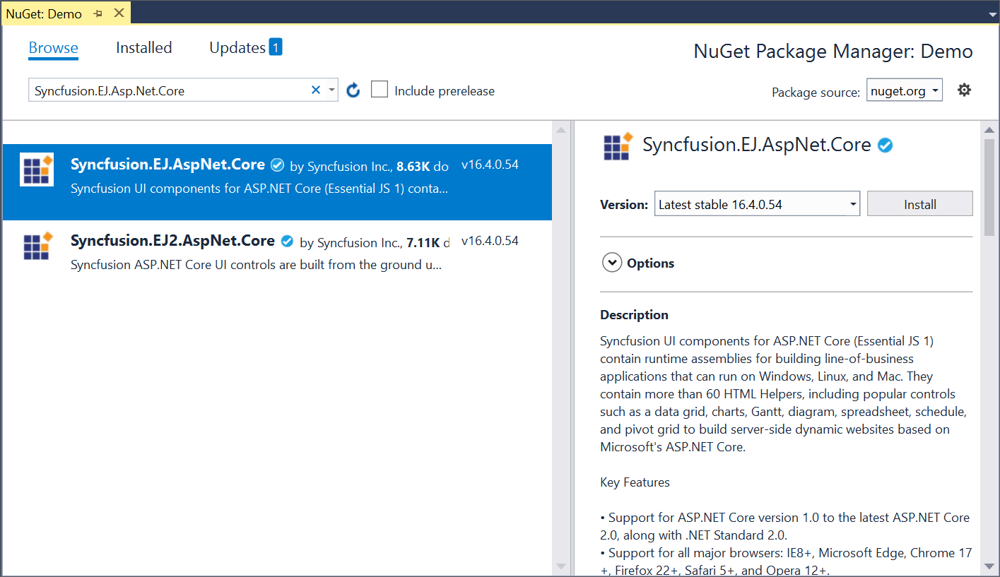             

3.	The Syncfusion NuGet Packages are listed the available package in the source feed URL. Search and install the required packages in your application, by clicking **Install** button.

### Using Package Manager Console

To reference the Syncfusion component using the Package Manager Console as NuGet packages, 

1.	On the **Tools** menu, select **NuGet Package Manager** and then **Package Manager Console**. 

2.	Run the following NuGet installation commands: 

    ~~~
    #install specified package in default project
    Install-Package <Package Name>

    #install specified package in default project with specified package source
    Install-Package <Package Name> -Source <Source Location>

    #install specified package in specified project 
    Install-Package <Package Name> - ProjectName <Project Name>
    ~~~

    **For example:**

    ~~~
    #install specified package in default project
    Install-Package Syncfusion.EJ.AspNet.Core

    #install specified package in default project with specified Package Source
    Install-Package Syncfusion.EJ.AspNet.Core -Source “https://nuget.syncfusion.com/nuget_aspnetcore-js2/nuget/getsyncfusionpackages/aspnetcore-js2”

    #install specified package in specified project 
    Install-Package Syncfusion.EJ.AspNet.Core -ProjectName SyncfusionDemoApplication
    ~~~

### Using Visual Studio for macOS

Add packages can be used to search and install NuGet packages to the Visual Studio project in macOS:

1.	Right-click on the folder in the project, and then select **Add Packages…** 

      
              
2.	By default, the NuGet.org package is selected in the **Package source** drop-down. Select the appropriate feed name. 

      

3.	The Syncfusion NuGet Packages available in the package source location will be listed. Search and install the required packages in your application, by clicking **Add Package** button.

## Managing NuGet package using NuGet CLI

The NuGet Command Line Interface (CLI), nuget.exe, provides the full extent of NuGet functionality to install, create, publish, and manage packages without making any change to the project files.

### Configure NuGet feed URL 

1.	Download the latest NuGet CLI from [here](https://dist.nuget.org/win-x86-commandline/latest/nuget.exe).

    N> To update the existing nuget.exe to latest version use the following command:

    ~~~
    nuget update -self
    ~~~

2.	Open the downloaded executable location in the command window, and run the following commands to configure the Syncfusion NuGet packages: 

    ~~~
    #Add specified package source in NuGet.config file for Windows platform
    nuget.exe Sources Add –Name <Source name> –Source <Source location>

    #Add specified Package Source in Nuget.config file for MAC/Linux platform
    mono nuget.exe Sources Add –Name <Source name> –Source <Source location>
    ~~~

    **For example:**

    ~~~
    #For Windows platform
    nuget.exe Sources Add –Name “Syncfusion Source” –Source “https://nuget.syncfusion.com/nuget_aspnetcore-js2/nuget/getsyncfusionpackages/aspnetcore-js2”

    #For MAC/Linux platform
    mono nuget.exe Sources Add –Name “Syncfusion Source” –Source “https://nuget.syncfusion.com/nuget_aspnetcore-js2/nuget/getsyncfusionpackages/aspnetcore-js2”
    ~~~

### NuGet installation

Download and install the required NuGet packages to a project specified in the package.config. 

~~~
#install specified package in default project from specified package source for Windows Platform 
nuget.exe install <Package name | ConfigFilePath > <Options>

#install specified package in default project from specified package source for MAC/Linux Platform 
mono nuget.exe install <Package name | ConfigFilePath > <Options>
~~~

N> configPath is optional. This identifies the packages.config or solutions file that lists the packages utilized in the project. 

**For example:**

~~~
#install specific package for Windows 
nuget.exe install “Syncfusion.EJ.AspNet.Core”

#install all package which mention in package.config path for Windows 
nuget.exe install “C:\Users\SyncfusionApplication\package.config”

#install specific Syncfusion ASP.NET Core NuGet package with Syncfusion ASP.NET Core NuGet feed for Windows 
nuget.exe install “Syncfusion.EJ.AspNet.Core”  –Source https://nuget.syncfusion.com/nuget_aspnetcore-js2/nuget/getsyncfusionpackages/aspnetcore-js2”

#install specific package for Mac and Linux 
mono nuget.exe install “ Syncfusion.EJ.AspNet.Core”

#install all package which mention in package.config path for Mac and Linux 
mono nuget.exe install “C:\Users\SyncfusionApplication\package.config”

#install specific Syncfusion ASP.NET Core NuGet package with Syncfusion ASP.NET Core NuGet feed for Mac and Linux 
mono nuget.exe install “Syncfusion.EJ.AspNet.Core”  –Source “https://nuget.syncfusion.com/nuget_aspnetcore-js2/nuget/getsyncfusionpackages/aspnetcore-js2”
~~~

## Managing NuGet package using Dotnet CLI

The NuGet Command Line Interface (CLI), Dotnet.exe, provides the full extent of NuGet functionality to add, restore, pack, publish, and manage packages without making any change to the project files.

1.	Open command prompt window with administrator privileges and navigate to your project folder.

2.	The specified ASP.NET Core NuGet package command as below,

    **Add**

    ~~~
    #Add specified package in specified project from Package Source
    dotnet add package <Package name> [-s|--source] <Source location>
    ~~~

    **For example :**

    ~~~        
    dotnet add package Syncfusion.EJ.AspNet.Core  -s “https://nuget.syncfusion.com/nuget_aspnetcore-js2/nuget/getsyncfusionpackages/aspnetcore-js2”
    ~~~

    **Restore**

    ~~~
    #Restore all package which specified in project
    dotnet restore
    ~~~

	To know more command about the dotnet CLI, refer [here](https://docs.microsoft.com/en-us/dotnet/core/tools/dotnet?tabs=netcore2x).

## Managing NuGet package for Visual Studio online application

The following steps help you configure and restore the Syncfusion NuGet packages in Visual Studio online application.

### Configure NuGet feed URL 

1.  Create and add the NuGet.config file in your Visual Studio online application location along with required Syncfusion platform NuGet feed links. You can get the Syncfusion NuGet package feed link by clicking the **Copy URL** label from the required platform provided in the following link:
    <http://nuget.syncfusion.com>
     
    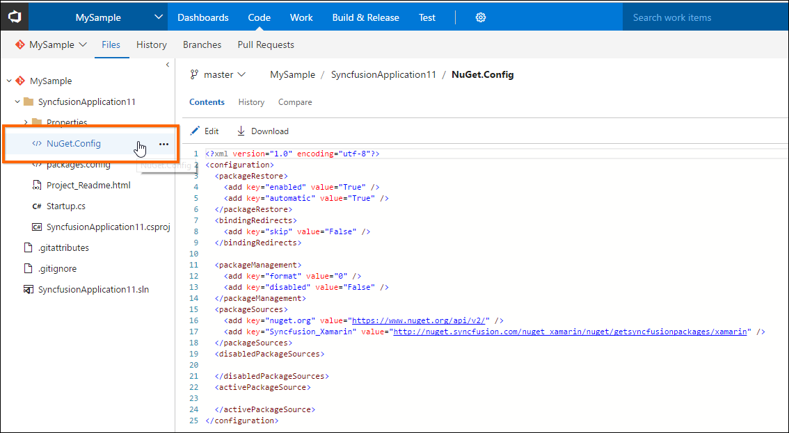

2.  If your application doesn't have any build definitions, create new build definition by clicking the **New Definition** button under **Build & Release**. 

    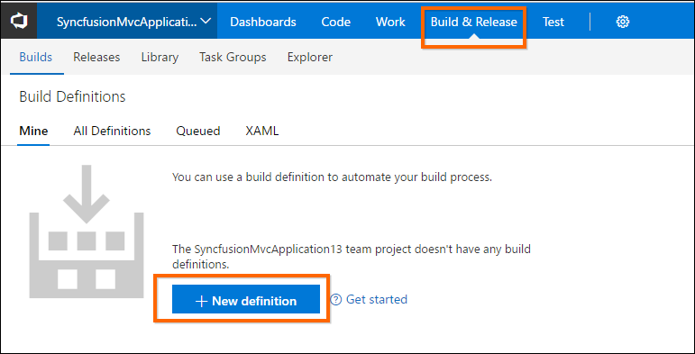

    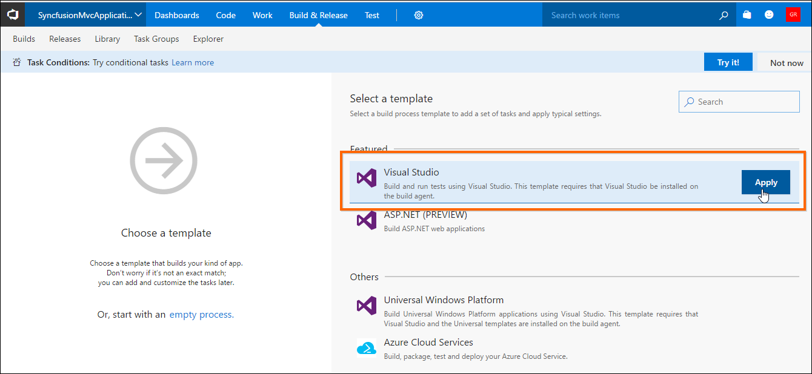

### NuGet installation

1.  If your application has any build definitions, navigate to **Build & Release** tab and select the **Edit** option from corresponding application to include the NuGet restore process.

    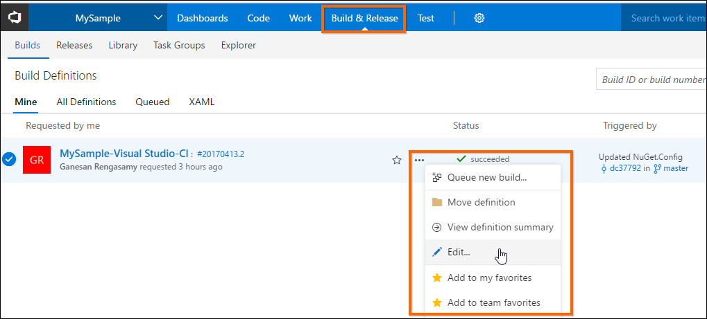
     
    N> If we can't find the NuGet restore process from these build definitions, we can add it by using **Add build step -> Package -> NuGet Installer**. 

2.  Then update path of the NuGet.config file in Path to NuGet.config textbox and Save this build definition.
	
	

3.  Then start the build process by clicking **Queue new build** button. The required NuGet packages are restored and project will be compiled successfully.

    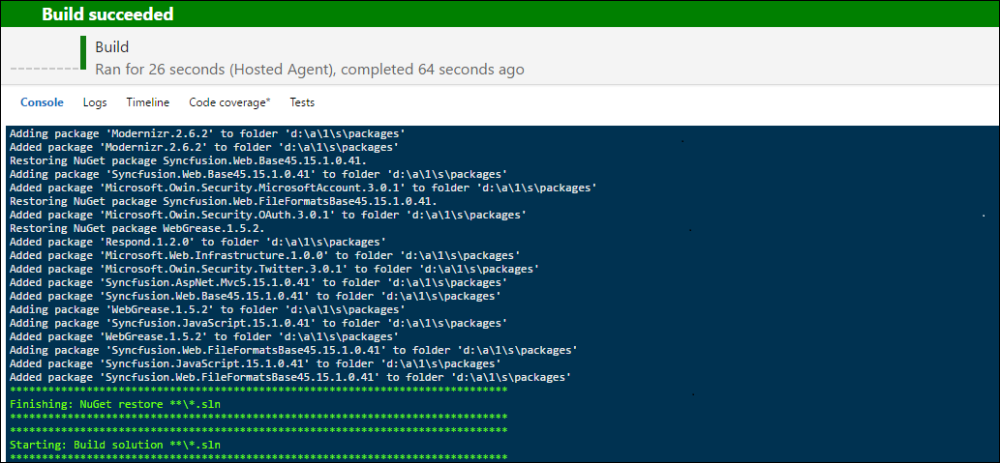
	
	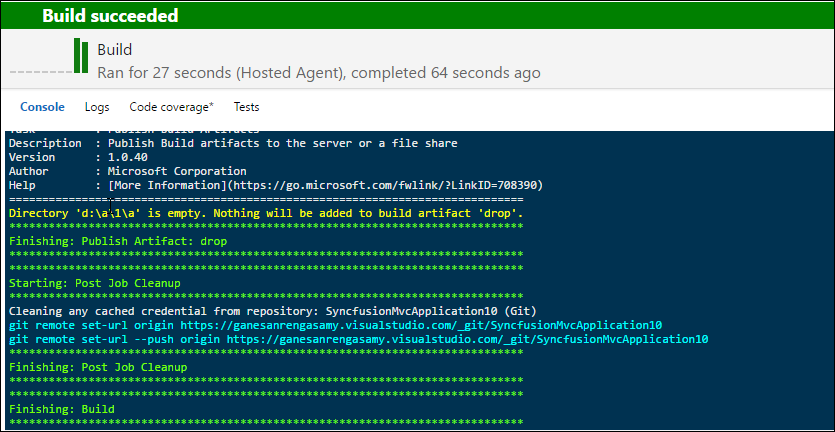

## Upgrading NuGet packages

### Using NuGet Package Manger 

NuGet packages can be updated to their specific version or latest version available in the Visual Studio solution or project:

1. On the **Tools** menu, `NuGet Package Manager | Manage NuGet Packages for Solution...`
    Alternatively, right-click on project/solution in the Solution Explorer tab, and choose **Manage NuGet Packages…**

2. Select the **Updates** tab to see the packages available for update from the desired package sources. Select the required packages and the specific version from the dropdown, and click the **Update** button.

### Using Visual Studio for macOS

Using **Update** context menu from Visual Studio for Mac application, NuGet packages can be updated:

1.	Right-click on the Packages folder in the project, and select **Update**. 

     

2.	This will update the NuGet package to the latest version. You can double-click Add packages and choose the specific version.

N> To update all the projects from solution, use update option in the solution level. 

### Using Package Manger Console

To update the installed Syncfusion NuGet packages using the Package Manager Console: 

1.	On the **Tools** menu, select **NuGet Package Manager**, and then **Package Manager Console.** 

2.	Run the following NuGet installation commands:

    ~~~ 
    #Update specific NuGet package in default project
    Update-Package <Package Name>

    #Update all the packages in default project
    Update-Package 

    #Update specified package in default project with specified package source
    Update-Package <Package Name> -Source <Source Location>

    #Update specified package in specified project 
    Update-Package <Package Name> - ProjectName <Project Name>
    ~~~

    **For example:**

    ~~~
    #Update specified Syncfusion NuGet package 
    Update-Package Syncfusion.EJ.AspNet.Core

    #Update specified package in default project with specified Package Source
    Update-Package Syncfusion.EJ.AspNet.Core –Source “https://nuget.syncfusion.com/nuget_aspnetcore-js2/nuget/getsyncfusionpackages/aspnetcore-js2” 
    #Update specified package in specified project 
    Update-Package Syncfusion.EJ.AspNet.Core -ProjectName SyncfusionDemoApplication
    ~~~

### Using NuGet CLI

Using the NuGet CLI, all the NuGet packages in the project can be updated to the available latest version: 

1.	Download the latest NuGet CLI from [here](https://dist.nuget.org/win-x86-commandline/latest/nuget.exe).

    N> To update the existing nuget.exe to latest version use the following command: 

    ~~~
    nuget update -self
    ~~~

2.	Open the downloaded executable location in the command window. Run the following “update commands” to update the Syncfusion ASP.NET Core NuGet packages.

    ~~~ 
    #update all NuGet packages from config file
    nuget update <configPath> [options]

    #update all NuGet packages from specified Packages Source
    nuget update -Source <Source Location> [optional]
    ~~~      

    N> configPath is optional. This identifies the packages.config or solutions file lists the packages utilized in the project. 
	
    **For example:**

    ~~~          
    #Update all NuGet packages from config file
    nuget update “C:\Users\SyncfusionApplication\package.config”

    #Update all NuGet packages from specified Packages Source
    nuget update -Source “https://nuget.syncfusion.com/nuget_aspnetcore-js2/nuget/getsyncfusionpackages/aspnetcore-js2”
    ~~~

    N> Update command is not working as expected in Mono (Mac and Linux) and projects using PackageReference format.
   

