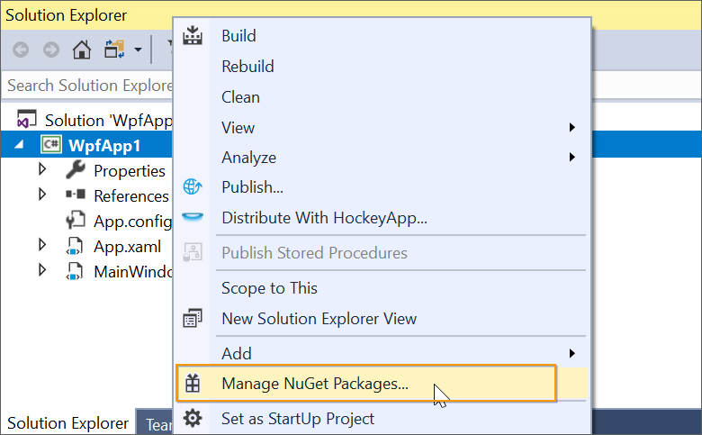
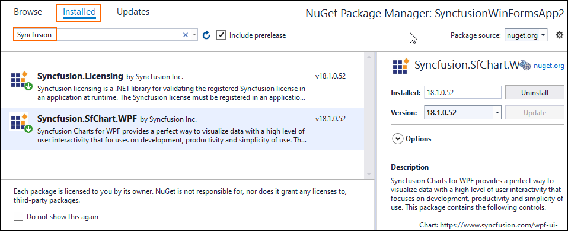
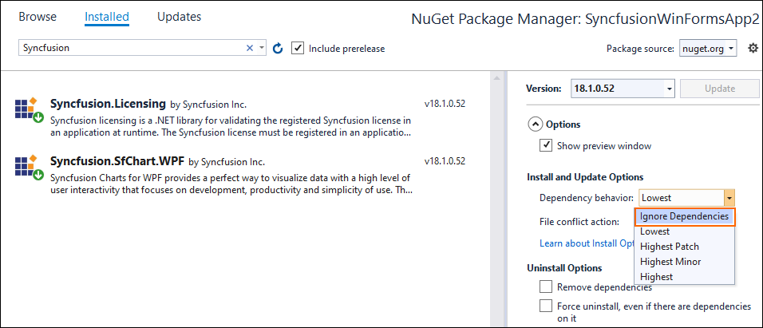
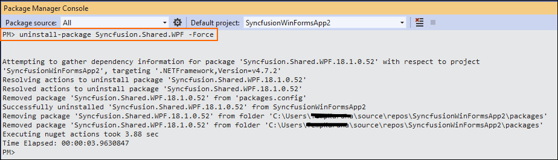

# NuGet Uninstallation process

## NuGet Uninstallation by using NuGet Package Manager

You can uninstall already installed Syncfusion NuGet packages from project using the following steps via NuGet Package Manager dialog.

1. Right-click on Project and select **Manage NuGet Packages** option. 

   
   
2. Select the **Installed** tab from NuGet Package Manager dialog and you can see the installed Syncfusion NuGet packages list by giving the Syncfusion keyword in search.

   

3. Uninstall the Syncfusion NuGet packages which are not required for the project. 

   

N> You cannot uninstall the dependent package because of the package being referred in other NuGet Packages. It removes Project Reference and package from the project location.

4. If you don't want to uninstall the dependent NuGet packages when uninstall the Syncfusion NuGet packages, you can select the **Ignore Dependencies** option to ignore the uninstallation for dependend packages.

   

## NuGet Uninstallation by using Package Manager Console

You can uninstall already installed Syncfusion NuGet packages from project using the following steps via Package Manager Console window.

1. Select the **Tools-> NuGet Package Manager-> Package Manager Console**.

2. Run the following command to uninstall the specified Syncfusion NuGet Package with the package name. 

   uninstall-package {package name} –RemoveDependencies

   Example: uninstall-package Syncfusion.SfChart.WPF –RemoveDependencies
      
   

3. You can uninstall the dependent NuGet package alone even if other NuGet packages depend on it by using the below command.

   uninstall-package {package name} -Force

   Example: uninstall-package Syncfusion.Shared.WPF -Force

      