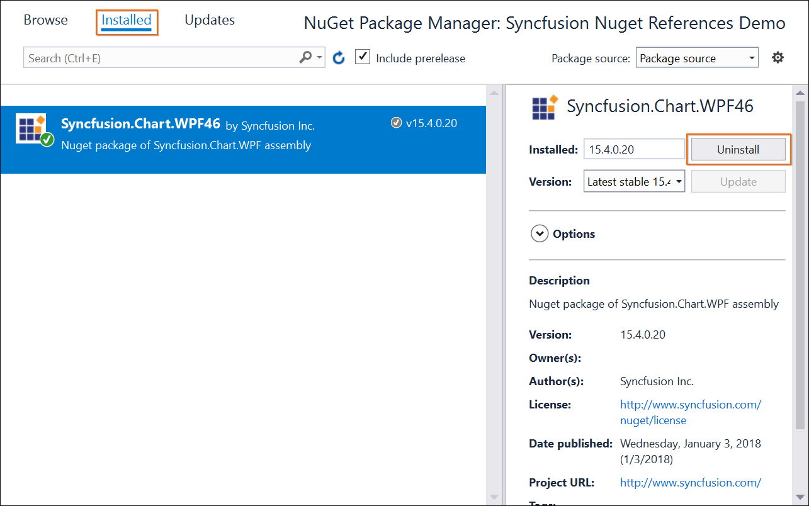
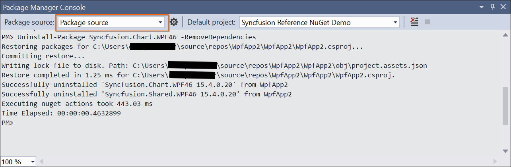

### NuGet Uninstallation process

#### NuGet Uninstallation

You can uninstall the installed packages from the WPF project using the following steps viathe Manage NuGet Packages dialog.

1. Right-click Project and select Manage NuGet Packages. 
2. Select the Installed packages and see the installed packages list.
3. Uninstall packages that are not required for the project. 

{:.image }

> _Note: You cannot uninstall the dependent package because of the package being referred in other NuGet Packages. It removes Project Reference and package from the project location._

#### Uninstall from Package Manager Console

To uninstall the Syncfusion NuGet Packages by Package Manager Console, follow the given steps.

1. Select the Tools-> NuGet Package Manager-> Package Manager Console.
2. Run the following command to uninstall the specified NuGet Package with the package name. 

Uninstall-package {package name} –remove Dependencies

Example: uninstall-package Syncfusion.Chart.WPF45 –remove Dependencies

3. Refer to the following screenshot for more information.

{:.image }

