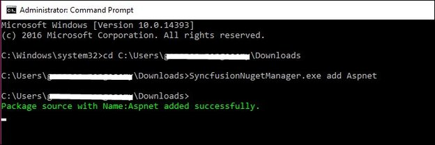

# Syncfusion NuGet Package Manager

## Overview

Syncfusion NuGet Package Manager is the utility that allows you to add, remove and update the Syncfusion NuGet sources (available platforms) to NuGet Package Manager. Download the Syncfusion NuGet Manager utility from [here](http://www.syncfusion.com/downloads/support/directtrac/general/ze/SyncfusionNugetManager-1610952973.zip).

## Add Syncfusion NuGet Package sources 

The following steps directs you to add the Syncfusion NuGet Package sources from Syncfusion NuGet Manager. 

1. Run the SyncfusionNuGetManager.exe from Syncfusion NuGet Manager extracted location. 

   

2. Syncfusion NuGet Manager Window will be opened.

   

3. Select the required platforms needed to be configured from “Select platforms to add” (Left side of the window) column and click Add>> button.

   

4. Now selected platforms will be added under “Selected platforms to remove” (Right side of the window) column. Click “Configure” button to add the required Syncfusion Package sources to NuGet Package Manager.

   

5. Once Syncfusion NuGet Manager added the Syncfusion NuGet sources, the changes will be reflected in package sources of your Visual Studio. 

   

## Remove Syncfusion NuGet Package sources 

1. If any configured Syncfusion NuGet Package sources are no longer required, Select the unwanted platforms from “Select platforms to remove” (Right side of the window) column and click <<Remove button. 

      

2. Now selected platforms will be added under “Selected platforms to add” (Left side of the window) column. Click “Configure” button to remove the required Syncfusion Package sources to NuGet Package Manager.

3. Once Syncfusion NuGet Manager removed the Syncfusion NuGet sources, the changes will be reflected in NuGet.config file of your machine and updated the same in available package sources of your Visual Studio. 

## Syncfusion NuGet Manager command line

The following steps directs you to use the Syncfusion NuGet Manager from command line.

1. Open Windows Command Prompt in Administrator Mode.

2. Navigate to SyncfusionNuGetManager.exe from Syncfusion NuGet Manager extracted location.  

3. Run SyncfusionNuGetManager.exe with required platforms arguments. Refer the below table for platform as arguments to configure the Syncfusion NuGet Packages sources. 

   

**Add**

To add the Syncfusion NuGet feed link with below command.

SyncfusionNuGetManager.exe Add [platform key]

Example:SyncfusionNuGetManager.exe Add

**Update**

To update the new feed\local NuGet location with update command.

SyncfusionNuGetManager.exe Update {platform key} {source feed link\Local NuGet location}

Example:SyncfusionNuGetManager.exe Update JavaScript “D:\Syncfusion\JavaScript NuGet”

**Remove**

To remove the configured Syncfusion NuGet by below command.

SyncfusionNuGetManager.exe Remove [platform  key] [local NuGet Location]

Example:SyncfusionNuGetManager.exe Remove JavaScript

**Platform Key table**

Here the list of keyword for platform keys to access. 

<table>
 <thead>
  <tr>
    <th>Platform</th>
    <th>Platform Keys</th>
  </tr>
 </thead>
 <tbody>
  <tr>
   <td>ASP.NET</td>
   <td>Aspnet /asp.net</td>
  </tr>
  <tr>
    <td>ASP.NET MVC</td>
    <td>Aspnetmvc /asp.net mvc /mvc</td>
  </tr>
  <tr>
    <td>ASP.NET Core</td>
    <td>Aspnetcore /asp.net core /core</td>
  </tr>
  <tr>
   <td>JavaScript</td>
   <td>JavaScript/JS</td>
  </tr>
  <tr>
    <td>Xamarin</td>
     <td>Xamarin</td>
  </tr>
  <tr>
   <td>UWP</td>
   <td>Uwp /universalwindows</td>
 </tr>
 <tr>
   <td>WPF </td>
   <td>Wpf</td>
 </tr>
 <tr>
   <td>Windows Forms</td>
   <td>WindowsForms /Winforms/WF</td>
 </tr>
 <tr>
  <td>Windows Phone</td>
  <td>WindowsPhone /wp /winphone</td>
 </tr>
 <tr>
  <td>WinRT</td>
  <td>WinRT</td>
 </tr>
 <tr>
  <td>Universal</td>
  <td>Universal</td>
 </tr>
 <tr>
  <td>LightSwitchHTML</td>
  <td>LightSwitch</td>
 </tr>
 <tr>
  <td>Silverlight</td>
  <td>Silverlight</td>
 </tr>
 </tbody>
</table>

4. Once Syncfusion NuGet Manager removed the Syncfusion NuGet sources, the changes will be reflected in NuGet.config file of your machine and updated the same in available package sources of your Visual Studio. 

   

