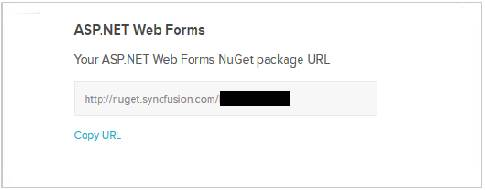
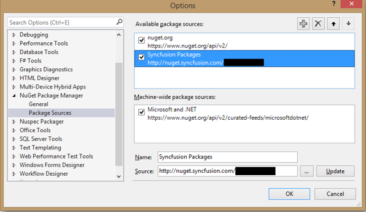
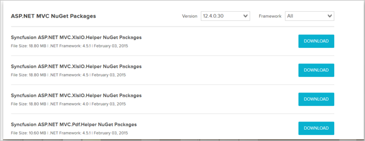
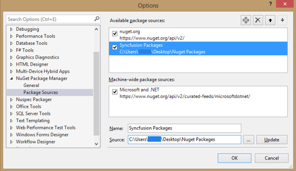
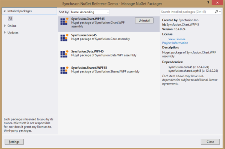
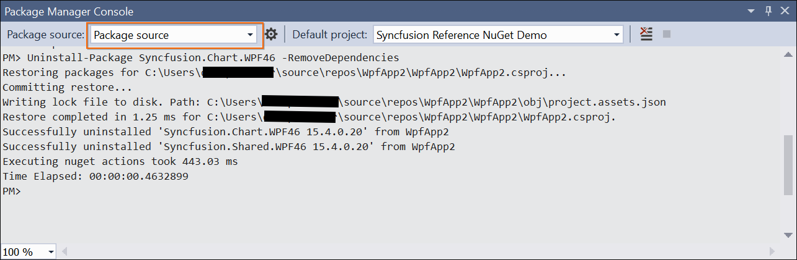

# Syncfusion NuGet Packages

Syncfusion assemblies are packed by NuGet Packages. Get the Syncfusion NuGet Packages from the following link by logging in with your SyncfusionAccount credentials. 

[http://nuget.syncfusion.com/account](http://nuget.syncfusion.com/account)

## NuGet Install and Configuration

### NuGet Configuration in Visual Studio

You can configure the SyncfusionNuGetPackages files in Visual Studio 2008\2010\2012\2013. SyncfusionNuGet packages are configured in the following ways.

1. By using Syncfusion’s private feed URL.
2. From the Syncfusion NuGet downloaded from the website.

#### Configure the Syncfusion NuGet Packages by using Syncfusion’s private feed URL

The following steps help you configure Syncfusion NuGet Packages with a URL.

1. Launch the Microsoft Visual Studio 2008/2010/2012/2013.
2. Select Tools-> NuGet Package Manager-> Package Manager Settings, and the Options dialog opens. 
3. Navigate to the NuGet Package Manager->Package Sources from the Options dialog. 
4. Click the Add  
    button to create the new Package Source.
5. Select the newly created Package Source and rename the source name using the Name input box.
6. Copy the Syncfusion NuGet Package URL from Syncfusion NuGet account and paste it in the source textbox. You can get the URL by clicking the Copy URL label from the required version and platform provided in the following link: [http://nuget.syncfusion.com/account](http://nuget.syncfusion.com/account)

   

7. Select Update and then click the OK button. The package's source is added to the list of available package sources as shown in the following screenshot.

   

   > Note: The Syncfusion NuGet packages URL link is provided by platform basics.

#### Configure the Syncfusion NuGet Packages in Visual Studio from downloaded packages

The following steps help you download and configure the downloaded Syncfusion NuGet Packages in the Visual Studio. The download file format is a zip file that contains all the packages with the framework.

1. Click the download link of Syncfusion NuGet Package and save the zip file. The download option is shown in the following screenshot.

   

2. Launch the Visual Studio application.
3. Navigate to Tools-> NuGet Package Manager-> Package Manager Settings, and the Options dialog opens. 
4. Select the NuGetPackage Manager->Package Sources from the Options dialog. 
5. Click the Add  button to create the new Package Source.
6. Select the newly created Package Source and rename the source name from the Name input box and browse the source location with the extracted locationof SyncfusionNuGets.
7. Select Update and then click the OK button. The package's source is added to the list of available package sources as shown in the following screenshot.

   

### Install from Package Manager Console

You can install the Syncfusion NuGet packages by using the Package Manager Console. The following steps help you install the Syncfusion NuGet package.

1. Select the Tools-> NuGet Package Manager-> Package Manager Console.
2. Make sure that the Package source under the “Syncfusion packages registered Name” in Package Manager Settings is present. Refer the following screenshot.

   

3. Run the following command to install the specified NuGet Package with the package name.

Install-package {package name}. Example: install-package Syncfusion.Chart.WPF45.

### Visual Studio Toolbox manual configuration

To configure the Syncfusion control in the Visual Studio Toolbox manually with the Syncfusion assemblies, get the Syncfusion assemblies from the NuGet Installed in project location. The following steps help you to configure the toolbox to your Visual Studio.

1. Create a new tab named Syncfusion in the toolbox.

   

2. Right-click and select the Choose Items.

   

3. Click Toolbox Items and the window opens as displayed in the following screenshot.

   

4. Select the WPF Components tab.__
5. Navigate to the SyncfusionWPF assembly from the packages location of the project. You do not have to add the design assemblies
6. Click OK, and the assemblies are copied to the newly created Syncfusion WPF Toolbox tab.

### NuGet Updates

The following steps help you update the SyncfusionNuGet to your Project.

1. Before updating the packages, configure the latest NuGet’s details in Visual Studio. 
2. Right-click on Project and choose Manage NuGet Packages. 
3. Select the Updates -> &lt;Created Package Source Name&gt;. Refer to the following screenshot for more information.

   

4. When the latest version of the NuGets are available from Visual Studio Configurations, the Updates are automatically shown in the Manage NuGet Packages ->Updates-> &lt;Created Package Source Name&gt;.  Refer to the above screenshot for more information.
5. By clicking the Update button the NuGet is updated in your project.

## Register the Syncfusion License key

You need to register for the Syncfusion license for development purpose. The following steps guide you as to how to register for the Syncfusionlicense.

1. Download the [Syncfusion License](http://files2.syncfusion.com/Installs/Support/KB/RegisterProductkeyinBuildMachine.zip) Register tool and extract the file. 
2. Open the Command Prompt with administrator privileges.
3. Navigate to the root location of the extracted downloaded, Syncfusion license.
4. Run the following command to register the license key-Synckeynoui.exe “License key”.

   

## NuGet Uninstallation process

### NuGet Uninstallation

You can uninstall the installed packages from the WPF project using the following steps viathe Manage NuGet Packages dialog.

1. Right-click Project and select Manage NuGet Packages. 
2. Select the Installed packages and see the installed packages list.
3. Uninstall packages that are not required for the project. 

   

> Note: You cannot uninstall the dependent package because of the package being referred in other NuGet Packages. It removes Project Reference and package from the project location.

### Uninstall from Package Manager Console

To uninstall the Syncfusion NuGet Packages by Package Manager Console, follow the given steps.

1. Select the Tools-> NuGet Package Manager-> Package Manager Console.
2. Run the following command to uninstall the specified NuGet Package with the package name. 

   Uninstall-package {package name} –remove Dependencies

   Example: uninstall-package Syncfusion.Chart.WPF45 –remove Dependencies

3. Refer to the following screenshot for more information.

   

