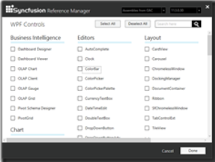
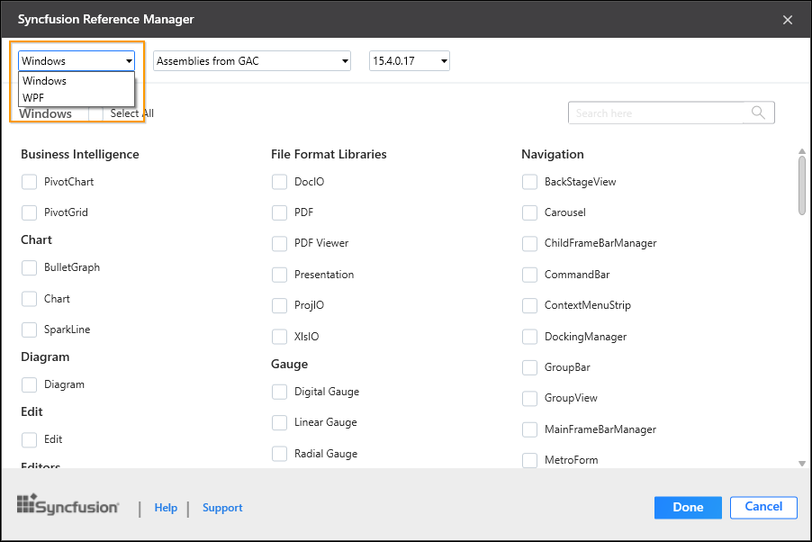
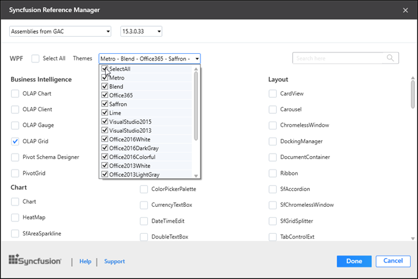
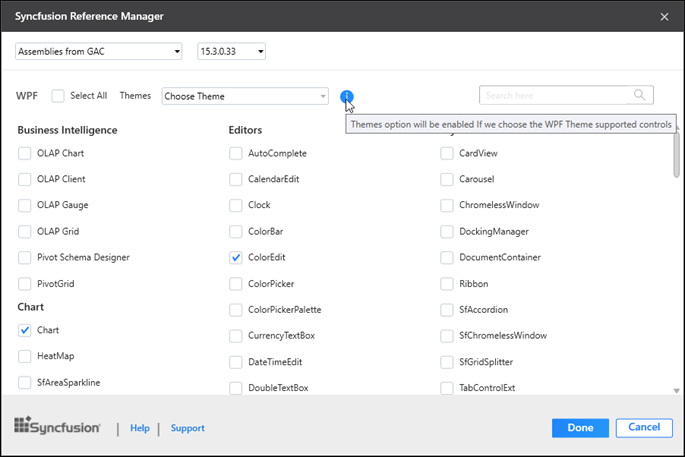
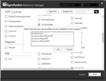
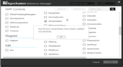

# Add a Syncfusion References via Syncfusion Reference Manger

The Add-In launches a pop-up window that contains the list of Syncfusion controls that are loaded, based on the platform of the project. If it is a WPF project, all the Syncfusion WPF controls are loaded.

To add the assemblies:

1. Select the Syncfusion Reference Manager either in the WPF, Windows Forms/Console/Class Library or Silverlight Project.
2. The Syncfusion Reference Manager dialog is displayed as shown in the following screenshot.

   

3. If launched the Syncfusion Reference Manager from Console/Class Library project, Platform selection option will be appeared as option in Syncfusion Reference Manager. Choose the required platform based on your need. 

    

    N> Platform selection option will be appeared only if Essential Studio for Enterprise Edition with the platforms WPF and Windows Forms has been installed or both Essential Studio for WPF and Essential Studio for Windows Forms has been installed.

4. If launched the Syncfusion Reference Manager from WPF project or select the WPF platform from platform selection option, **Themes** option will be appeared as option in Syncfusion Reference Manger. Choose the required themes based on your need. Refer the below link to know more about built in themes and its available assemblies.

    [https://help.syncfusion.com/wpf/themes/](https://help.syncfusion.com/wpf/themes/)

    

    N> Themes option will be enabled only if selected SfSkinManager supported controls.

    

5. Reference assemblies
   * Syncfusion assemblies can either be from GAC or from installed location. These options determine the location of the assemblies that are referenced in the project.
   * Syncfusion Essential Studio versions that were previously installed in your machine. This option determines the assembly version that is referenced in the project.
   * Choose the required controls that you want include in project
6. Click Done to add the required assemblies for the selected controls into the project. The   following screenshot shows the list of required assemblies for 
   the selected controls to be added.

   

7. Click OK. The listed Syncfusion assemblies are added to project. Then it notifies “Syncfusion assemblies have been added successfully” in Visual Studio status bar.

   

N>Currently we are providing Syncfusion Reference Manager support for specific framework which is specified/shipped (assemblies) in Essential Studio setup. So, if we try to add Syncfusion assemblies in project and project framework is not supported with selected Syncfusion version assemblies, the dialog will be appeared along with “Current build version is not supported this framework” message.

