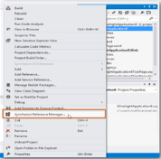

# Configure Syncfusion assemblies in Visual Studio project

The Syncfusion Reference Manager provides options to select from in the Context Menu of the project, right click on the project to see the Context Menu. The following screenshot shows this option in Visual Studio.   

