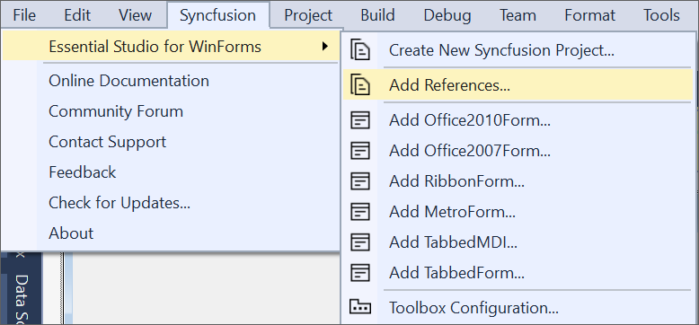

# Configure Syncfusion&reg; assemblies in Visual Studio project

To open Syncfusion&reg; Reference Manager Wizard, follow either one of the options below:
**Option 1:**  
Click **Syncfusion&reg; Menu** and choose **Essential Studio&reg; for WinForms/WPF > Add References…** or any other Form in **Visual Studio**.

N> In Visual Studio 2019, Syncfusion&reg; menu available under Extension in Visual Studio menu.

**Option 2:**  
Right-click the selected project file from Solution Explorer, then select **Syncfusion&reg; Reference Manager…** from **Context Menu**. The following screenshot shows this option in Visual Studio.   

