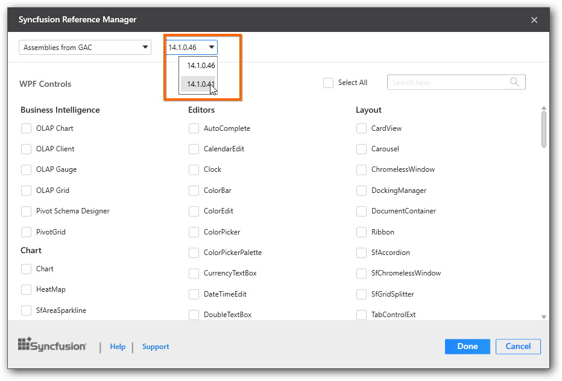
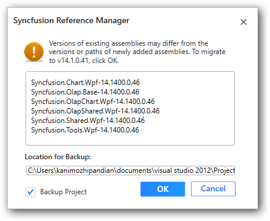

# Migrate the Syncfusion® assemblies

The Syncfusion® Reference Manager can migrate the Syncfusion® assemblies to selected version of Syncfusion® assemblies when you want to migrate from one version to another version, the Syncfusion® references in the project.

To migrate the Syncfusion® assemblies,

1. Open the project you would like to migrate with another version of Syncfusion® assemblies.
2. Select the option Syncfusion® Reference Manager in the WPF or Windows Forms or Silverlight Project.
3. The dialog Syncfusion® Reference Manager is opened. Then choose the required Syncfusion® Essential Studio® version to migrate the project. Refer the following
   screenshots for more information.

   

4. When you want to add controls additionally, select controls while the migration is in process. Otherwise, do not select any control.
5. Click Done. The following screenshot shows the list of assemblies to be migrated. 

   

6. The option Backup Project copies the project into the Backup folder in the same project location before migration.
7. Then click OK. The project is migrated to the selected versions of the Syncfusion® assembly reference.

