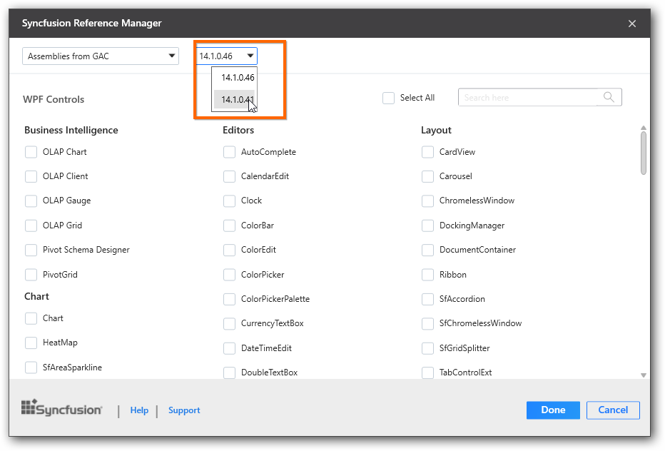
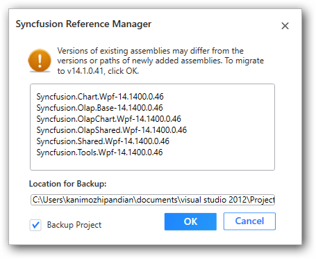

# Syncfusion Reference Manager

Syncfusion Reference Manager is the Visual Studio Add-In for WPF, Windows Forms and Silverlight platforms. It adds the Syncfusion assembly reference to the project, either from the GAC location or from where Essential Studio is installed. It can also migrate the projects that contain the old versions of the Syncfusion assembly reference to newer or specific versions of the Syncfusion assembly reference. Support is provided for this extension, for VS2010, VS2012, and VS2013. This Visual Studio extension is included from Essential Studio 2013 Volume 3 release.

  Note: This Reference Manager can be applied to a project for Syncfusion assembly versions 10.4.0.71 and later.

## Configure Syncfusion assemblies in Visual Studio project

The Syncfusion Reference Manager provides options to select from in the Context Menu of the project, right click on the project to see the Context Menu. The following screenshot shows this option in Visual Studio.   

## Add a Syncfusion References via Syncfusion Reference Manger

The Add-In launches a pop-up window that contains the list of Syncfusion controls that are loaded, based on the platform of the project. If it is a WPF project, all the Syncfusion WPF controls are loaded.

To add the assemblies:

1. Select the Syncfusion Reference Manager eitherin the WPF, Windows Forms or Silverlight Project.
2. The Syncfusion Reference Manager dialog is displayed as shown in the following screenshot.

   

3. Reference assemblies
* Syncfusion assemblies can either be from GAC or from installed location. These options determine the location of the assemblies that are referenced in the project.
* Syncfusion Essential Studio versions that were previously installed in your machine. This option determines the assembly version that is referenced in the project.
* Choose the required controls that you want include in project
4.Click Done to add the required assemblies for the selected controls into the project. The following screenshot shows the list of required assemblies for the selected controls to be added.

  

5.Click OK. The listed Syncfusion assemblies are added to project. Then it notifies the “Assembly Added Successfully” window.

  

## Migrate the Syncfusion assemblies

The Syncfusion Reference Manager can migrate the Syncfusion assemblies to selected version of Syncfusion assemblies when you want to migrate from one version to another version, the Syncfusion references in the project.

To migrate the Syncfusion assemblies,

1. Open the project you would like to migrate with another version of Syncfusion assemblies.
2. Select the option Syncfusion Reference Manager in the WPF or Windows Forms or Silverlight Project.
3. The dialog Syncfusion Reference Manager is opened. Then choose the required Syncfusion Essential Studio version to migrate the project. Refer the following screenshots for more information.

  

4. When you want to add controls additionally, select controls while the migration is in process. Otherwise, do not select any control.
5. Click Done. The following screenshot shows the list of assemblies to be migrated. 

   

6. The option Backup Project copies the project into the Backup folder in the same project location before migration.
7. Then click OK. The project is migrated to the selected versions of the Syncfusion assembly reference.

