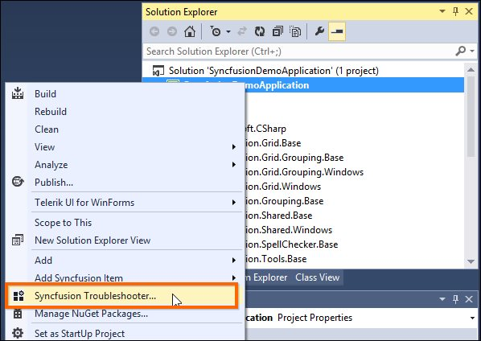

# Troubleshoot the project

The Syncfusion Troubleshooter will be installed in Visual Studio along with Syncfusion Essential Studio setup installation. The Syncfusion Troubleshooter can be done the below items,

1. Report the Configuration issues.  

2. Apply the solution

## Report the Configuration issues

The following steps direct you to utilize the Syncfusion Troubleshooter by Visual Studio. 

1. Right click on the Project file in Solution Explorer, then select the command “Syncfusion Troubleshooter”. Refer the following screenshot for more information. 

   

2. Now it’s analyze the project and it will report the project configuration issues of Syncfusion controls in the Troubleshooter dialog if any issues found. If the project doesn’t have any configuration issue, the dialog box will show the message as “There is no configuration changes required for this project” like below,

   

I> The Syncfusion Troubleshooter command will be visible only for Syncfusion projects that means the project should contain Syncfusion assemblies or Syncfusion NuGet packages referred.

Syncfusion Troubleshooter handles the below project configuration issues, 

1. Assembly Reference Issues.

2. Web.config Issues (for Web applications).

3. NuGet related Issues.

### Assembly Reference Issues

The Syncfusion Troubleshooter deals with below assembly reference issues in Syncfusion Projects. 

1. Dependent assemblies are missing for referred assemblies from project. 

2. Mismatched the referred Syncfusion assemblies. 

3. Framework version mismatching (Syncfusion Assemblies) with project’s .NET Framework version. 

   

### Web.config Issues (for Web applications)

The Syncfusion Troubleshooter deals with below web.config issues in Syncfusion web projects. 

1. Syncfusion assembly entry missing.

2. Duplicate assembly entry. 

3. Multiple version Syncfusion assembly entry. 

4. Namespace entry missing.

5. HTTP/Server handler entry missing.
 
   

### NuGet Issues

The Syncfusion Troubleshooter deals with below NuGet package related issues in Syncfusion projects. 

1. Multiple versions of Syncfusion NuGet Packages are installed. 

2. Installed Syncfusion NuGet package’s Framework version is differing from the project’s .NET Framework version.

3. Dependent NuGet package of the installed Syncfusion NuGet packages is missing. 

   

I> Internet connection is required to restore the missing dependent packages. If no Internet is available, the dependent packages will not be restored.

## Apply the solution

1. Once the Syncfusion Troubleshooter dialog loads, check the corresponding check box of the issue which you need to resolve. Then click the "Troubleshoot" button. 

   

2. A dialog appears, which will ask to take a backup of the project before perform the troubleshooting process. If you need to backup the project before troubleshooting click “Yes” button. 

   

3. Wait for a while, the Syncfusion Troubleshooter is being resolve the selected issues. Once the troubleshooting process completed, there will be a status message in the Visual Studio status bar as “Troubleshooting process completed successfully.” 

   