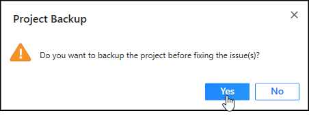

# Troubleshoot the project

The Syncfusion Troubleshooter will be installed in Visual Studio along with Syncfusion Essential Studio setup installation. The Syncfusion Troubleshooter can be done the below items,

1. Report the Configuration issues.  

2. Apply the solution

## Report the Configuration issues

The following steps direct you to utilize the Syncfusion Troubleshooter by Visual Studio. 

1. Right click on the Project file in Solution Explorer, then select the command “Syncfusion Troubleshooter...”. Refer the following screenshot for more information. 

   

2. Now it’s analyze the project and it will report the project configuration issues of Syncfusion controls in the Troubleshooter dialog if any issues found. If the project doesn’t have any configuration issue, the dialog box will show there is no configuration changes required in following areas,

     * Syncfusion assembly references.

     * Syncfusion Web.config entries.

     * Syncfusion NuGet Packages. 

   

I> The Syncfusion Troubleshooter command will be visible only for Syncfusion projects that means the project should contain Syncfusion assemblies or Syncfusion NuGet packages referred.

Syncfusion Troubleshooter handles the below project configuration issues, 

1. Assembly Reference Issues.

2. Web.config Issues (for Web applications).

3. NuGet related Issues.

### Assembly Reference Issues

The Syncfusion Troubleshooter deals with below assembly reference issues in Syncfusion Projects. 

1. Dependent assemblies are missing for referred assemblies from project. 

   **For Instance:**  If “Syncfusion.Tools.WPF” assembly referred in project and “Syncfusion.Shared.WPF” (dependent of Syncfusion.Tools.WPF) not referred in project, Syncfusion Troubleshooter will be shown dependent assembly missing.

   

2. Syncfusion assembly version mismatched. Compare to all Syncfusion assembly’s versions are in same project. If found any Syncfusion assembly version inconsistency, Syncfusion Troubleshooter will be shown Syncfusion assemblies version mismatched. 

   **For Instance:**  If “Syncfusion.Tools.WPF” assembly (v15.2450.0.43) referred in project, but other Syncfusion assemblies referred assembly version is v15.2450.0.40.  Syncfusion Troubleshooter will be shown Syncfusion assembly version mismatched.

   

3. Framework version mismatching (Syncfusion Assemblies) with project’s .NET Framework version. Find the supported .NET Framework details for Syncfusion assemblies in below link,

   <https://help.syncfusion.com/common/essential-studio/supported-environments#net-framework> 

   **For Instance:** The.NET Framework of the application is v4.5 and “Syncfusion.Tools.WPF” assembly (v15.2400.0.43 & .NET Framework version 4.0) referred in same application. The Syncfusion Troubleshooter will be shown Syncfusion assembly .NET Framework version is incompatible with project’s .NET Framework version.

   

   

### Web.config Issues (for Web applications)

The Syncfusion Troubleshooter deals with below web.config issues in Syncfusion web projects. 

1. Syncfusion assembly entry version mismatched. Each Syncfusion assembly entry version/.NET Framework version will be compared with corresponding referred Syncfusion assembly in the application.

   **For Instance:** If “Syncfusion.EJ.Export” assembly (v15.2450.0.46) referred in project, But “Syncfusion.EJ.Export” assembly entry version (v15.2450.0.33) in Web.config file. Syncfusion Troubleshooter will be shown Syncfusion assembly entry version mismatched.

   

2. Multiple version and Duplicate Syncfusion assembly entry. Syncfusion Troubleshooter will show the duplicate assembly entry when Syncfusion assembly entry presented in Web.config which is not referred in project or multiple Syncfusion assembly entry in Web.config for same Syncfusion assembly. 

   **For Instance:** If project have “Syncfusion.EJ.Pivot” assembly (v15.2450.0.43) entry in Web.config file, But “Syncfusion.EJ.Pivot” assembly not referred in project. Syncfusion Troubleshooter will be show Duplicate assembly entry.
 
   

   **For Instance:** If project Multiple “Syncfusion.EJ” assembly (v15.2400.0.46 && v15.2460.0.46) entry with mismatched assembly version/.NET Framework version in Web.config, Syncfusion Troubleshooter will show the Duplicate assembly entry and Multiple Syncfusion assembly entries.

   

3. Namespace entry missing. If any Syncfusion namespaces are missing in Web.config that is related to referred Syncfusion assemblies in project, Syncfusion Troubleshooter will show namespace entry is missing.

   **For Instance:** If “Syncfusion.EJ.MVC” assembly (v15.2450.0.46) referred in project and “Syncfusion.MVC.EJ” namespace entry missing in Web.config file, Syncfusion Troubleshooter will show Syncfusion namespace entry missing.
   
   

4. Namespace entry version mismatched. If any Namespace entry version (assembly version) mismatched with corresponding referred assembly version in ASP.NET Web Application, Syncfusion Troubleshooter will be shown Namespace entry version mismatched.

   **For Instance:** If “Syncfusion.EJ” assembly (v15.2450.0.46) referred in project and “Syncfusion.JavaScript.DataVisualization” Namespace entry version (v15.2450.0.43) in Web.config file. Syncfusion Troubleshooter will be show Syncfusion namespace entry version mismatched.

   

5. HTTP/Server handler entry mismatched. HTTP/Server handler entry version compare to corresponding referred assembly version in project. If any Syncfusion HTTP/Server handler entry version mismatched, Syncfusion Troubleshooter will show HTTP/Server handler entry mismatched.  

   **For Instance:** If “Syncfusion.EJ.” assembly (v15.2450.0.46) referred in project, But “Syncfusion.JavaScript.ImageHandler” HTTP/Server handler entry version (v15.2450.0.43) in Web.config file. Syncfusion Troubleshooter will be show Syncfusion HTTP/Server handler entry version mismatched.
   
   

### NuGet Issues

The Syncfusion Troubleshooter deals with below NuGet package related issues in Syncfusion projects. 

1. Multiple versions of Syncfusion NuGet Packages are installed. If Syncfusion NuGet Package version is differ from other Syncfusion NuGet Package version, Syncfusion Troubleshooter will be shown Syncfusion NuGet package version is mismatched. 

   **For Instance:** Syncfusion.Web,Base package installed multiple version(v15.2.0.43 & v15.2.0.46), Syncfusion Troubleshooter will be shown Syncfusion package version mismatched.
 
   

2. Installed Syncfusion NuGet package’s Framework version is differing from the project’s .NET Framework version.

   **For Instance:** Syncfusion.Calculate.Base NuGet package version(v15.2.0.46 with 4.0 Framework) installed in project, But the project .NET Framework version is 4.5. So, Syncfusion Troubleshooter will be show Syncfusion package Framework version is mismatched.
  
   

3. Dependent NuGet package of the installed Syncfusion NuGet packages is missing.

   **For Instance:** If install Syncfusion.Calculate.WPF NuGet package alone in project, Syncfusion Troubleshooter will show the Syncfusion.Calculate.Base dependent NuGet package missing.
 
   

I> Internet connection is required to restore the missing dependent packages. If no Internet is available, the dependent packages will not be restored.

## Apply the solution

1. Once the Syncfusion Troubleshooter dialog loads, check the corresponding check box of the issue which you need to resolve. Then click the "Fix Issue(s)" button. 

   

2. A dialog appears, which will ask to take a backup of the project before perform the troubleshooting process. If you need to backup the project before troubleshooting click “Yes” button. 

   

3. Wait for a while, the Syncfusion Troubleshooter is being resolve the selected issues. Once the troubleshooting process completed, there will be a status message in the Visual Studio status bar as “Troubleshooting process completed successfully.” 

   

4. Then, Syncfusion licensing registration required message box will be shown as follow, if you are installed the trial setup or NuGet packages since Syncfusion introduced the licensing system from 2018 Volume 2 (v16.2.0.41) Essential Studio release. Please navigate to the [help topic](https://help.syncfusion.com/common/essential-studio/licensing/license-key#how-to-generate-syncfusion-license-key) which is shown in the licensing message box to generate and register the Syncfusion license key to your project. Refer to this [blog](https://blog.syncfusion.com/post/Whats-New-in-2018-Volume-2-Licensing-Changes-in-the-1620x-Version-of-Essential-Studio.aspx) post for understanding the licensing changes introduced in Essential Studio.   

   