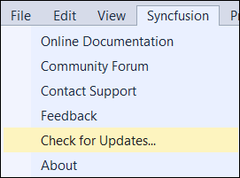
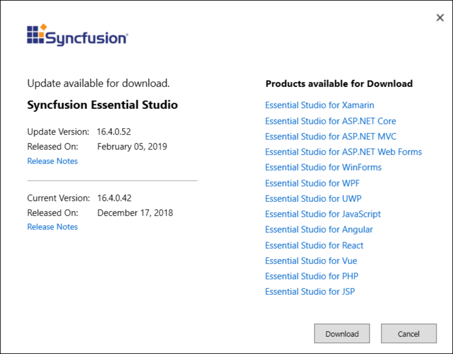

# Update Essential Studio&reg;  to the most recent release

Syncfusion&reg;  provides the Extensions to update most recent version of the Essential Studio&reg;  release. So that, you always get the latest features, fixes, and improvements by installing the latest version.

I> The Syncfusion&reg;  Check for updates extension is available from v17.1.0.32.

You can check updates availability in Visual Studio, and then install the update version if required.

1. Choose **Syncfusion&reg; ** **->** **Check** **for** **Updates…** in the Visual Studio menu.

   

   N> *In Visual Studio 2019, Choose **Extensions** **->** **Syncfusion&reg; ** **->** **Check** **for** **Updates…** in the Visual Studio menu.*

2. When there is an update, **Update** dialog box opens.

   

3. You can download the Syncfusion&reg;  Essential Studio&reg;  from the Syncfusion&reg;  website by selecting **Download**.

   N> *If you are using the latest version of Syncfusion&reg;  Essential Studio, you will get the **No** **Updates** **are** **available** information.*  

