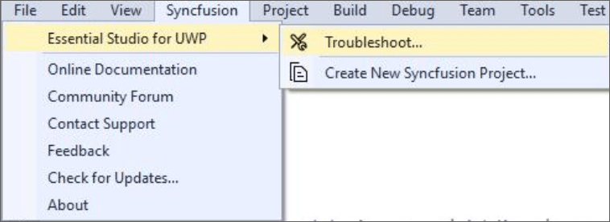

# UWP Extension

## Overview
 
The Syncfusion&reg; UWP Visual Studio Extensions can be accessed through the Syncfusion&reg; Menu to create and configure the project with Syncfusion&reg; references in Visual Studio.The Syncfusion&reg; UWP Extensions supports Microsoft Visual Studio 2017.

I> The Syncfusion&reg; UWP menu option is available from v17.1.0.32.

The Syncfusion&reg; provides the following extension supports in Visual Studio:

1.	[Syncfusion&reg; UWP Project Template](https://help.syncfusion.com/extension/uwp-extension/project-templates): To create the Syncfusion&reg; UWP application by adding required Syncfusion&reg; assemblies/NuGet based on the control chosen.
2.	[Troubleshooter](https://help.syncfusion.com/extension/syncfusion-troubleshooter/syncfusion-troubleshooter): Troubleshoot the project with the Syncfusion&reg; configuration and apply the fix like, wrong Framework Syncfusion assembly added to the project or missing any Syncfusion&reg; dependent assembly of a referred assembly.

**No project selected in Visual Studio**

**Selected Syncfusion&reg; UWP application in Visual Studio**

N> In Visual Studio 2019, Syncfusion&reg; menu available under Extension in Visual Studio menu.

The Syncfusion&reg; UWP Visual Studio Extensions are installed along with the following setups,

* Essential Studio&reg; for Enterprise Edition with the platform UWP
* Essential Studio&reg; for UWP

N> The Syncfusion&reg; UWP Project Templates provide Visual Studio 2015 support from v15.3.0.26 to v16.4.0.52.

