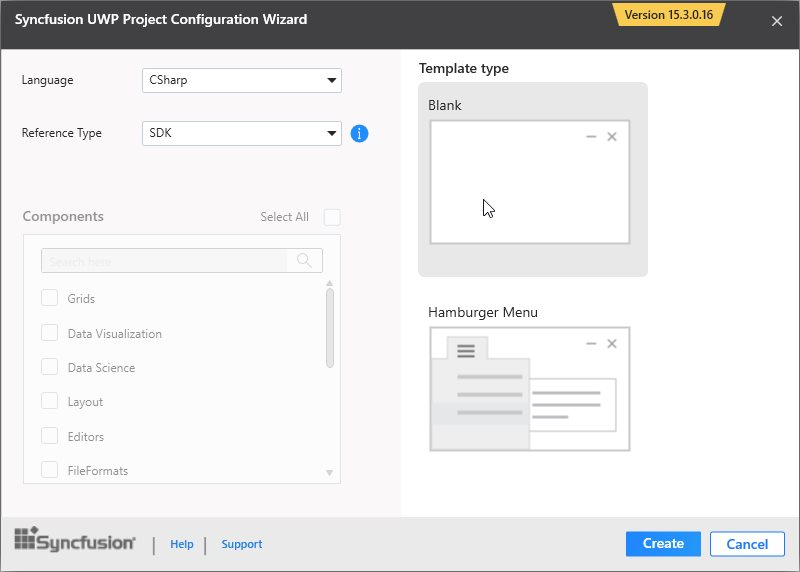
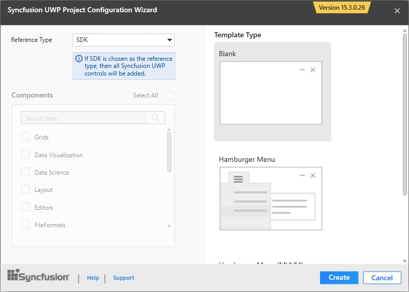

# Syncfusion Project Templates

Syncfusion provides the **Visual** **Studio** **Project** **Templates** for the Syncfusion UWP platform to create Syncfusion UWP Applications.  

I> The Syncfusion UWP project templates are available from v15.3.0.*.  

## Create Syncfusion UWP Application

The following steps direct you to create the **Syncfusion** **UWP** **Application** through the **Visual** **Studio** **Project** **Template**.

1. To create a Syncfusion UWP project, choose **New** **Project****->** **Syncfusion****->****Universal** **Windows****->****Syncfusion** **Univeral** **Windows** **Application** from **Visual** **Studio**.

   

2. Name the **Project** and choose the destination location if required, then click **OK**. The Project Configuration Wizard appears.

3. Choose the options to configure the Syncfusion Universal Windows Application by using the following Project Configuration dialog.

   ### Project configurations:

   **Language:** Select the language of the UWP Project, either C# or VisualBasic.

   **Reference Type:** Select the reference type of UWP Project, either Assemblies or SDK.

   **Template Type:** Select the template type of UWP Project, either Blank or Hamburger Menu.

   **Components:** Choose the Required Syncfusion components to configure.

   
   
3. Once you click Create button, the Syncfusion UWP Application is created.

4. Required Syncfusion SDK or assemblies are added to the Project.

   

