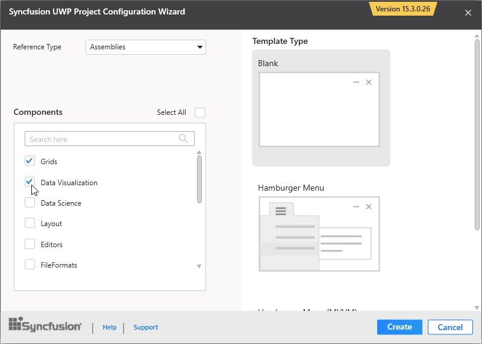

# Syncfusion Project Templates

Syncfusion provides the **Visual** **Studio** **Project** **Templates** for the Syncfusion UWP platform to create Syncfusion UWP Applications.  

I> The Syncfusion UWP project templates are available from v15.3.0.26.  

## Create Syncfusion UWP Application

The following steps direct you to create the **Syncfusion** **UWP** **Application** through the **Visual** **Studio** **Project** **Template**.

1. To create a Syncfusion UWP project, choose **New** **Project****->** **Syncfusion****->****Universal** **Windows****->****Syncfusion** **Universal** **Windows** **Application** from **Visual** **Studio**.

   

2. Name the **Project** and choose the destination location if required, then click **OK**. 

3. Then Project Configuration Wizard appears. Choose the options to configure the Syncfusion Universal Windows Platform application by using the following Project Configuration dialog.

   ### Project configurations:

   **Language:** Select the language, either Visual C# or Visual Basic.

   **Reference Type:** Select the reference type of UWP Project, either Assemblies or SDK.

   **Target Version:** Choose the Target Version of the UWP platform that your project is targeting. This sets the **TargetPlatformVersion** setting in your project file.

   **Minimum Version:** Choose the Minimum Version of the UWP platform that your project can work with. This sets the **TargetPlatformMinVersion** setting in your project file.

   **Template Type:** Select the template type of UWP Project, either Blank or Hamburger Menu or Hamburger Menu (MVVM).

   **Components:** Choose the required Syncfusion components to configure.
   
   
   
   N> If SDK is chosen as the reference type, then all the Syncfusion UWP controls will be added. So, you no need to select any components.
   
4. Once you click Create button, the Syncfusion UWP Application is created.

5. Once the Project Configuration Wizard is done, the Syncfusion UWP Application is created with required SDK/references and pages.

   

