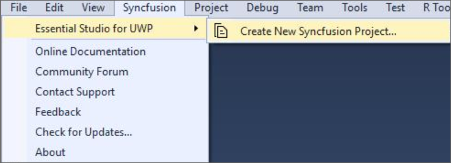
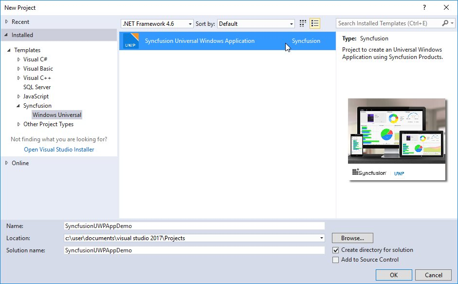
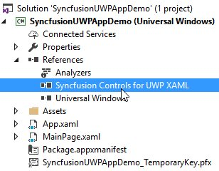
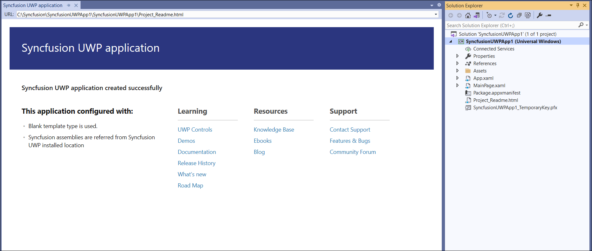

# Syncfusion&reg; Project Templates

Syncfusion&reg; provides the **Visual** **Studio** **Project** **Templates** for the Syncfusion&reg; UWP platform to create Syncfusion&reg; UWP Applications.  

I> The Syncfusion&reg; UWP project templates are available from v15.3.0.26.  

## Create Syncfusion&reg; UWP Application

The following steps help you to create the **Syncfusion&reg;** **UWP** **Application** through the **Visual** **Studio** **Project** **Template**.

> Before use the Syncfusion&reg; UWP Project Template, check whether the **UWP Extensions - Syncfusion&reg;** installed or not in Visual Studio Extension Manager by clicking on the Tools -> Extensions and Updates -> Installed for Visual Studio 2017 or lower and for Visual Studio 2019 by clicking on the Extensions -> Manage Extensions -> Installed.

1. To create a Syncfusion&reg; UWP project, follow either one of the options below:

   **Option 1:**   
   Click **Syncfusion&reg; Menu** and choose **Essential Studio&reg; for UWP > Create New Syncfusion&reg; Project…** in **Visual Studio**.
   
   

   N> In Visual Studio 2019, Syncfusion&reg; menu under Extension in Visual Studio menu.

   **Option 2:**  
   Choose **File > New > Project** and navigate to **Syncfusion&reg; > Windows Universal> Syncfusion&reg; Universal Windows Application** in **Visual Studio**.

   

2. Name the **Project** and choose the destination location if required, then click **OK**. 

3. Then Project Configuration Wizard appears. Choose the options to configure the Syncfusion&reg; Universal Windows Platform application by using the following Project Configuration dialog.

   ### Project configurations:

   **Language:** Select the language, either Visual C# or Visual Basic.

   **Reference Type:** Select the reference type of UWP Project, either Assemblies or SDK.

   **Target Version:** Choose the Target Version of the UWP platform that your project is targeting. This sets the **TargetPlatformVersion** setting in your project file.

   **Minimum Version:** Choose the Minimum Version of the UWP platform that your project can work with. This sets the **TargetPlatformMinVersion** setting in your project file.

   **Template Type:** Select the template type of UWP Project, either Blank or Hamburger Menu or Hamburger Menu (MVVM).

   **Components:** Choose the required Syncfusion&reg; components to configure.
   
   
   
   N> If SDK is chosen as the reference type, then all the Syncfusion&reg; UWP controls will be added. So, you no need to select any components.
   
4. Once you click Create button, the Syncfusion&reg; UWP Application is created.

5. Once the Project Configuration Wizard is done, the Syncfusion&reg; UWP Application is created with required SDK/references and pages.

   

   

6. Then, Syncfusion&reg; licensing registration required message box will be shown as follow, if you are installed the trial setup or NuGet packages since Syncfusion&reg; introduced the licensing system from 2018 Volume 2 (v16.2.0.41) Essential Studio&reg; release. Please navigate to the [help topic](https://help.syncfusion.com/common/essential-studio/licensing/license-key#how-to-generate-syncfusion-license-key) which is shown in the licensing message box to generate and register the Syncfusion&reg; license key to your project. Refer to this [blog](https://blog.syncfusion.com/post/Whats-New-in-2018-Volume-2-Licensing-Changes-in-the-1620x-Version-of-Essential-Studio.aspx) post for understanding the licensing changes introduced in Essential Studio&reg;.

      

