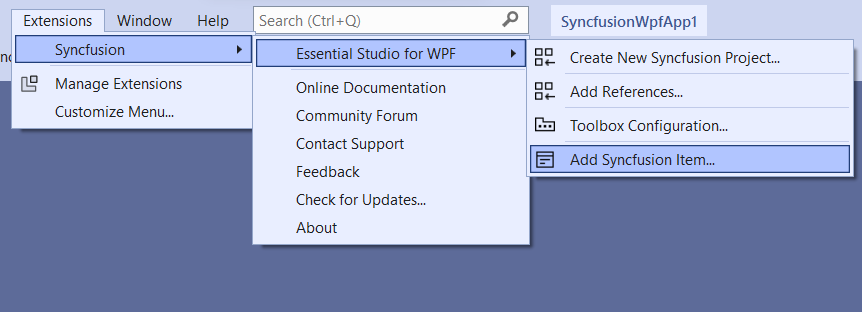
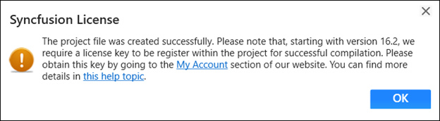

# Add Syncfusion Components to the WPF Application

Syncfusion&reg; WPF Item Templates let you add Syncfusion&reg; WPF components to a WPF application along with the required Syncfusion&reg; references.

I> The Syncfusion&reg; WPF item templates are available from Syncfusion Essential Studio release `v19.1.0.54`.

## Prerequisites

> Check whether the **WPF Extensions - Syncfusion&reg;** are installed in the Visual Studio Extension Manager. In Visual Studio 2019 or later, go to **Extensions -> Manage Extensions -> Installed**. In Visual Studio 2017 or lower, go to **Tools -> Extensions and Updates -> Installed**. If this extension is not installed, follow the steps from the [download and installation](https://help.syncfusion.com/wpf/visual-studio-integration/download-and-installation) help topic to install it.

I> If you installed the trial setup or NuGet packages, a Syncfusion&reg; license registration message is displayed. Syncfusion&reg; introduced the licensing system in 2018 Volume 2 (v16.2.0.41) of the Essential Studio&reg; release. For more information, refer to the [licensing help topic](https://help.syncfusion.com/common/essential-studio/licensing/license-key#how-to-generate-syncfusion-license-key).

## Add Components using Syncfusion&reg; Item Template

The following steps will guide you to add the Syncfusion&reg; WPF components to your Visual Studio WPF application.

1.	Open a new or existing WPF application. Any standard WPF project (targeting .NET Framework, .NET Core, or .NET 5+) is supported.

2.	Launch the Add Syncfusion&reg; Item wizard using one of the following options:

	**Option 1:** From the **Solution Explorer**, right-click the WPF application and choose **Add Syncfusion&reg; Item...**.

	

	**Option 2:** From the **Extensions** menu, click **Essential Studio&reg; for WPF > Add Syncfusion&reg; Item…**.

	

3.	The Syncfusion&reg; WPF Item Template wizard appears.

	

4.	Select the components from the Component list. The features associated with the selected component are displayed. Choose the features required for your project.

5.	Choose where to add the required Syncfusion&reg; assemblies. Options include GAC location, Essential Studio&reg; installed location, or NuGet packages.

	N> If the Syncfusion&reg; Essential Studio&reg; WPF installation is present, the **Installed location** and **GAC** options are enabled. Otherwise, use the **NuGet** option. The **GAC** option is not available for .NET Core and later (.NET 5+) applications. The **Version** drop-down lists the installed WPF versions.

6.	Click **Add**. A pop-up appears with information about the Component **files** and **NuGet/Assemblies** that will be added.

	

7.	Click **OK** to incorporate the chosen components into the WPF application, along with the required Syncfusion&reg; assemblies.

	

8.	If you installed the trial setup or NuGet packages, the Syncfusion&reg; license registration message box is displayed. Navigate to the [help topic](https://help.syncfusion.com/common/essential-studio/licensing/license-key#how-to-generate-syncfusion-license-key) shown in the message box to generate and register the Syncfusion&reg; license key for your project. Refer to this [blog post](https://blog.syncfusion.com/post/Whats-New-in-2018-Volume-2-Licensing-Changes-in-the-1620x-Version-of-Essential-Studio.aspx) to understand the licensing changes introduced in Essential Studio&reg;.

	