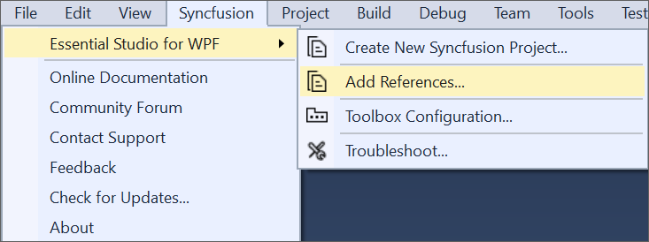
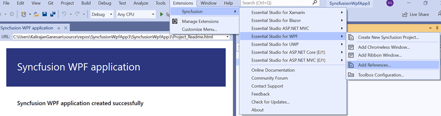
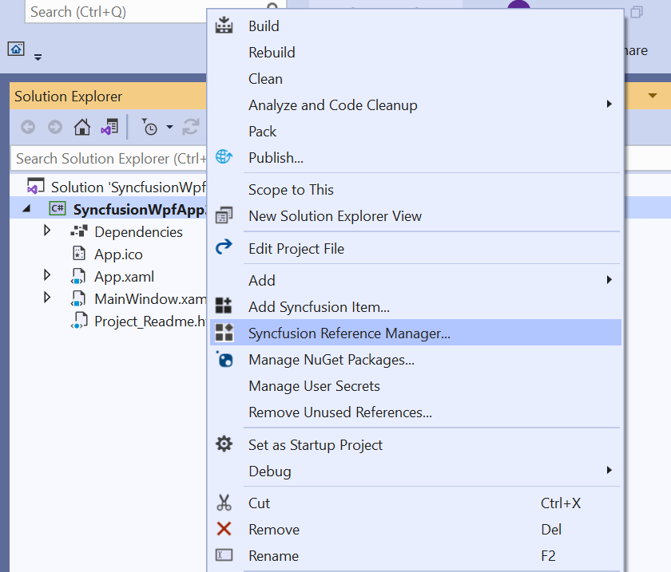
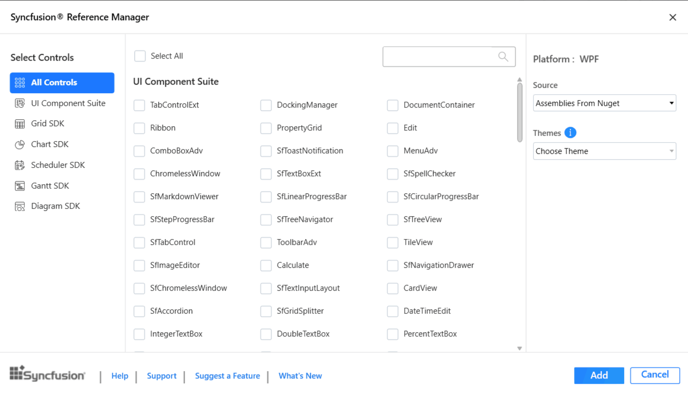
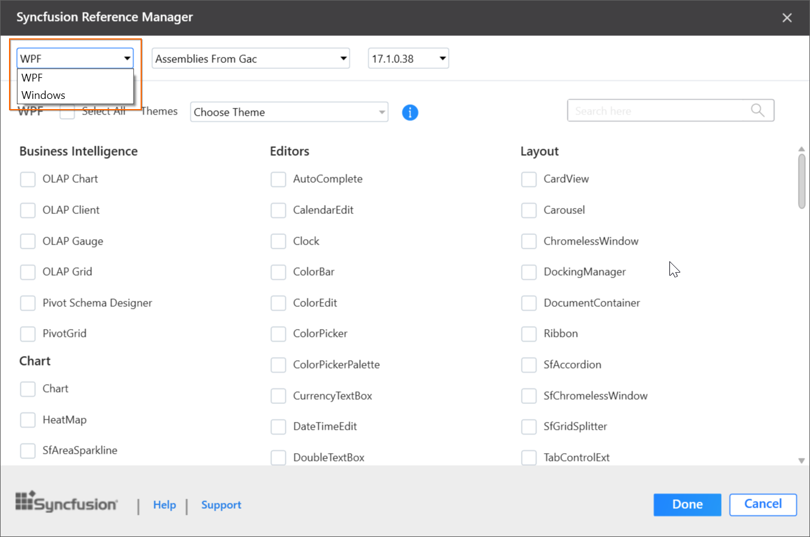
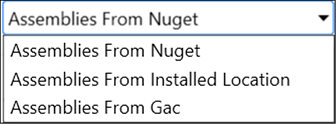
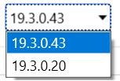
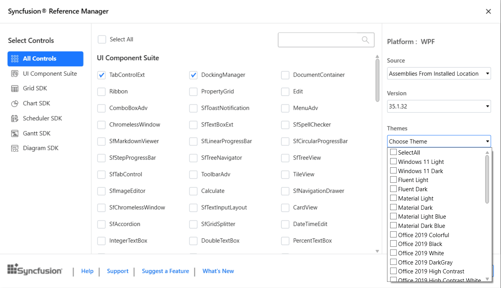
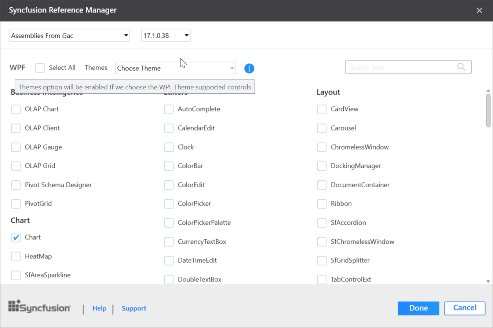
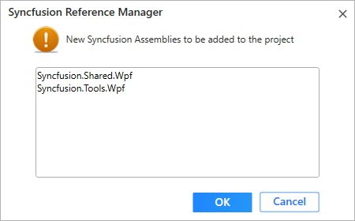

# Add Reference for WPF

Syncfusion&reg; Reference Manager is a Visual Studio add-in for the WPF platform. It adds the Syncfusion&reg; assembly reference to the project from the GAC location, the Essential Studio&reg; installed location, or NuGet packages. It can also migrate projects that contain older Syncfusion&reg; assembly references to a newer or specific version. It supports Microsoft Visual Studio 2013 or higher. This Visual Studio extension is included from the Essential Studio&reg; 2013 Volume 3 release.

N> This Reference Manager can be applied to a project for Syncfusion&reg; assembly versions 10.4.0.71 and later.

To add the Syncfusion&reg; assembly references in Visual Studio, follow the steps below:

> Check whether the **WPF Extensions - Syncfusion&reg;** are installed in the Visual Studio Extension Manager. In Visual Studio 2017 or lower, go to **Tools -> Extensions and Updates -> Installed**. In Visual Studio 2019 and later, go to **Extensions -> Manage Extensions -> Installed**. If this extension is not installed, follow the steps from the [download and installation](download-and-installation) help topic to install it.

1. Open a new or existing **WPF** application.

2. To open Syncfusion&reg; Reference Manager Wizard, follow either one of the options below:

   **Option 1:** From the **Syncfusion&reg; Menu**, choose **Essential Studio&reg; for WPF > Add References…**.

   

   N> From Visual Studio 2019, the Syncfusion&reg; menu is available under **Extensions** in the Visual Studio menu.

   

   **Option 2:** Right-click the project in **Solution Explorer** and select **Syncfusion&reg; Reference Manager…** from the context menu. The following screenshot shows this option in Visual Studio.

   

3. The Syncfusion&reg; Reference Manager Wizard displays a list of loaded Syncfusion&reg; WPF controls.

   

   **Platform Selection:** The Platform Selection option appears when the Syncfusion&reg; Reference Manager is opened from a Console or Class Library project. Select the appropriate platform.

   

   N> The Platform Selection option appears only if Essential Studio&reg; for Enterprise Edition with the platforms WPF and Windows Forms has been installed, or if both Essential Studio&reg; for WPF and WinForms have been installed.

   **Assembly From:** Choose the assembly location: NuGet packages, installed location, or GAC location.

   N> The **Installed location** and **GAC** options are available only when the Syncfusion&reg; Essential Studio&reg; WPF setup has been installed.

   

   N> The **GAC** option is not available when you select a WPF (.NET 10.0, .NET 9.0, .NET 8.0, .NET 7.0, and .NET 6.0) application in Visual Studio 2022 and later.

   **Version:** To add the corresponding version assemblies to the project, select the build version.

   

   **Themes Option:** Choose the necessary themes based on your requirements. To learn more about built-in themes and their available assemblies, click the link below.

   [https://help.Syncfusion.com/wpf/themes/](https://help.Syncfusion.com/wpf/themes/)

   

   N> The **Themes** option is enabled only if you select theme-supported controls.

   

4. Select the required controls to add to your project, then click **Done** to add the required assemblies for the specified controls. The list of required assemblies for the selected controls to be added is shown in the screenshot below.

   

5. Click **OK**. The listed Syncfusion&reg; assemblies are added to the project. A status bar message in Visual Studio confirms: "Syncfusion&reg; assemblies have been added successfully".

   

6. If you installed the trial setup or NuGet packages, the Syncfusion&reg; license registration message box is displayed, since Syncfusion&reg; introduced the licensing system in 2018 Volume 2 (v16.2.0.41) of the Essential Studio&reg; release. Navigate to the [help topic](https://help.Syncfusion.com/common/essential-studio/licensing/license-key#how-to-generate-Syncfusion-license-key) shown in the licensing message box to generate and register the Syncfusion&reg; license key for your project. Refer to this [blog](https://blog.Syncfusion.com/post/Whats-New-in-2018-Volume-2-Licensing-Changes-in-the-1620x-Version-of-Essential-Studio.aspx) post to understand the licensing changes introduced in Essential Studio&reg;.

   

N> Reference Manager support is provided by Syncfusion&reg; for select versions of the .NET Framework that are included (as assemblies) in the Syncfusion&reg; Essential Studio&reg; installation. If you add Syncfusion&reg; assemblies to a project and the project framework is not compatible with the specified Syncfusion&reg; version assemblies, a dialog box appears with the message: **Current build v{version} isn't compatible with this framework v{Framework} Version**.

