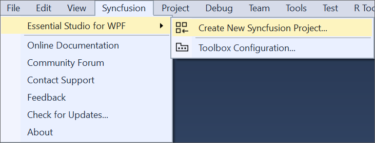
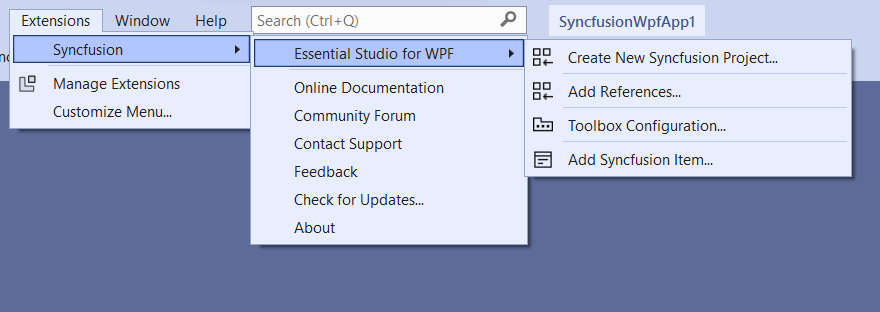

# Syncfusion&reg; WPF Extension

The Syncfusion&reg; WPF Extension can be accessed through the Syncfusion&reg; menu to create and configure the project with Syncfusion&reg; references in Visual Studio. The Syncfusion&reg; WPF Extension supports Microsoft Visual Studio 2013 or higher.

N> The Syncfusion&reg; WPF Extension is published in the Visual Studio Marketplace. Separate Syncfusion&reg; WPF Extensions are provided for Visual Studio 2022 and 2026, and for Visual Studio 2019 or lower. Please refer to the marketplace links below.

[Visual Studio 2022 or 2026](https://marketplace.visualstudio.com/items?itemName=SyncfusionInc.WPFVSExtension)

I> The Syncfusion&reg; WPF menu option is available from Syncfusion Essential Studio release `v17.1.0.32`.

Syncfusion&reg; provides the following extension features in Visual Studio:

1.  [Template Studio](https://help.syncfusion.com/wpf/visual-studio-integration/template-studio): Syncfusion&reg; WPF Template Studio simplifies application development with its components by managing references and providing pre-defined code. It streamlines the process of creating WPF applications.
2.	[Add Item](https://help.syncfusion.com/wpf/visual-studio-integration/add-item): Add Syncfusion&reg; WPF controls into the WPF application by adding Syncfusion&reg; WPF assemblies or NuGet packages.
3.	[Add References](https://help.syncfusion.com/wpf/visual-studio-integration/add-references): Add the required Syncfusion&reg; assembly to the WPF project reference based on the selected control(s).
4.	[Toolbox Configuration](https://help.syncfusion.com/wpf/visual-studio-integration/toolbox-configuration): Configure the Syncfusion&reg; controls into the Visual Studio .NET toolbox.
5.	[Troubleshooter](https://help.syncfusion.com/wpf/visual-studio-integration/troubleshooting): Troubleshoot the project for Syncfusion&reg; configuration issues and apply fixes, such as a wrong framework Syncfusion&reg; assembly added to the project, or a missing Syncfusion&reg; dependent assembly of a referred assembly.

### Syncfusion Menu in Visual Studio

**No project selected in Visual Studio**

**Selected Microsoft WPF application in Visual Studio**

**Selected Syncfusion&reg; WPF application in Visual Studio**

N> In Visual Studio 2017 or lower, you can see the Syncfusion&reg; menu directly in the Visual Studio menu. In Visual Studio 2019 and later, access the Syncfusion&reg; menu through the **Extensions** menu.
