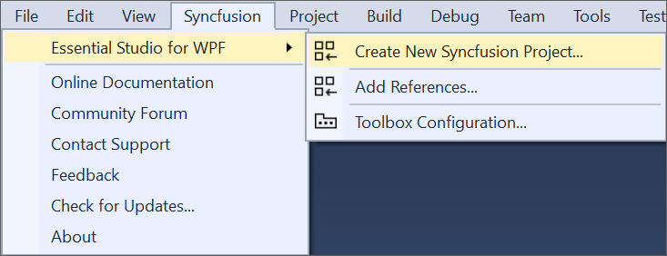
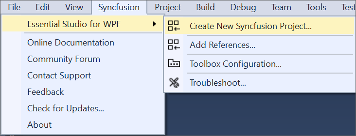

# WPF Extension

The Syncfusion WPF Studio Extensions can be accessed through the Syncfusion Menu to create and configure the project with Syncfusion references in Visual Studio.The Syncfusion WPF Extensions supports Microsoft Visual Studio 2010 or higher.

I> The Syncfusion WPF menu option is available from v17.1.0.32.

The Syncfusion provides the following extension supports in Visual Studio:

1.	[Syncfusion WPF Project Template](https://help.syncfusion.com/extension/wpf-extension/syncfusion-project-templates-for-wpf): To create the Syncfusion WPF application by adding the required Syncfusion assemblies and XMAL.
2.	[Reference Manager](https://help.syncfusion.com/extension/syncfusion-reference-manager/configure-syncfusion-assemblies-in-visual-studio-project): To add the required Syncfusion assembly to Windows project reference based on the selected control.
3.	[Toolbox Configuration](https://help.syncfusion.com/common/essential-studio/utilities#toolbox-configuration): To configure the Syncfusion controls into the Visual Studio .NET toolbox.
4.	[Troubleshooter](https://help.syncfusion.com/extension/syncfusion-troubleshooter/syncfusion-troubleshooter): Troubleshoot the project with the Syncfusion configuration and apply the fix like, wrong Framework Syncfusion assembly added to the project or missing any Syncfusion dependent assembly of a referred assembly.

**No project selected in Visual Studio**

**Selected Microsoft WPF application in Visual Studio**

**Selected Syncfusion WPF application in Visual Studio**

N> In Visual Studio 2019, Syncfusion menu available under Extension in Visual Studio menu.

The Syncfusion WPF Visual Studio Extensions are installed along with the following setups,

* Essential Studio for Enterprise Edition with the platform WPF
* Essential Studio for WPF
