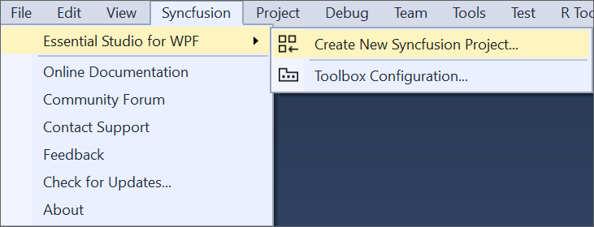

# Syncfusion&reg; WPF Extension

The Syncfusion&reg; WPF Studio Extensions can be accessed through the Syncfusion&reg; Menu to create and configure the project with Syncfusion&reg; references in Visual Studio.The Syncfusion&reg; WPF Extensions supports Microsoft Visual Studio 2013 or higher.

N> Syncfusion&reg; Extension is published in Visual Studio Marketplace. We provided separate Syncfusion&reg; WPF Extension support for Visual Studio 2022 or Visual Studio 2026 and Visual Studio 2019 or lower. Please refer below marketplace link.

[Visual Studio 2022 or 2026](https://marketplace.visualstudio.com/items?itemName=SyncfusionInc.WPFVSExtension)

[Visual Studio 2019 or lower](https://marketplace.visualstudio.com/items?itemName=SyncfusionInc.WPFExtension)

I> The Syncfusion&reg; WPF menu option is available from `v17.1.0.32`.

The Syncfusion&reg; provides the following extension supports in Visual Studio:

1.  [Template Studio](https://help.Syncfusion.com/wpf/visual-studio-integration/template-studio): Syncfusion&reg; WPF Template Studio simplifies application development with its components by managing references and providing pre-defined code. It streamlines the process of creating WPF applications.
2.	[Add Item](https://help.Syncfusion.com/wpf/visual-studio-integration/add-item): Add Syncfusion&reg; WPF Controls into the WPF application with add Syncfusion&reg; WPF assemblies/NuGet packages
3.	[Add References](https://help.Syncfusion.com/wpf/visual-studio-integration/add-references): Add the required Syncfusion&reg; assembly to WPF project reference based on the selected control(s).
4.	[Toolbox Configuration](https://help.Syncfusion.com/wpf/visual-studio-integration/toolbox-configuration): Configure the Syncfusion&reg; controls into the Visual Studio .NET toolbox.
5.	[Troubleshooter](https://help.Syncfusion.com/wpf/visual-studio-integration/troubleshooting): Troubleshoots the project with the Syncfusion&reg; configuration and apply the fix like, wrong Framework Syncfusion&reg; assembly added to the project or missing any Syncfusion&reg; dependent assembly of a referred assembly.

**No project selected in Visual Studio**

**Selected Microsoft WPF application in Visual Studio**

**Selected Syncfusion&reg; WPF application in Visual Studio**

N> In Visual Studio 2017 or lower, you can see the Syncfusion&reg; menu directly in the Visual Studio menu.
