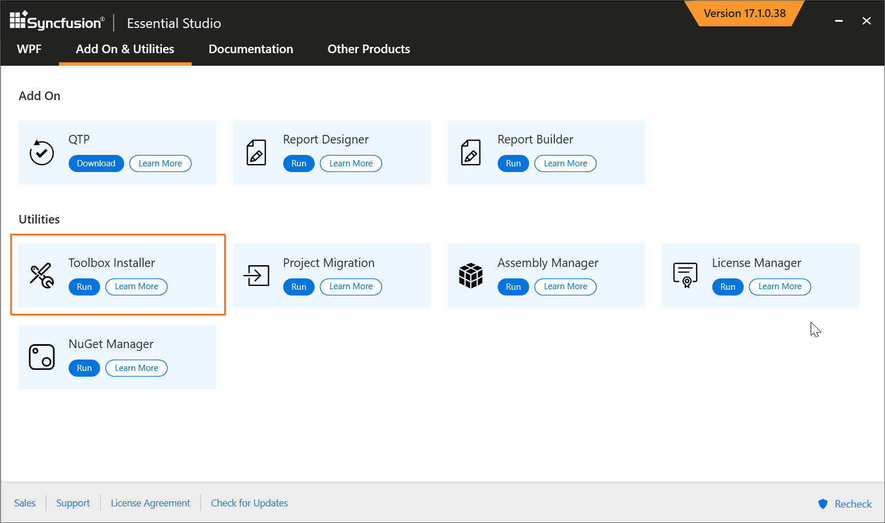
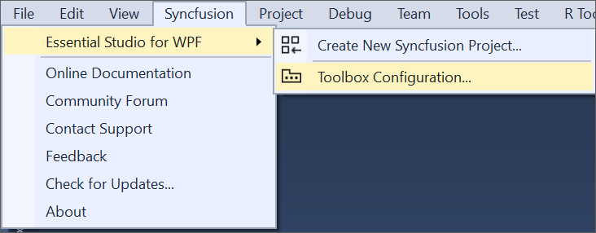
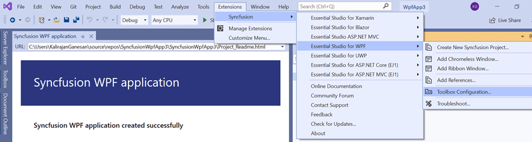
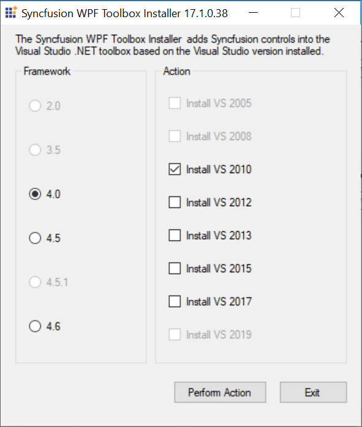
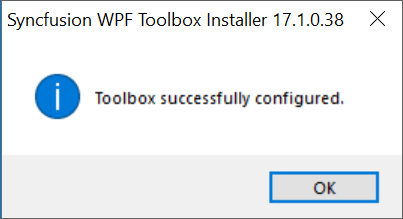
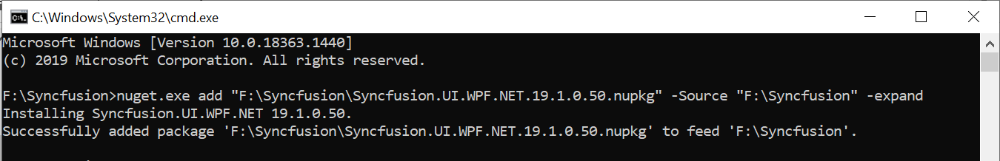
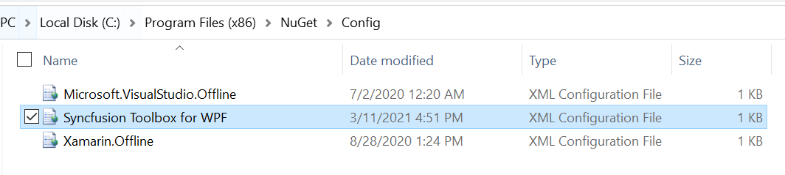
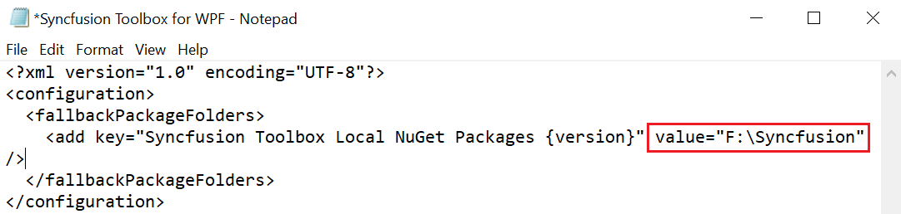

# Toolbox Configuration

The Syncfusion&reg; Toolbox Installer utility incorporates the Syncfusion&reg; WPF components into the Visual Studio .NET toolbox.

N> Toolbox configuration support is not available for the Visual Studio Express Edition. However, you can manually configure the Syncfusion&reg; controls into the Visual Studio Express Toolbox. To do so, refer the [Manual Toolbox Configuration](https://help.Syncfusion.com/common/faq/how-to-configure-the-toolbox-of-visual-studio-manually).

If the <b>“Configure Syncfusion&reg; Controls in Visual Studio”</b> checkbox is selected from the installer UI while installing the Syncfusion&reg; WPF installer, Syncfusion&reg; components will be automatically configured in the Visual Studio toolbox.

To add the Syncfusion&reg; WPF components via the Syncfusion&reg; Toolbox Installer, perform the following steps:

1. To launch Toolbox configuration utility, follow either one of the options below:

   **Option 1:**   
   Open the Syncfusion&reg; Control Panel, click **Add On and Utilities > Toolbox Installer**.
   
   
   
   **Option 2:**  
   Click **Syncfusion&reg; menu** and choose **Essential Studio&reg; for WPF > Toolbox Configuration...** in **Visual Studio**

   

   N> From Visual Studio 2019, Syncfusion&reg; menu is available under Extensions in Visual Studio menu.

   

2. Toolbox Installer will be opened.

   

   The following options are available in Toolbox Configuration:

   * Install VS2005 – Configures Framework 2.0 Syncfusion&reg; controls in VS 2005 toolbox.
   * Install VS2008 – Configures Framework 3.5 Syncfusion&reg; controls in VS 2008 toolbox.
   * Install VS2010 – Configures Framework 4.0 Syncfusion&reg; controls in VS 2010 toolbox.
   * Install VS2012 – Configures Framework 4.5 Syncfusion&reg; controls in VS 2012 toolbox.
   * Install VS2013 – Configures Framework 4.5.1 Syncfusion&reg; controls in VS 2013 toolbox.
   * Install VS2015 – Configures Framework 4.6 Syncfusion&reg; controls in VS 2015 toolbox.
   * Install VS2017 – Configures Framework 4.6 Syncfusion&reg; controls in VS 2017 toolbox.
   * Install VS2019 – Configures Framework 4.6 Syncfusion&reg; controls in VS 2019 toolbox
   * Install VS2022 – Configures Framework 4.6 Syncfusion&reg; controls in VS 2022 toolbox.
   * Install VS2026 – Configures Framework 4.6.2 Syncfusion&reg; controls in VS 2026 toolbox.

    N> You can also configure Syncfusion&reg; controls from a lower version Framework assembly to higher version of Visual Studio.
   
3. The successful configuration of Toolbox is indicated by an Information message. Click OK.

   
   
   
   N> * You must reset the toolbox, when the installed controls are not reflected properly in the Toolbox. 
   * This tool configures only the controls that are located under {Installed Location}\Assemblies\{Framework version}. 

   
## Configuring toolbox for WPF .NET 5.0 projects

From 2021 Volume 1,Syncfusion&reg; started providing toolbox support for the WPF .NET 5.0 framework in Visual Studio. After installing the Syncfusion&reg; WPF installer, Syncfusion&reg; controls will be automatically configured in the Visual Studio toolbox for WPF.NET 5.0 projects.

N> * Syncfusion&reg; included this toolbox support for .NET 5.0 WPF platform from 2021 Volume 1 release version v19.1.0.54 only. 
* If the project was created with TargetFramework.NET Core 3.1 and then changed to.NET 5.0 after installing the WPF setup, you must restart Visual Studio to see the Syncfusion&reg; controls in the Visual Studio Toolbox. 
* Visual Studio 2019 16.7 Preview 2 and later is required.

### Upgrading the Syncfusion&reg; WPF toolbox .NET 5.0 controls without installing the build

You can upgrade the Syncfusion&reg; WPF toolbox for .NET 5.0 control with NuGet packages downloaded from [nuget.org](https://www.nuget.org/). Download ["Syncfusion.UI.WPF.NET"](https://www.nuget.org/packages/Syncfusion.UI.WPF.NET/) package from nuget.org in your machine.

Use the following steps to add the Syncfusion&reg; WPF controls through Syncfusion&reg; NuGet packages:

**step 1:** 
   
   Extract **"Syncfusion&reg;.UI.WPF.NET"** package by using the below commands.
	
   Open Command prompt from nuget.exe path and run the following commands
	
   **Command:** {nuget.exe path} add "F:\Syncfusion\Syncfusion.UI.WPF.NET.{version}.nupkg" -Source "F:\Syncfusion\Expand" -expand
	
   **Example:** F:\Syncfusion>nuget.exe add "F:\Syncfusion\Syncfusion.UI.WPF.NET.19.1.0.50.nupkg" -Source "F:\Syncfusion" -expand
	
   
	
**step 2:** 

   Open **"Syncfusion&reg; Toolbox for WPF.config"** file from the following location.
	
   **Location:** "C:\Program Files (x86)\NuGet\Config\Syncfusion Toolbox for WPF.config"
	
   

   Or you can create this file in the same location by using the XML format given below
    
   
   
     <?xml version="1.0" encoding="utf-8"?>
      <configuration>
        <fallbackPackageFolders>
          <add key="Syncfusion&reg; Toolbox Local NuGet Packages {version}" value="F:\Syncfusion" />
        </fallbackPackageFolders>
      </configuration>
   
   
	
**step 3:**
   
   Update extracted Syncfusion&reg; NuGet package path in **value** attribute.
	
   **Example:**
   
	
**step 4:**
   
   Now restart the Visual Studio 2019 to get populate the latest Syncfusion&reg; controls in Toolbox.

## Configuring toolbox for .NET Core 3.1 projects

The Syncfusion&reg; NuGet packages must be installed in the WPF .NET Core application before the Syncfusion&reg; toolbox can be configured. The corresponding NuGet packages Syncfusion&reg; components will be configured in Visual Studio toolbox after installing the Syncfusion&reg; NuGet packages in.NET Core application. 

Please refer the documentation [link](../../wpf/installation/install-nuget-packages), to learn more about how to use the Syncfusion&reg; components using the Syncfusion&reg; NuGet packages in .NET Core application.
   
