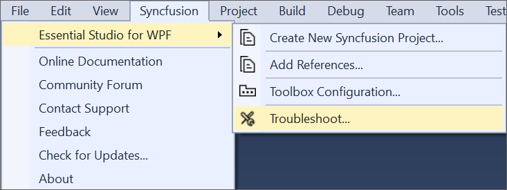
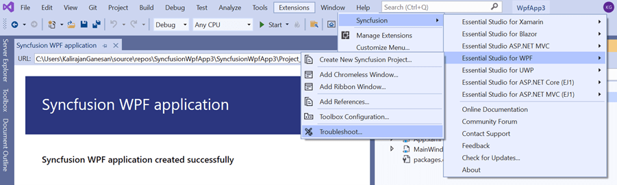
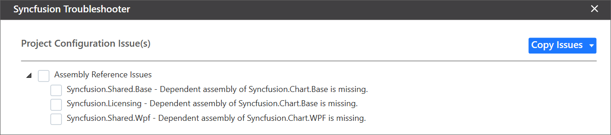
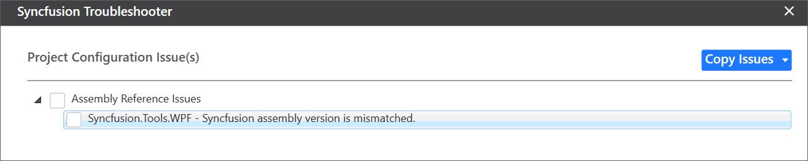
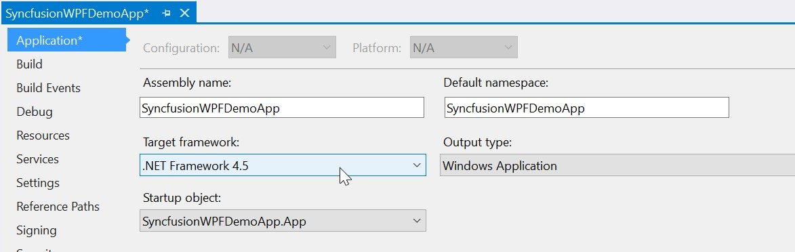
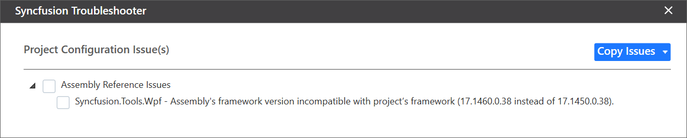
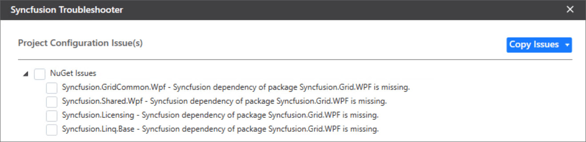
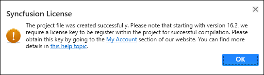

# Troubleshoot the WPF project

Troubleshoot the project with the Syncfusion&reg; configuration and apply the fix, such as a wrong .NET Framework version of a Syncfusion&reg; assembly in the project or a missing Syncfusion&reg; dependent assembly of a referred assembly. The Syncfusion&reg; Troubleshooter can perform the following tasks:

* Report the configuration issues.
* Apply the solution.

## Report the Configuration issues

The steps below will assist you in using the Syncfusion&reg; Troubleshooter in Visual Studio.

> Check whether the **WPF Extensions - Syncfusion&reg;** are installed in the Visual Studio Extension Manager. In Visual Studio 2017 or lower, go to **Tools -> Extensions and Updates -> Installed**. In Visual Studio 2019 and later, go to **Extensions -> Manage Extensions -> Installed**. If this extension is not installed, follow the steps from the [download and installation](download-and-installation) help topic to install it.

1. To open the Syncfusion&reg; Troubleshooter wizard, follow one of the options below:

   **Option 1**
   Open an existing Syncfusion&reg; WPF application, click the **Syncfusion&reg; Menu**, and choose **Essential Studio&reg; for WPF > Troubleshoot…** in Visual Studio.

   

   N> From Visual Studio 2019 and later, the Syncfusion&reg; menu is available under **Extensions** in the Visual Studio menu.

   

   **Option 2**
   Right-click the project file in **Solution Explorer** and select **Syncfusion&reg; Troubleshooter…** from the context menu.

   

2. Analyze the project now. If any Syncfusion&reg; control project configuration errors are discovered, they are reported in the Troubleshooter dialog. If there are no configuration issues with the project, the dialog box indicates that no modifications are required in the following areas:

   * Syncfusion&reg; assembly references.
   * Syncfusion&reg; NuGet Packages.
   * Syncfusion&reg; Toolbox Configuration.

   

I> The Syncfusion&reg; Troubleshooter options are visible only for Syncfusion&reg; projects, which means the project should contain Syncfusion&reg; assemblies or Syncfusion&reg; NuGet packages referred.

The Syncfusion&reg; Troubleshooter handles the following project configuration issues:

1. Assembly Reference Issues.

2. NuGet-related Issues.

3. Toolbox Configuration Issues.

### Assembly Reference Issues

The Syncfusion&reg; Troubleshooter handles the assembly reference issues listed below in Syncfusion&reg; projects.

1. Dependent assemblies are missing for referred assemblies from the project.

   **For instance:** If the "Syncfusion.Chart.WPF" assembly is referred in the project and "Syncfusion.Shared.WPF" (dependent of Syncfusion.Chart.Base) is not referred in the project, the Syncfusion&reg; Troubleshooter will show that the dependent assembly is missing.

   

2. The Syncfusion&reg; Troubleshooter compares all Syncfusion&reg; assembly versions in the same project. If any Syncfusion&reg; assembly version inconsistency is found, the Syncfusion&reg; Troubleshooter will show that the Syncfusion&reg; assemblies versions are mismatched.

   **For instance:** If the "Syncfusion&reg;.Tools.WPF" assembly (v17.1.0.32) is referred in the project, but other Syncfusion&reg; assemblies' referred assembly version is v17.1.0.38, the Syncfusion&reg; Troubleshooter will show that the Syncfusion&reg; assembly version is mismatched.

   

3. Framework version mismatching (Syncfusion&reg; Assemblies) with the project's .NET Framework version. Find the supported .NET Framework details for Syncfusion&reg; assemblies in the following link:

   <https://help.syncfusion.com/common/essential-studio/assembly-information#supported-framework-version-for-essential-studio-assemblies>

   **For instance:** The .NET Framework of the application is v4.5 and the "Syncfusion.Tools.WPF" assembly (v17.1.0.38 & .NET Framework version 4.6) is referred in the same application. The Syncfusion&reg; Troubleshooter will show that the Syncfusion&reg; assembly .NET Framework version is incompatible with the project's .NET Framework version.

   

   

### NuGet Issues

The Syncfusion&reg; Troubleshooter addresses the following NuGet package-related issues in Syncfusion&reg; projects.

1. If the application has Syncfusion&reg; NuGet packages in multiple versions, the Syncfusion&reg; Troubleshooter will show that the Syncfusion&reg; NuGet package version is mismatched.

   **For instance:** Syncfusion&reg; WPF platform packages are installed in multiple versions (v16.4.0.54 & v17.1.0.38), so the Syncfusion&reg; Troubleshooter will show that the Syncfusion&reg; package version is mismatched.

   

2. The installed Syncfusion&reg; NuGet package's Framework version differs from the project's .NET Framework version.

   **For instance:** If the "Syncfusion.SfBulletGraph.WPF40" NuGet package version (v15.4.0.17 with 4.0 Framework) is installed in the project, but the project .NET Framework version is 4.5, the Syncfusion&reg; Troubleshooter will show that the Syncfusion&reg; package Framework version is mismatched.

   

3. A dependent NuGet package of the installed Syncfusion&reg; NuGet packages is missing.

   **For instance:** If you install the Syncfusion.Chart.WPF NuGet package alone in the project, the Syncfusion&reg; Troubleshooter will show that the Syncfusion.Chart.Base and other dependent NuGet packages are missing.

   

I> An internet connection is required to restore the missing dependent packages. If the internet is not available, the dependent packages will not be restored.

### Toolbox Configuration Issues

In Syncfusion&reg; projects, the Syncfusion&reg; Troubleshooter addresses the following Toolbox Configuration issues.

1. If the project .NET Framework version's Syncfusion&reg; Toolbox is not installed or configured, the Syncfusion&reg; Troubleshooter will show that the Syncfusion&reg; Toolbox .NET Framework version is mismatched.

   **For instance:** If the latest Syncfusion&reg; assembly reference version is v17.1.0.38 but the Toolbox assemblies are configured to v17.1.0.32, the Syncfusion&reg; Troubleshooter will show that the Syncfusion&reg; Toolbox version is mismatched.

   

2. If the configured version of the Syncfusion&reg; Toolbox differs from the latest Syncfusion&reg; assembly reference version or NuGet package version in the same project, the Syncfusion&reg; Troubleshooter will indicate that the Syncfusion&reg; Toolbox version is mismatched.

   **For instance:** If the latest Syncfusion&reg; assembly reference version is v17.1.0.38 but the Toolbox assemblies are configured to v17.1.0.32, the Syncfusion&reg; Troubleshooter will show that the Syncfusion&reg; Toolbox version is mismatched.

   

## Apply the solution

1. After loading the Syncfusion&reg; Troubleshooter dialog, check the corresponding check box of the issue to be resolved. Then click the **"Fix Issue(s)"** button.

   

2. A dialog appears, asking you to take a backup of the project before performing the troubleshooting process. If you need to back up the project before troubleshooting, click the **"Yes"** button.

   

3. Wait while the Syncfusion&reg; Troubleshooter resolves the selected issues. After the troubleshooting process is complete, a status message appears in the Visual Studio status bar: **"Troubleshooting process completed successfully"**.

   

4. If you installed the trial setup or NuGet packages, the Syncfusion&reg; license registration message box is displayed, since Syncfusion&reg; introduced the licensing system in 2018 Volume 2 (v16.2.0.41) of the Essential Studio&reg; release. Navigate to the [help topic](https://help.syncfusion.com/common/essential-studio/licensing/license-key#how-to-generate-syncfusion-license-key) shown in the licensing message box to generate and register the Syncfusion&reg; license key for your project. Refer to this [blog post](https://blog.syncfusion.com/post/Whats-New-in-2018-Volume-2-Licensing-Changes-in-the-1620x-Version-of-Essential-Studio.aspx) to understand the licensing changes introduced in Essential Studio&reg;.

   