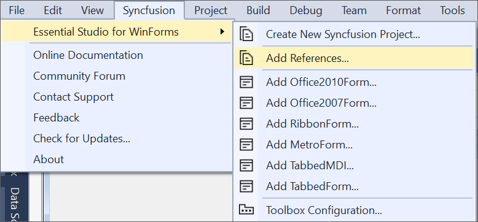
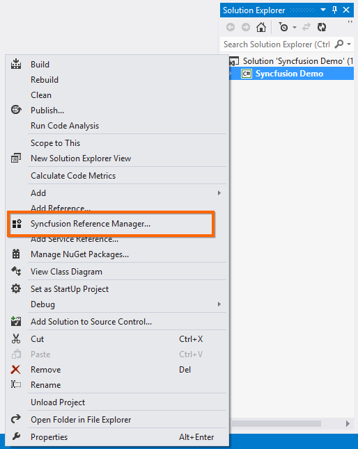
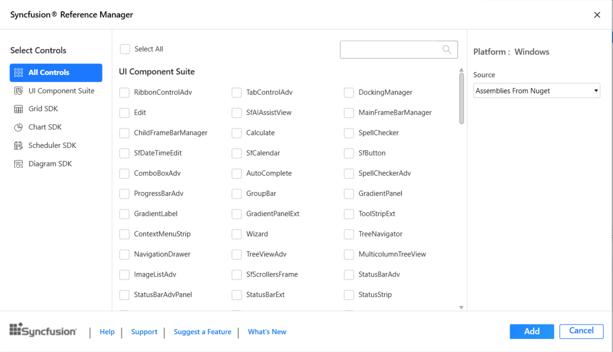
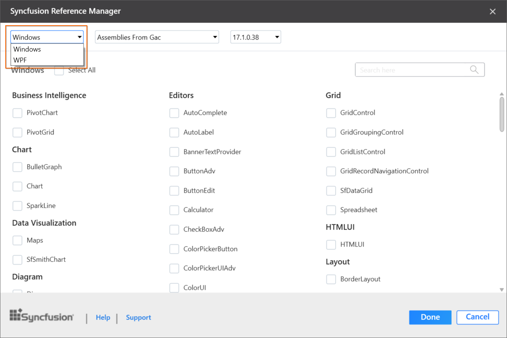
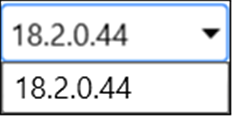

# Add Reference for WinForms

Syncfusion&reg; Reference Manager is the Visual Studio Add-In for the WinForms platform. It adds the Syncfusion&reg; assembly reference to the project, either from the GAC location or the Essential Studio&reg; WinForms installed location. It can also migrate the projects that contain the old versions of the Syncfusion&reg; assembly reference to newer or specific versions of the Syncfusion&reg; assembly reference. It supports Microsoft Visual Studio 2013 or higher. This Visual Studio extension is included from the Essential Studio&reg; 2013 Volume 3 release.

N> This Reference Manager can be applied to a project for Syncfusion&reg; assembly versions 10.4.0.71 and later.

Follow the given steps to add the Syncfusion&reg; references in Visual Studio:

> Before using the Syncfusion&reg; WinForms Reference Manager, check whether the **WinForms Extensions - Syncfusion&reg;** is installed or not in the Visual Studio Extension Manager by clicking on Tools -> Extensions and Updates -> Installed for Visual Studio 2017 or lower, and for Visual Studio 2019 or higher by clicking on Extensions -> Manage Extensions -> Installed. If this extension is not installed, please install the extension by following the steps from the [download and installation](https://help.Syncfusion.com/windowsforms/visual-studio-integration/vs2019-extensions/download-and-installation/) help topic.

1. Open a new or existing **WinForms** application.

2. To open the Syncfusion&reg; Reference Manager Wizard, follow either one of the options below:

   **Option 1:**  
   Click **Syncfusion&reg; Menu** and choose **Essential Studio&reg; for WinForms > Add References…** or any other Form in **Visual Studio**.

   

   N> From Visual Studio 2019, Syncfusion&reg; menu is available under Extensions in Visual Studio menu.

   **Option 2:**  
   Right-click the selected project file from Solution Explorer, then select **Syncfusion&reg; Reference Manager…** from **Context Menu**. The following screenshot shows this option in Visual Studio.   

   

3. The Syncfusion&reg; Reference Manager Wizard contains the list of Syncfusion&reg; WinForms controls that are loaded.

   

   **Platform Selection:** If you launch the Syncfusion&reg; Reference Manager from a Console/Class Library project, the Platform selection option will appear as an option in the Syncfusion&reg; Reference Manager. Choose the required platform. 

   

   **Assembly From:** Choose the assembly location, either from NuGet packages, the build installed location, or by using the GAC location.

   N> The installed location and GAC option will be available only when the Syncfusion&reg; Essential Studio&reg; WinForms setup has been installed.

   

   N> The GAC option will not be available if you have selected a WinForms (.NET 10.0, .NET 9.0, .NET 8.0, .NET 7.0, and .NET 6.0) application in Visual Studio.

   **Version:** Choose the build version to add the corresponding version assemblies to the project.

   

   
  

4. Choose the required controls that you want to include in the project. Then, click **Done** to add the required assemblies for the selected controls into the project. The following screenshot shows the list of required assemblies for the selected controls to be added.

   

5. Click **OK**. The listed Syncfusion&reg; assemblies are added to the project. Then, it notifies “Syncfusion&reg; assemblies have been added successfully” in the Visual Studio status bar.

   

6. Then, the Syncfusion&reg; licensing registration required message box will be shown if you installed the trial setup or NuGet packages, since Syncfusion&reg; introduced the licensing system from the 2018 Volume 2 (v16.2.0.41) Essential Studio&reg; release. Navigate to the  [help topic](https://help.Syncfusion.com/common/essential-studio/licensing/license-key#how-to-generate-Syncfusion-license-key), which is shown in the licensing message box, to generate and register the Syncfusion&reg; license key in your project. Refer to this [blog](https://blog.Syncfusion.com/post/Whats-New-in-2018-Volume-2-Licensing-Changes-in-the-1620x-Version-of-Essential-Studio.aspx) post to understand the licensing changes introduced in Essential Studio&reg;.

   

N>  Syncfusion&reg; provides Reference Manager support for specific .NET Frameworks, which are shipped (assemblies) in the Syncfusion&reg; Essential Studio&reg; setup. So, if you try to add Syncfusion&reg; assemblies to the project and the project framework is not supported with the selected Syncfusion&reg; version assemblies, the dialog appears along with the **“Current build v{version} is not supported this framework v{Framework Version}”** message.

