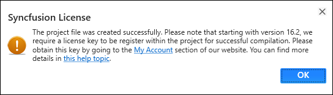

# Add Reference for WinForms

Syncfusion&reg; Reference Manager is the Visual Studio Add-In for WinForms platform. It adds the Syncfusion&reg; assembly reference to the project, either from the GAC location or Essential Studio&reg; WinForms installed location. It can also migrate the projects that contain the old versions of the Syncfusion&reg; assembly reference to newer or specific versions of the Syncfusion&reg; assembly reference. It supports Microsoft Visual Studio 2013 or higher. This Visual Studio extension is included from Essential Studio&reg; 2013 Volume 3 release.

N> This Reference Manager can be applied to a project for Syncfusion&reg; assembly versions 10.4.0.71 and later.

Follow the given steps to add the Syncfusion&reg; references in Visual Studio:

> Before use the Syncfusion&reg; WinForms Reference Manager, check whether the **WinForms Extensions - Syncfusion&reg;** installed or not in Visual Studio Extension Manager by clicking on the Tools -> Extensions and Updates -> Installed for Visual Studio 2017 or lower and for Visual Studio 2019 by clicking on the Extensions -> Manage Extensions -> Installed.If this extension not installed, please install the extension by follow the steps from the [download and installation](https://help.syncfusion.com/windowsforms/visual-studio-integration/vs2019-extensions/download-and-installation/) help topic.

1. Open a new or existing **WinForms** application.

2. To open Syncfusion&reg; Reference Manager Wizard, follow either one of the options below:

   **Option 1:**  
   Click **Syncfusion&reg; Menu** and choose **Essential Studio&reg; for WinForms > Add References…** or any other Form in **Visual Studio**.

   

   N> From Visual Studio 2019, Syncfusion&reg; menu is available under Extensions in Visual Studio menu.

   **Option 2:**  
   Right-click the selected project file from Solution Explorer, then select **Syncfusion&reg; Reference Manager…** from **Context Menu**. The following screenshot shows this option in Visual Studio.   

   

3. The Syncfusion&reg; Reference Manager Wizard that contains the list of Syncfusion&reg; WinForms controls that are loaded.

   

   **Platform Selection:** If launched the Syncfusion&reg; Reference Manager from Console/Class Library project, Platform selection option will be appeared as option in Syncfusion&reg; Reference Manager. Choose the required platform. 

   

   **Assembly From:** Choose the assembly location, either from NuGet packages, the build installed location, or by using the GAC location.

   N> The installed location and GAC option will be available only when the Syncfusion&reg; Essential Studio&reg; Winforms setup has been installed.

   

   N> The GAC option will not be available if you have selected a WinForms (.NET 8.0, .NET 7.0, and .NET 6.0) application in Visual Studio 2022.

   **Version:** Choose the build version to add the corresponding version assemblies to the project.

   

   
  

4. Choose the required controls that you want to include in the project. Then, click Done to add the required assemblies for the selected controls into the project. The following screenshot shows the list of required assemblies for the selected controls to be added.

   

5. Click **OK**. The listed Syncfusion&reg; assemblies are added to project. Then it notifies “Syncfusion&reg; assemblies have been added successfully” in Visual Studio status bar.

   

6. Then, Syncfusion&reg; licensing registration required message box will be shown, if you installed the trial setup or NuGet packages since Syncfusion&reg; introduced the licensing system from 2018 Volume 2 (v16.2.0.41) Essential Studio&reg; release. Navigate to the  [help topic](https://help.syncfusion.com/common/essential-studio/licensing/license-key#how-to-generate-syncfusion-license-key), which is shown in the licensing message box to generate and register the Syncfusion&reg; license key to your project. Refer to this [blog](https://blog.syncfusion.com/post/Whats-New-in-2018-Volume-2-Licensing-Changes-in-the-1620x-Version-of-Essential-Studio.aspx) post for understanding the licensing changes introduced in Essential Studio&reg;.

   

N>  Syncfusion&reg; provides Reference Manager support for specific .NET Framework, which is shipped (assemblies) in Syncfusion&reg; Essential Studio&reg; setup. So, if you try to add Syncfusion&reg; assemblies in the project and project framework is not supported with selected Syncfusion&reg; version assemblies, the dialog appears along with **“Current build v{version} is not supported this framework v{Framework Version}”** message.

