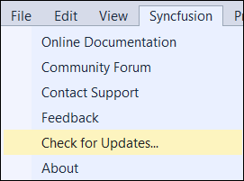
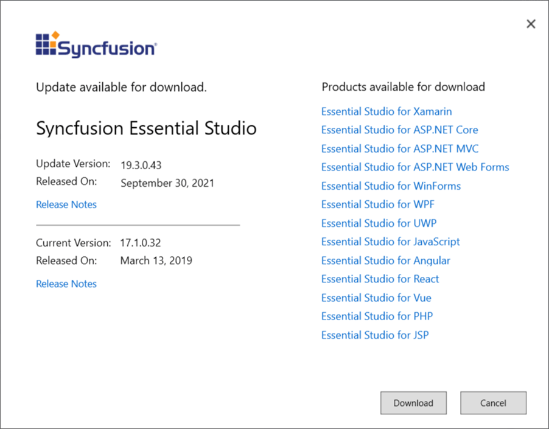

# Check for Updates in Syncfusion Essential WindowsForms

Syncfusion&reg; provides the Check for Updates extension to find whether the latest version of an Essential Studio&reg; release is available, and if it is available, provides an option to update to the most recent version of the Essential Studio&reg; release. So, you always get the latest features, fixes, and improvements by installing the latest version.

I> The Syncfusion&reg; Check for Updates is available from v17.1.0.32.

You can check for update availability in Visual Studio, and then install the updated version if required.

1. Choose **Syncfusion&reg; -> Check for Updates…** in the Visual Studio menu

   

   N> From Visual Studio 2019, Syncfusion&reg; menu is available under Extensions in Visual Studio menu.
   
2. When there is an update, the **Update** dialog box opens.

   

3. You can download the latest Syncfusion&reg; Essential Studio&reg; from the Syncfusion&reg; website by selecting **Download**. 

