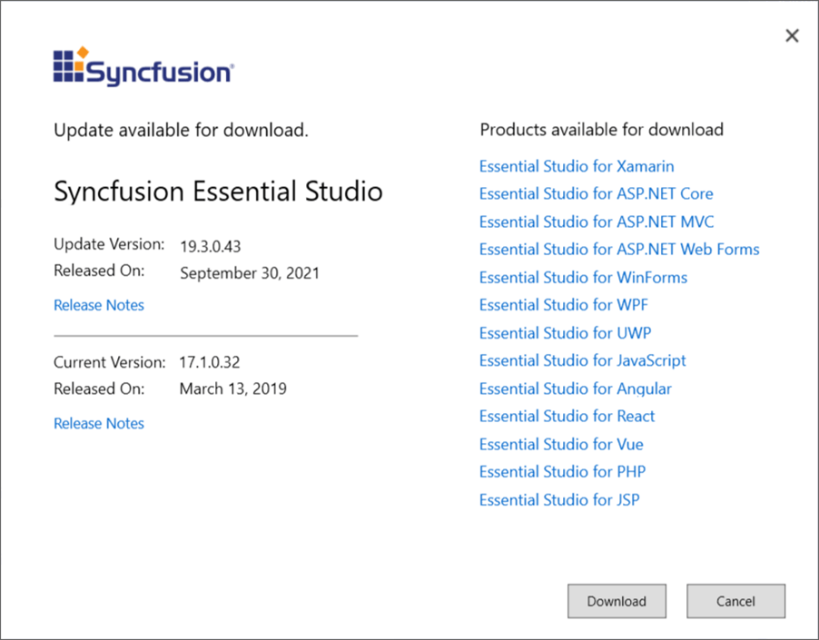

# Check for Updates in Syncfusion Essential WindowsForms

Syncfusion&reg; provides the check for update extensions to find latest version of essential release was available, if it was available then provide option update most recent version of the Essential Studio&reg; release. So that, you always get the latest features, fixes, and improvements by installing the latest version.

I> The Syncfusion&reg; Check for updates is available from v17.1.0.32.

You can check updates availability in Visual Studio, and then install the update version if required.

1. Choose **Syncfusion&reg; -> Check for Updates…** in the Visual Studio menu

   

   N> From Visual Studio 2019, Syncfusion&reg; menu is available under Extensions in Visual Studio menu.
   
2. When there is an update, **Update** dialog box opens.

   

3. You can download the latest Syncfusion&reg; Essential Studio&reg; from the Syncfusion&reg; website by selecting **Download**.
