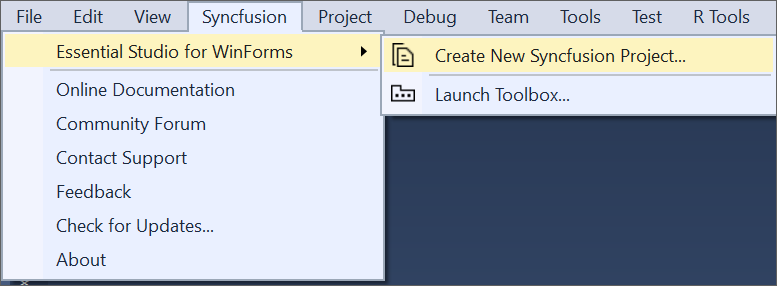
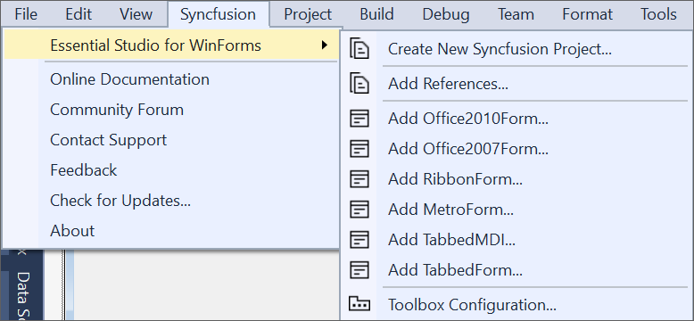
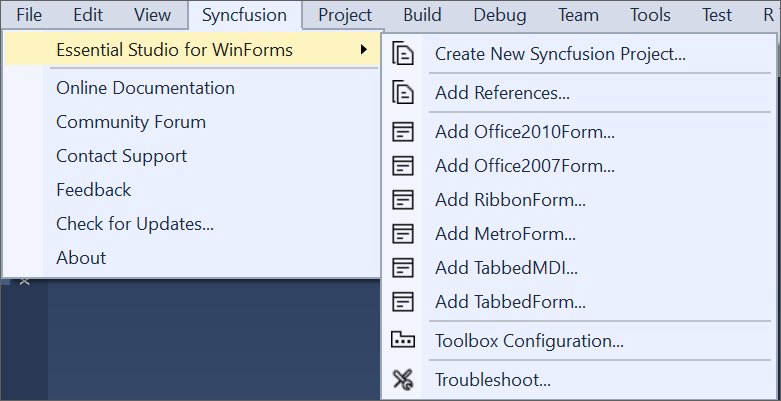

# Windows Forms Extension

The Syncfusion WinForms Visual Studio Extensions can be accessed through the Syncfusion Menu to create and configure the project with Syncfusion references in Visual Studio.The Syncfusion WinForms Extensions supports Microsoft Visual Studio 2010 or higher.

N> Syncfusion Extension is published in the Visual Studio Marketplace. Refer to the following link.
[https://marketplace.visualstudio.com/items?itemName=SyncfusionInc.Windows-Extensions](https://marketplace.visualstudio.com/items?itemName=SyncfusionInc.Windows-Extensions)

I> The Syncfusion WinForms menu option is available from v17.1.0.32.

The Syncfusion provides the following extension supports in Visual Studio:

1.	[Syncfusion Windows Forms Project Template](https://help.syncfusion.com/extension/windowsforms-extension/syncfusion-project-templates-for-windows-forms): To create the Syncfusion Windows Forms application by adding the required Syncfusion assemblies and forms.
2.	[Item Template](https://help.syncfusion.com/extension/windowsforms-extension/syncfusion-item-templates-for-windows-forms): Add predefined Syncfusion items (Forms) and the required Syncfusion assemblies in WinForms Application.
3.	[Reference Manager](https://help.syncfusion.com/extension/syncfusion-reference-manager/configure-syncfusion-assemblies-in-visual-studio-project): To add the required Syncfusion assembly to Windows project reference based on the selected control.
4.	[Toolbox Configuration](https://help.syncfusion.com/common/essential-studio/utilities#toolbox-configuration): To configure the Syncfusion controls into the Visual Studio .NET toolbox.
5.	[Troubleshooter](https://help.syncfusion.com/extension/syncfusion-troubleshooter/syncfusion-troubleshooter): Troubleshoot the project with the Syncfusion configuration and apply the fix like, wrong Framework Syncfusion assembly added to the project or missing any Syncfusion dependent assembly of a referred assembly.

**No project selected in Visual Studio**

**Selected Microsoft Windows Forms application in Visual Studio**

**Selected Syncfusion Windows Forms application in Visual Studio**

N> In Visual Studio 2019, Syncfusion menu available under Extension in Visual Studio menu.

The Syncfusion Windows Forms Visual Studio Extensions are installed along with the following setups,

* Essential Studio for Enterprise Edition with the platform Windows Forms
* Essential Studio for Windows Forms

